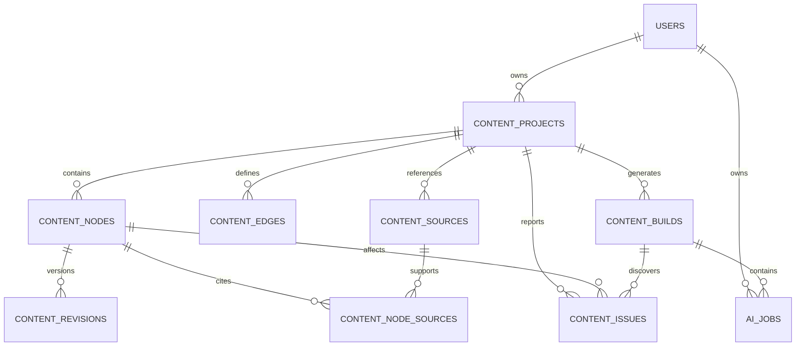
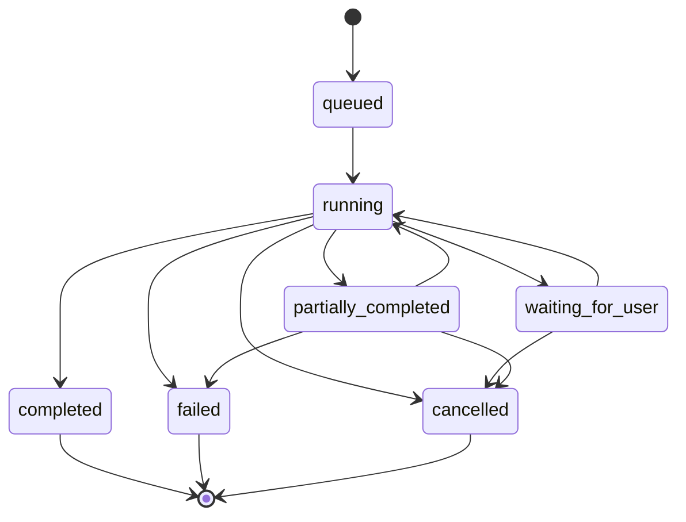
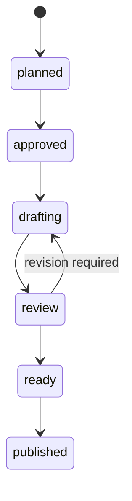
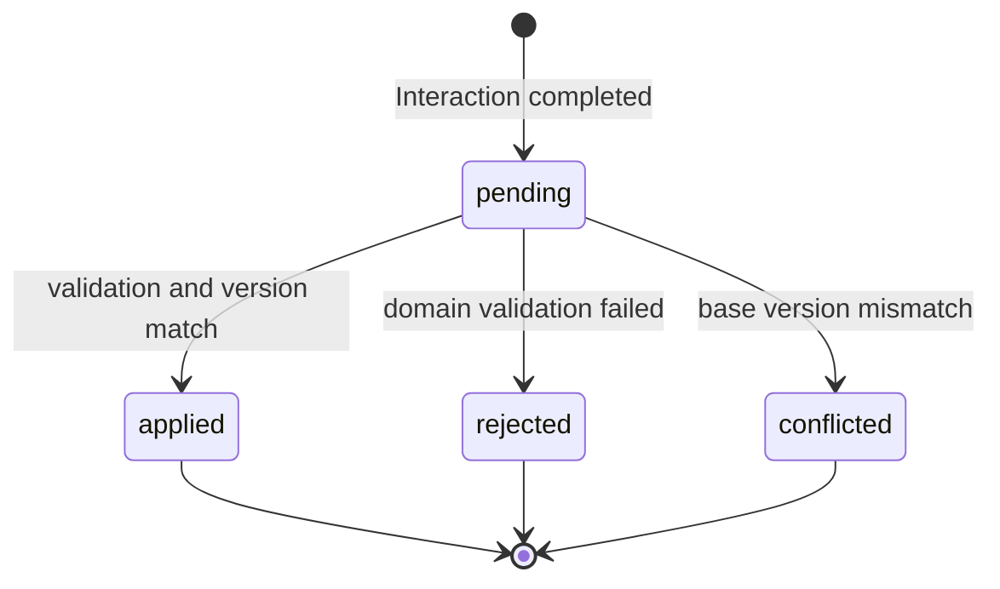

# Chaek Content Compiler 구현설계서

## 문서 상태

| 항목 | 값 |
| --- | --- |
| 상태 | Phase 0–3 + single Chapter drafting implemented, verification pending |
| 작성일 | 2026-07-27 |
| 대상 프로젝트 | Chaek |
| 대상 기능 | 사용자 입력을 장편 독립 콘텐츠로 완성하는 Content Compiler |
| 구현 기준 | Next.js 16.2.11, TypeScript, Turso/libSQL, Drizzle ORM, `@google/genai` 2.13.0 |
| 관련 문서 | [`database-schema.md`](./database-schema.md), [`design-system.md`](./design-system.md) |

이 문서는 Chaek의 콘텐츠 생성 기능에 대한 구현 Source of Truth다. 여기서 말하는 구현은 사용자 입력을 해석해 콘텐츠 그래프를 만들고, Gemini를 이용해 각 그래프 노드를 리서치·작성·검수·수정하여 한 권의 장편 독립 콘텐츠로 완성하는 흐름을 뜻한다.

이 문서는 목표 구조와 단계별 구현 경계를 정의한다. Phase 0–3의 계약, Graph 영속성, Brief/Graph Planning과 client polling 기반 Reconciliation에 더해, 선택한 Chapter 하나를 생성·저장·조회하는 baseline Vertical Slice가 구현되어 있다. Grounding, Revision, Research, 전체 의존성 Build와 Review 구조는 아직 목표 설계이며, 문서에 등장한다는 이유만으로 현재 구현으로 간주하지 않는다.

## 요약

Chaek은 Gemini에게 한 권의 책을 한 번에 생성하도록 요청하지 않는다. Chaek이 콘텐츠의 구조와 완성 조건을 소유하고, Gemini가 구조화된 단위 작업을 수행하도록 한다.

```text
사용자 입력
  → Content Brief
  → Content Graph
  → Research Packets
  → Chapter Drafts
  → Reviews
  → Revisions
  → 완성된 장편 콘텐츠
```

핵심 결정은 다음과 같다.

1. 콘텐츠 그래프는 Gemini Interaction이 아니라 Chaek 데이터베이스가 소유한다.
2. 책 한 권의 생성은 하나의 Gemini 요청이 아니라 여러 `ai_jobs`를 묶는 `content_builds`로 관리한다.
3. Gemini 결과는 `response_format` 기반 Structured Output으로 받고, 동일한 런타임 스키마로 다시 검증한다.
4. Gemini는 데이터베이스를 직접 변경하지 않는다. 후보 결과를 반환하고 Chaek이 검증 후 트랜잭션으로 반영한다.
5. 구조 검증, 순환 검증, 참조 검증, 버전 충돌 검증은 결정론적인 애플리케이션 코드가 수행한다.
6. 리서치와 집필을 분리한다. 리서치 단계에서 출처를 확정하고 집필 단계에서는 승인된 Research Packet을 사용한다.
7. `previous_interaction_id`는 동일 작업의 짧은 Repair에만 사용하고 책 전체의 기억으로 사용하지 않는다.
8. Background Interaction의 완료 결과는 client가 Build Status API를 polling할 때 `interactions.get()`으로 회수한다.
9. 탭이 중지된 동안 즉시 반영되지 않아도, 사용자가 돌아와 다시 조회하면 동일한 idempotent reconciliation이 결과를 DB에 적용한다.
10. Graph Planning 다음 수직 단면은 사용자가 선택한 Chapter 하나를 독립적으로 생성하는 흐름이며, Research와 Revision은 baseline 품질을 확인한 뒤 붙인다.

## 1. 배경과 제품 정의

Chaek의 핵심 기능은 사용자의 입력을 요약하거나 단순 재작성하는 것이 아니다. 사용자의 짧은 입력을 해석해 원문 없이도 독립적으로 읽히는 장편 콘텐츠로 발전시키는 것이다.

예를 들어 사용자가 다음과 같이 입력한다.

```text
LLM From Scratch
```

Chaek은 이 입력에서 대상 독자, 선수 지식, 학습 목표, 범위, 제외 범위와 완성물을 추론하고, 여러 Part와 Chapter로 이루어진 하나의 콘텐츠를 설계한다. 이후 각 Chapter를 개별적으로 작성하되, 전체 책의 개념 순서, 용어, 예제 코드와 논리적 약속을 일관되게 유지한다.

특정 출판사나 기존 책의 문체·목차·예제를 복제하지 않는다. 오라일리나 매닝 같은 기술 출판물에서 참고하는 것은 다음과 같은 편집적 완결성이다.

- 명확한 독자와 선수 지식
- 기초에서 응용으로 이어지는 학습 순서
- Chapter별 책임과 범위
- 책 전체를 통과하는 예제와 용어
- 검증 가능한 기술적 근거
- 마지막까지 따라갔을 때 완성되는 결과물

## 2. 목표와 비목표

### 2.1 목표

- 한 줄 또는 짧은 사용자 입력에서 장편 콘텐츠의 Brief와 구조를 생성한다.
- Part, Chapter, Concept, Example과 이들의 관계를 영속적인 콘텐츠 그래프로 저장한다.
- Gemini Background Interaction을 이용해 장시간 생성 작업을 안전하게 실행한다.
- Chapter 단위로 리서치, 집필, 검수와 수정을 수행한다.
- 사용자 편집과 늦게 도착한 AI 결과 사이의 충돌을 막는다.
- 앞선 Chapter의 변경이 영향을 미치는 후속 Chapter만 찾아 `stale`로 표시한다.
- 실패한 Chapter만 재시도하고 완료된 Chapter는 보존한다.
- 책 전체의 완성 여부를 데이터와 검증 규칙으로 판정한다.
- Gemini 모델 또는 API가 변경되어도 Chaek의 콘텐츠 상태와 편집 이력을 유지한다.

### 2.2 비목표

- Gemini Interaction 하나에 책 전체의 기억을 맡기지 않는다.
- 책 전체를 단일 프롬프트와 단일 JSON 응답으로 생성하지 않는다.
- Gemini에 DB 쓰기·삭제·출판 권한을 주지 않는다.
- 초기 구현에서 모든 문단과 Claim을 그래프 노드로 만들지 않는다.
- 초기 구현에서 별도 Graph Database나 Vector Database를 추가하지 않는다.
- 초기 구현에서 여러 모델을 자동 선택하는 Model Router를 만들지 않는다.
- 초기 구현에서 외부 Queue 서비스를 추가하지 않는다.
- 초기 구현에서 실시간 공동 편집, CRDT, 자동 번역과 다중 포맷 출판까지 다루지 않는다.
- 특정 기존 책이나 저자의 표현을 재현하는 기능을 만들지 않는다.

## 3. 성공 기준

기능이 구현되었다고 판단하려면 최소한 다음 조건을 만족해야 한다.

### 3.1 Graph Planning

- `"LLM From Scratch"` 입력에서 Content Brief를 생성할 수 있다.
- Brief를 바탕으로 Part, Chapter, Concept와 Edge를 생성할 수 있다.
- 모델이 반환한 JSON을 런타임 스키마로 검증할 수 있다.
- 존재하지 않는 참조와 순환 의존성을 DB 반영 전에 차단할 수 있다.
- 동일 요청 재전송이 중복 프로젝트나 중복 Gemini Interaction을 만들지 않는다.

### 3.2 Chapter Generation

- 하나의 Chapter Contract와 관련 Graph Context만으로 Chapter를 생성할 수 있다.
- 생성 결과는 도입, Section, Code Example, 결론과 Key Takeaway로 구성된 Structured JSON이다.
- 현재 baseline은 선택한 Chapter 하나를 생성해 Node의 `content_json`에 직접 저장한다.
- 현재 baseline은 `baseGraphVersion`으로 Outline 변경과 늦은 결과의 충돌을 차단한다.
- Continuity Capsule, 사용자 편집 충돌과 Revision Apply Gate는 후속 범위다.

### 3.3 Graph Completion

- 필수 Chapter가 모두 현재 Revision을 가진다.
- Blocking Graph Issue와 Blocking Review Issue가 없다.
- `stale` 상태의 필수 Chapter가 없다.
- 사용되는 개념이 앞선 Chapter에서 소개된다.
- 코드·예제의 Checkpoint 연결이 끊기지 않는다.
- 근거가 필요한 기술적 Claim에 Source가 연결된다.
- Content Brief의 Promise와 Scope가 Chapter에 의해 충족된다.

## 4. 현재 프로젝트 기준

### 4.1 이미 구현된 기반

현재 체크아웃에는 다음 기반이 있다.

- `lib/ai/gemini/client.ts`
  - `server-only` Gemini 클라이언트
  - `GEMINI_API_KEY` 지연 검증
  - `GoogleGenAI` 인스턴스 재사용
- `lib/ai/gemini/config.ts`
  - 기본 모델 `gemini-3.6-flash`
- `lib/db/schema/ai-jobs.ts`
  - 사용자 소유권
  - 요청 멱등성
  - Gemini Interaction ID
  - Job 상태·오류·사용량
  - reconciliation 시각
- `lib/auth/session.ts`
  - `requireUser()` 기반 인증 사용자 확인
- Turso/libSQL과 Drizzle ORM
- Google OAuth와 Chaek opaque session
- Zod 4 기반 `ContentBriefResult`와 `GraphPlanResult`
- Zod 4 기반 `ChapterDraftingJobInput`과 `ChapterContentResult`
- 결정론적 Graph Validator, Stable Topological Sort와 Impact Analyzer
- `content_projects`, `content_nodes`, `content_edges`, `content_builds`
- `POST /api/content-projects`와 Project, Graph, Build 조회 Route Handler
- Brief Generation과 Graph Planning Background Interaction
- 선택한 Chapter의 Graph Context Compiler와 `node_drafting` Background Interaction
- Chapter 결과의 Structured Output 검증, Graph Version 확인과 `content_nodes.content_json` 저장
- Structured Output 회수, 런타임 검증과 Graph 저장 Transaction
- Build Status 요청 기반 Polling과 Reconciliation 경로
- `/content` 사용자용 생성·상태·Outline 화면
  - nonterminal Build를 2.5초 간격으로 조회
  - background 탭에서는 조회 중지
  - 탭 복귀 시 즉시 Build Status 재조회
  - 완료 후 Project Summary를 조회해 Part와 Chapter 표시
  - Chapter 선택, 단일 Chapter 생성, polling 완료 후 본문 읽기
- Chapter API
  - `GET /api/content-projects/{projectId}/nodes/{nodeId}`
  - `POST /api/content-projects/{projectId}/nodes/{nodeId}/generate`
- `/content/test` 인증 없는 정적 Content View 검증 화면
- 실제 Gemini credential, Vercel Production과 Turso를 사용한
  `LLM From Scratch` Brief → Graph Planning → Graph 저장 E2E
  - Polling Reconciliation을 통해 완료
  - 약 65초 안에 4 Parts, 9 Chapters, 12 Concepts, 5 Examples 저장

### 4.2 아직 구현되지 않은 범위

현재 다음 요소는 구현되어 있지 않다.

- Chapter Revision과 Apply Gate
- Research Packet, Source와 Citation
- Google Search Grounding
- 여러 Chapter의 의존성 Scheduler
- 실제 Revision 변경에 따른 `stale` 전파
- Node Review, Project Review와 Completion 판정

### 4.3 공식 API 기준

구현 시 다음 공식 계약을 따른다.

- [Gemini Interactions API](https://ai.google.dev/gemini-api/docs/interactions-overview)
  - `input`, `response_format`, `output_text`를 사용한다.
  - `previous_interaction_id`는 대화 이력만 이어주며 `tools`, `system_instruction`, `generation_config`는 요청마다 다시 지정한다.
  - `store=false`는 Background Execution과 호환되지 않는다.
- [Gemini Structured Output](https://ai.google.dev/gemini-api/docs/structured-output)
  - `response_format.type = "text"`
  - `response_format.mime_type = "application/json"`
  - `response_format.schema`에 지원되는 JSON Schema 부분집합을 전달한다.
  - Schema 적합성 외의 의미 검증은 애플리케이션이 수행한다.
- [Gemini Background Execution](https://ai.google.dev/gemini-api/docs/background-execution)
  - 장시간 작업은 `background=true`로 실행한다.
  - Interaction ID를 저장한 뒤 `interactions.get()` polling으로 상태와 결과를 확인한다.
- [Grounding with Google Search](https://ai.google.dev/gemini-api/docs/google-search)
  - 현재 정보와 기술적 근거가 필요한 Research Job에서 사용한다.
  - 응답의 Annotation과 Search Step을 Source 정규화에 사용한다.
- [Gemini Context Caching](https://ai.google.dev/gemini-api/docs/caching)
  - Interactions API에서는 암묵적 캐시만 사용한다.
  - 공통된 큰 입력을 프롬프트 앞부분에 안정적으로 유지한다.
- [Next.js Route Handlers](https://nextjs.org/docs/app/getting-started/route-handlers)
  - API 경계는 `app/**/route.ts`의 Web Request/Response 기반 Route Handler로 구현한다.
  - 사용자·Job 조회 응답은 캐시하지 않는다.
- [Zod JSON Schema](https://zod.dev/json-schema)
  - 구현 시 Zod 4를 런타임 스키마의 Source of Truth로 도입한다.
  - `z.toJSONSchema()`로 Gemini에 전달할 JSON Schema를 만든다.
  - `safeParse()`로 Gemini 결과를 다시 검증한다.

## 5. 아키텍처 선택

### 5.1 검토한 선택지

| 선택지 | 설명 | 장점 | 문제 |
| --- | --- | --- | --- |
| 단일 Background Interaction | 한 번의 요청으로 책 전체 구조와 본문 생성 | 가장 단순함 | 부분 재생성, 일관성, 충돌 처리, Schema 크기에 취약 |
| 단계별 Content Compiler | Chaek이 단계와 상태를 소유하고 Gemini가 단위 작업 수행 | 복구·부분 수정·검증·관찰 가능 | 오케스트레이터와 계약 설계가 필요 |
| 자율 Gemini Agent | Function Calling으로 모델이 그래프와 DB 변경 | 높은 자율성 | DB 무결성, 재현성, 사용자 편집 보호가 어려움 |

### 5.2 결정

단계별 Content Compiler를 사용한다.

```text
Chaek
  ├── 구조와 상태를 소유한다.
  ├── 다음 작업을 결정한다.
  ├── Gemini 입력을 컴파일한다.
  ├── 결과를 검증한다.
  └── 검증된 결과만 반영한다.

Gemini
  ├── Brief 후보를 생성한다.
  ├── Graph Plan 후보를 생성한다.
  ├── 리서치를 수행한다.
  ├── Chapter 초안을 생성한다.
  ├── 의미적 문제를 검수한다.
  └── 수정 후보를 생성한다.
```

Gemini는 데이터베이스 명령을 생성하지 않는다. 단계별 도메인 결과를 Structured Output으로 반환하고, Chaek이 결과를 DB 작업으로 변환한다.

## 6. 핵심 용어

| 용어 | 정의 |
| --- | --- |
| Content Project | 사용자 입력에서 시작된 장편 콘텐츠 한 개 |
| Content Brief | 독자, 선수 지식, Promise, Scope, Exclusion을 정의한 프로젝트 계약 |
| Content Graph | 구조 노드와 의미 관계를 포함한 영속적인 콘텐츠 설계도 |
| Content Node | Part, Chapter, Concept, Example 같은 그래프 단위 |
| Content Edge | `requires`, `introduces`, `uses`, `continues` 의미 관계 |
| Chapter Contract | 한 Chapter가 맡는 목적, 포함 범위와 제외 범위 |
| Content Revision | 특정 Node의 불변 본문 버전 |
| Continuity Capsule | 후속 Chapter에 전달할 용어, 결정, 코드 Checkpoint와 약속 |
| Research Packet | 승인된 Claim과 Source를 모은 집필 입력 |
| Content Build | Project 또는 일부 Subgraph를 완성하기 위한 상위 실행 |
| AI Job | 하나의 Gemini Interaction에 대응하는 실행 단위 |
| Graph Version | 구조·계약·의미 관계 변경을 나타내는 단조 증가 버전 |
| Freshness | 현재 Revision이 최신 의존성에 기반하는지 나타내는 상태 |
| Result Disposition | 완료된 AI 결과가 적용·거부·충돌 중 어떤 상태인지 나타내는 값 |

## 7. 전체 아키텍처

```text
┌──────────────────────┐
│ Browser              │
│ topic / outline /    │
│ chapter editor       │
└──────────┬───────────┘
           │ authenticated request
           ▼
┌─────────────────────────────────────┐
│ Next.js Route Handlers              │
│                                     │
│ POST content-projects               │
│ GET  project / graph / build        │
│ POST builds / cancel                │
└──────────┬──────────────────────────┘
           │
           ▼
┌─────────────────────────────────────┐
│ Content Compiler                    │
│                                     │
│ Contract Parser                     │
│ Graph Validator                     │
│ Dependency Scheduler                │
│ Context Compiler                    │
│ Result Normalizer                   │
│ Apply Gate                          │
│ Impact Analyzer                     │
│ Build Coordinator                   │
└───────┬─────────────────┬───────────┘
        │                 │ interactions.get()
        │                 ▼
        │      ┌──────────────────────┐
        │      │ Gemini Interactions  │
        │      │                      │
        │      │ Structured Output    │
        │      │ Background Execution │
        │      │ Google Search        │
        │      └──────────┬───────────┘
        ▼                 ▼
┌─────────────────────────────────────┐
│ Turso / Drizzle                     │
│                                     │
│ content_projects                    │
│ content_nodes                       │
│ content_edges                       │
│ content_revisions                   │
│ content_sources                     │
│ content_node_sources                │
│ content_builds                      │
│ content_issues                      │
│ ai_jobs                             │
└─────────────────────────────────────┘
```

## 8. 불변식

아래 규칙은 프롬프트가 아니라 Chaek 도메인 코드가 보장한다.

### 8.1 소유권

- 모든 Content Project는 하나의 `users.id`가 소유한다.
- 모든 사용자 API 조회와 수정은 인증된 `users.id`와 Project 소유자가 일치해야 한다.
- `ai_jobs.user_id`는 연결된 Project 소유자와 일치해야 한다.
- Gemini Interaction ID는 클라이언트용 Job ID로 사용하지 않는다.

### 8.2 Graph

- Part와 Chapter는 구조 트리에서 최대 하나의 부모를 가진다.
- Concept와 Example은 구조 트리 부모가 없어도 된다.
- `requires` 관계는 순환이 없는 DAG여야 한다.
- 하나의 Concept에는 최대 하나의 Primary Introducer가 있어야 한다.
- Chapter가 Concept를 `uses`하면 같은 Chapter 또는 앞선 Chapter가 이를 `introduces`해야 한다.
- 하나의 `(project, from, type, to)` Edge는 한 번만 존재한다.
- AI 결과의 임시 Ref는 DB 반영 전에 Chaek UUID로 치환한다.

### 8.3 Revision

- Revision은 생성 후 내용을 수정하지 않는 불변 레코드다.
- 하나의 Node에는 최대 하나의 Current Revision만 존재한다.
- 사용자 편집도 기존 Revision을 덮어쓰지 않고 새 Revision을 만든다.
- AI 결과는 `baseGraphVersion`과 `baseRevisionId`가 현재 상태와 일치할 때만 자동 적용한다.
- 충돌한 AI 결과는 폐기하지 않고 `conflicted` Proposal로 보존할 수 있다.

### 8.4 AI Job

- Job 생성은 사용자별 Idempotency Key를 사용한다.
- 외부 API 호출 중에는 DB Transaction을 열어두지 않는다.
- terminal Job을 비terminal 상태로 되돌리지 않는다.
- Gemini Interaction 조회 결과를 런타임 계약과 도메인 규칙 검증 없이 적용하지 않는다.
- Structured Output 통과만으로 결과를 적용하지 않는다.
- Gemini 오류 원문과 내부 Prompt를 클라이언트에 그대로 노출하지 않는다.

### 8.5 Build

- Content Build는 여러 AI Job을 소유할 수 있다.
- Build 완료는 AI Job 개수가 아니라 콘텐츠 완성 조건으로 계산한다.
- 의존성이 완료되지 않은 Chapter Job은 제출하지 않는다.
- `continues`로 이어지는 Example Checkpoint는 순차적으로 생성한다.
- 일부 Chapter 실패는 Project 전체 데이터를 롤백하지 않는다.

## 9. 데이터 모델

### 9.1 관계



### 9.2 `content_projects`

책 한 권의 정체성과 전체 계약을 저장한다.

| 컬럼 | 타입 | 필수 | 설명 |
| --- | --- | --- | --- |
| `id` | text PK | Yes | Chaek Project UUID |
| `user_id` | text FK | Yes | 소유자 `users.id` |
| `title` | text | Yes | 현재 제목 |
| `seed_input` | text | Yes | 최초 사용자 입력 |
| `brief_json` | text JSON | No | 검증된 Content Brief |
| `status` | text | Yes | `planning`, `drafting`, `review`, `ready`, `published` |
| `graph_version` | integer | Yes | 구조·계약·Edge 변경 시 증가 |
| `created_at` | integer | Yes | 생성 시각 |
| `updated_at` | integer | Yes | 마지막 수정 시각 |

제약과 인덱스:

```text
CHECK graph_version >= 0
INDEX (user_id, updated_at)
INDEX (user_id, created_at)
```

사용자가 Project를 삭제하면 해당 Project의 Node, Edge, Revision, Source, Build와 Issue를 삭제한다. 연결된 AI Job의 보존 정책은 데이터 보존 정책 확정 시 다시 검토한다.

### 9.3 `content_nodes`

Part, Chapter, Concept와 Example을 저장한다.

| 컬럼 | 타입 | 필수 | 설명 |
| --- | --- | --- | --- |
| `id` | text PK | Yes | Node UUID |
| `project_id` | text FK | Yes | 소속 Project |
| `parent_id` | text self FK | No | Part/Chapter 구조 부모 |
| `kind` | text | Yes | `part`, `chapter`, `concept`, `example` |
| `slug` | text | Yes | Project 내부 안정 식별자 |
| `title` | text | Yes | 표시 제목 |
| `position` | integer | No | 같은 부모 아래의 표시 순서 |
| `contract_json` | text JSON | No | Chapter Contract 또는 Concept 정의 |
| `content_json` | text JSON | No | 현재 baseline의 검증된 Chapter 본문 |
| `editorial_status` | text | Yes | `planned`, `approved`, `drafting`, `review`, `ready`, `published` |
| `freshness` | text | Yes | `fresh`, `stale` |
| `stale_reason_json` | text JSON | No | 변경된 선행 Node와 사유 |
| `created_at` | integer | Yes | 생성 시각 |
| `updated_at` | integer | Yes | 마지막 수정 시각 |

제약과 인덱스:

```text
UNIQUE (project_id, slug)
INDEX (project_id, kind)
INDEX (project_id, parent_id, position)
INDEX (project_id, editorial_status, freshness)
```

`position` 중복은 재정렬 Transaction과 애플리케이션 검증으로 방지한다. SQLite에서 `NULL` 부모를 포함한 복합 Unique 동작에 의존하지 않는다.

`content_json`은 Revision 모델이 도입되기 전 Vertical Slice의 직접 저장 위치다. 현재는 `ChapterContentResult` 런타임 계약을 통과한 결과만 저장한다. 사용자 편집과 여러 Revision이 필요해지면 본문 Source of Truth를 `content_revisions`로 옮기고 이 컬럼의 역할을 제거하거나 Projection으로 재정의한다.

### 9.4 `content_edges`

구조 순서가 아닌 의미 관계를 저장한다.

| 컬럼 | 타입 | 필수 | 설명 |
| --- | --- | --- | --- |
| `id` | text PK | Yes | Edge UUID |
| `project_id` | text FK | Yes | 소속 Project |
| `from_node_id` | text FK | Yes | 시작 Node |
| `to_node_id` | text FK | Yes | 대상 Node |
| `type` | text | Yes | `requires`, `introduces`, `uses`, `continues` |
| `metadata_json` | text JSON | No | 역할, 강도, 설명 등 확장 정보 |
| `created_at` | integer | Yes | 생성 시각 |

제약과 인덱스:

```text
UNIQUE (project_id, from_node_id, type, to_node_id)
INDEX (project_id, from_node_id, type)
INDEX (project_id, to_node_id, type)
CHECK from_node_id <> to_node_id
```

DB는 단일 Self Edge만 차단한다. 여러 Node를 경유하는 `requires` Cycle은 Graph Validator가 검사한다.

### 9.5 `content_revisions`

Node의 불변 본문 버전을 저장한다.

| 컬럼 | 타입 | 필수 | 설명 |
| --- | --- | --- | --- |
| `id` | text PK | Yes | Revision UUID |
| `node_id` | text FK | Yes | 대상 Node |
| `revision_number` | integer | Yes | Node별 증가 번호 |
| `base_revision_id` | text FK | No | 이 Revision의 기반 |
| `graph_version` | integer | Yes | 생성에 사용한 Graph Version |
| `content_markdown` | text | Yes | 본문 |
| `summary_json` | text JSON | Yes | 요약과 Coverage |
| `continuity_json` | text JSON | Yes | Continuity Capsule |
| `dependency_snapshot_json` | text JSON | Yes | 생성 당시 의존 Node와 Revision |
| `origin` | text | Yes | `user`, `ai`, `ai_then_user` |
| `ai_job_id` | text FK | No | 생성한 AI Job |
| `is_current` | integer boolean | Yes | 현재 Revision 여부 |
| `created_by_user_id` | text FK | No | 사용자 편집 작성자 |
| `created_at` | integer | Yes | 생성 시각 |

제약과 인덱스:

```text
UNIQUE (node_id, revision_number)
UNIQUE PARTIAL (node_id) WHERE is_current = true
INDEX (node_id, created_at)
CHECK revision_number >= 1
CHECK graph_version >= 0
```

새 Current Revision 적용은 하나의 Transaction에서 수행한다.

```text
기존 current → is_current = false
새 Revision INSERT → is_current = true
Node editorial_status / freshness 갱신
후속 영향 Node stale 처리
AI Job result_disposition 갱신
```

### 9.6 `content_sources`

리서치에 사용한 외부 Source 메타데이터를 저장한다.

| 컬럼 | 타입 | 필수 | 설명 |
| --- | --- | --- | --- |
| `id` | text PK | Yes | Source UUID |
| `project_id` | text FK | Yes | 소속 Project |
| `url` | text | Yes | 정규화된 Source URL |
| `title` | text | Yes | Source 제목 |
| `publisher` | text | No | 발행 주체 |
| `source_type` | text | Yes | `paper`, `official_docs`, `article`, `book`, `other` |
| `retrieved_at` | integer | Yes | 리서치 시각 |
| `annotation_json` | text JSON | No | Gemini Citation Annotation의 정규화 결과 |
| `created_at` | integer | Yes | 생성 시각 |

제약과 인덱스:

```text
UNIQUE (project_id, url)
INDEX (project_id, source_type)
```

외부 문서 전체를 무조건 복제해 저장하지 않는다. Source URL, 제목, 인용 위치와 검증에 필요한 최소 메타데이터만 저장한다. 원문 Snapshot 보존이 필요해지면 저작권과 데이터 보존 정책을 별도로 승인한다.

### 9.7 `content_node_sources`

Chapter와 Source의 연결을 저장한다.

| 컬럼 | 타입 | 필수 | 설명 |
| --- | --- | --- | --- |
| `node_id` | text FK | Yes | Chapter 또는 Concept |
| `source_id` | text FK | Yes | Source |
| `role` | text | Yes | `supports`, `further_reading` |
| `claim_key` | text | No | Chapter 내부 Claim 참조 |
| `created_at` | integer | Yes | 생성 시각 |

제약:

```text
UNIQUE (node_id, source_id, role, claim_key)
```

MVP에서는 Chapter 단위 Source 연결만 필수다. Claim 단위 연결은 `claim_key`가 실제 제품 가치를 보일 때 확장한다.

### 9.8 `content_builds`

여러 AI Job을 묶어 콘텐츠의 일부 또는 전체를 완성하는 상위 실행이다.

| 컬럼 | 타입 | 필수 | 설명 |
| --- | --- | --- | --- |
| `id` | text PK | Yes | Build UUID |
| `project_id` | text FK | Yes | 대상 Project |
| `requested_by_user_id` | text FK | Yes | 요청 사용자 |
| `idempotency_key` | text | Yes | 사용자 Build 요청 멱등성 |
| `scope_type` | text | Yes | `project`, `part`, `chapter`, `affected_subgraph` |
| `scope_node_id` | text FK | No | Part/Chapter Build의 기준 Node |
| `base_graph_version` | integer | Yes | 시작 Graph Version |
| `result_graph_version` | integer | No | 완료 후 Graph Version |
| `phase` | text | Yes | 현재 Compiler Phase |
| `status` | text | Yes | Build 실행 상태 |
| `error_code` | text | No | 최종 Build 오류 코드 |
| `error_message` | text | No | 내부 운영용 오류 |
| `created_at` | integer | Yes | 생성 시각 |
| `started_at` | integer | No | 시작 시각 |
| `finished_at` | integer | No | 종료 시각 |
| `updated_at` | integer | Yes | 마지막 변경 시각 |

`phase`:

```text
interpreting
planning
validating
researching
drafting
reviewing
revising
finalizing
```

`status`:

```text
queued
running
waiting_for_user
partially_completed
completed
failed
cancelled
```

제약과 인덱스:

```text
UNIQUE (project_id, idempotency_key)
INDEX (project_id, created_at)
INDEX (status, updated_at)
CHECK base_graph_version >= 0
```

Build 진행률은 가능한 한 Node와 AI Job 상태에서 계산한다. 중복된 카운터를 저장해 상태 불일치를 만들지 않는다.

### 9.9 `content_issues`

결정론적 Validator와 Gemini Reviewer가 발견한 문제를 저장한다.

| 컬럼 | 타입 | 필수 | 설명 |
| --- | --- | --- | --- |
| `id` | text PK | Yes | Issue UUID |
| `project_id` | text FK | Yes | 대상 Project |
| `build_id` | text FK | No | 발견한 Build |
| `node_id` | text FK | No | 영향 Node |
| `source` | text | Yes | `validator`, `gemini_review` |
| `code` | text | Yes | 안정적인 Issue 코드 |
| `severity` | text | Yes | `blocking`, `warning` |
| `status` | text | Yes | `open`, `resolved`, `dismissed` |
| `message` | text | Yes | 사용자 또는 운영 설명 |
| `details_json` | text JSON | No | 관련 Node, Edge와 수정 힌트 |
| `created_at` | integer | Yes | 생성 시각 |
| `resolved_at` | integer | No | 해결 시각 |

인덱스:

```text
INDEX (project_id, status, severity)
INDEX (node_id, status)
INDEX (build_id, status)
```

### 9.10 기존 `ai_jobs` 확장

기존 실행 상태 모델을 유지하고 콘텐츠 관계와 결과 적용 상태를 추가한다.

추가 컬럼:

| 컬럼 | 타입 | 필수 | 설명 |
| --- | --- | --- | --- |
| `content_project_id` | text FK | No | 대상 Project |
| `content_build_id` | text FK | No | 소속 Build |
| `target_node_id` | text FK | No | 대상 Chapter 등 |
| `base_graph_version` | integer | No | 생성 입력의 Graph Version |
| `base_revision_id` | text FK | No | 생성 입력의 기준 Revision |
| `attempt_number` | integer | Yes | 동일 작업의 시도 번호 |
| `result_disposition` | text | No | `pending`, `applied`, `rejected`, `conflicted` |
| `applied_at` | integer | No | 결과 적용 시각 |

`task_type`:

```text
brief_generation
graph_planning
graph_repair
node_research
node_drafting
node_review
project_review
node_revision
```

AI 실행 성공과 콘텐츠 반영 성공을 분리한다.

```text
ai_jobs.status = completed
result_disposition = rejected
```

위 조합은 Gemini 실행은 성공했지만 Chaek 의미 규칙을 통과하지 못했다는 뜻이다.

```text
ai_jobs.status = completed
result_disposition = conflicted
```

위 조합은 결과 자체는 유효하지만 사용자의 최신 편집보다 오래된 기준에서 생성됐다는 뜻이다.

## 10. Graph Version과 Revision Version

Graph Version과 Revision은 다른 변경을 표현한다.

### 10.1 Graph Version을 증가시키는 변경

- Content Brief 변경
- Part 또는 Chapter 추가·삭제·이동
- Chapter Contract 변경
- Concept 정의 변경
- Edge 추가·삭제
- Example의 구조적 역할 변경

### 10.2 Graph Version을 증가시키지 않는 변경

- Chapter 본문 Revision 생성
- 오탈자 수정 Revision
- 동일 Contract 안의 표현 개선
- Review Issue 상태 변경

본문 변경으로 후속 Chapter의 입력이 달라지면 Graph Version을 올리는 대신 영향 Node를 `stale`로 표시한다.

### 10.3 AI 결과 적용 조건

```ts
const canApply =
  result.baseGraphVersion === project.graphVersion &&
  result.baseRevisionId === currentRevision?.id;
```

Graph Planning처럼 대상 Revision이 없는 작업은 `baseGraphVersion`만 비교한다.

병렬로 생성되는 서로 독립적인 Chapter가 각자 Revision을 적용하더라도 Graph Version은 변하지 않는다. 따라서 불필요하게 형제 Chapter Job을 충돌 처리하지 않는다.

## 11. 런타임 계약

### 11.1 단일 Source of Truth

구현 시 Zod 4를 추가해 작업별 런타임 스키마의 Source of Truth로 사용한다.

```ts
import * as z from "zod";

export const graphPlanResultSchema = z.object({
  baseGraphVersion: z.number().int().nonnegative(),
  parts: z.array(partSchema),
  chapters: z.array(chapterSchema),
  concepts: z.array(conceptSchema),
  edges: z.array(edgeSchema),
  unresolvedQuestions: z.array(z.string()),
});

export type GraphPlanResult = z.infer<typeof graphPlanResultSchema>;

export const graphPlanJsonSchema = toGeminiJsonSchema(graphPlanResultSchema, {
  omitBounds: true,
});
```

같은 Zod Schema를 Source of Truth로 두 방향에 사용하되, Provider Schema는
Gemini 복잡도 한도에 맞게 축소한다.

```text
Zod Schema
  ├── z.toJSONSchema() → Gemini response_format.schema
  └── safeParse()      → Gemini output_text 런타임 검증
```

Gemini가 지원하는 JSON Schema 부분집합을 넘도록 Provider Schema를 단순하게 유지한다. 복잡한 의미 규칙과 Graph Cycle 검사는 Zod Transform이나 깊은 JSON Schema에 넣지 않고 별도 Domain Validator에서 수행한다.

Graph Plan처럼 속성과 중첩 배열이 많은 계약은 Provider Schema에서
`minimum`, `maximum`, `minItems`, `maxItems`를 생략한다. 2026-07-27 실제
Interactions API 검증에서 bounds를 포함한 Graph Schema는
`400 invalid_argument`로 거부됐고, bounds를 생략하자 같은 입력이
6 Parts, 12 Chapters, 18 Concepts, 7 Examples, 66 Edges를 생성해 Zod와
Domain Validator를 통과했다. 개수와 숫자 범위 제약은 응답 회수 후 Zod
런타임 검증에서 계속 강제한다.

### 11.2 계약 버전

기존 `ai_jobs.payload_version`을 작업별 입력·결과 계약 버전으로 사용한다.

```text
task_type = graph_planning
payload_version = 1
```

작업 입력 필드나 결과 의미가 바뀌면 새 Job부터 버전을 올린다. 과거 Job은 해당 버전 Parser로 읽는다.

### 11.3 `ContentBriefResult`

```ts
type ContentBriefResult = {
  title: string;
  language: string;
  audience: string;
  prerequisites: string[];
  promise: string;
  scope: string[];
  exclusions: string[];
  completionArtifact: string;
  assumptions: string[];
};
```

`assumptions`는 모델이 임의로 확정한 기술 선택을 구분하기 위한 필드다. Product Policy가 승인하지 않은 중요한 가정은 `waiting_for_user` 또는 Graph Plan Warning으로 승격한다.

### 11.4 `GraphPlanResult`

```ts
type GraphPlanResult = {
  baseGraphVersion: number;

  parts: Array<{
    ref: string;
    title: string;
    purpose: string;
    position: number;
  }>;

  chapters: Array<{
    ref: string;
    partRef: string;
    title: string;
    position: number;
    purpose: string;
    readerStateBefore: string;
    readerStateAfter: string;
    mustCover: string[];
    mustNotCover: string[];
  }>;

  concepts: Array<{
    ref: string;
    name: string;
    canonicalDefinition: string;
  }>;

  examples: Array<{
    ref: string;
    name: string;
    completionState: string;
  }>;

  edges: Array<{
    fromRef: string;
    type: "requires" | "introduces" | "uses" | "continues";
    toRef: string;
  }>;

  unresolvedQuestions: string[];
};
```

`ref`는 응답 내부에서만 유효한 임시 식별자다. UUID를 모델에 생성시키지 않는다.

### 11.5 `ResearchPacketResult`

```ts
type ResearchPacketResult = {
  baseGraphVersion: number;
  targetNodeId: string;

  claims: Array<{
    claimKey: string;
    statement: string;
    sourceRefs: string[];
    confidence: "high" | "medium" | "low";
  }>;

  sources: Array<{
    sourceRef: string;
    title: string;
    url: string;
    sourceType: "paper" | "official_docs" | "article" | "book" | "other";
  }>;

  unresolvedQuestions: string[];
};
```

응답 JSON 안의 URL만 신뢰하지 않는다. `Interaction.steps`의 Google Search 결과와 Text Annotation에 존재하는 URL을 대조한 뒤 Source로 저장한다.

### 11.6 `ChapterDraftResult`

```ts
type ChapterDraftResult = {
  baseGraphVersion: number;
  targetNodeId: string;
  baseRevisionId: string | null;
  title: string;
  markdown: string;
  summary: string;

  continuity: {
    conceptsDefined: Array<{
      conceptId: string;
      definitionUsed: string;
    }>;
    decisions: string[];
    codeCheckpoint: string | null;
    nextChapterPromises: string[];
  };

  coverage: {
    coveredRequirements: string[];
    intentionallyDeferred: string[];
  };

  proposedGraphChanges: Array<{
    reason: string;
    proposal: string;
  }>;
};
```

`proposedGraphChanges`는 DB Operation이 아니다. Graph Repair 후보로만 저장한다.

### 11.7 `ReviewReportResult`

```ts
type ReviewReportResult = {
  baseGraphVersion: number;
  targetNodeId: string;
  revisionId: string;
  verdict: "pass" | "needs_revision";

  issues: Array<{
    code:
      | "missing_requirement"
      | "scope_leak"
      | "concept_inconsistency"
      | "unsupported_claim"
      | "code_discontinuity"
      | "reader_level_mismatch"
      | "duplication";
    severity: "blocking" | "warning";
    locationHint: string;
    message: string;
    suggestedAction: string;
  }>;

  verifiedRequirements: string[];
};
```

Gemini Review는 의미 검수 보조다. Graph Cycle, 소유권, ID, 버전과 Unique 제약을 판정하지 않는다.

## 12. Prompt와 Context Compiler

### 12.1 Prompt 원칙

- Provider System Instruction과 작업 입력을 분리한다.
- 모든 Prompt Template에 `promptVersion`을 부여한다.
- 사용자 입력과 외부 Source를 명령이 아니라 데이터로 구분한다.
- 외부 문서 안의 Prompt Injection 문장은 시스템 규칙을 변경할 수 없다.
- 특정 책의 문체나 목차를 복제하지 않도록 독창성 요구를 포함한다.
- 출력 형식은 Prompt 설명과 `response_format` Schema에서 함께 명시한다.
- 공통 Context를 앞에, 현재 작업의 가변 지시를 뒤에 둔다.

### 12.2 Chapter Context

```ts
type ChapterGenerationInput = {
  promptVersion: number;
  graphVersion: number;
  projectBrief: ContentBrief;
  chapter: {
    id: string;
    title: string;
    contract: ChapterContract;
  };
  prerequisites: CanonicalConcept[];
  previousChapters: ContinuityCapsule[];
  researchPacket: ResearchPacket;
  codeState: CodeState | null;
  downstreamPromises: string[];
};
```

Context Compiler는 다음 순서로 입력을 조립한다.

```text
1. Versioned System Instruction
2. Content Brief
3. Canonical Glossary
4. 관련 선수 Concept
5. 선행 Chapter Continuity Capsule
6. Research Packet
7. Chapter Contract
8. 이전 코드 Checkpoint
9. 다음 Chapter에 전달할 약속
10. 현재 작업 지시
```

책 전체 원문을 매번 넣지 않는다. 필요한 Revision과 Capsule만 선택한다.

### 12.3 Job 입력 보존

`ai_jobs.input_json`에는 Gemini에 전달한 정규화된 작업 입력과 다음 메타데이터를 저장한다.

```text
prompt_version
payload_version
base_graph_version
base_revision_id
dependency_revision_ids
task-specific input
```

API Key, Session Token과 OAuth Token은 포함하지 않는다.

## 13. Build 단계

### 13.1 Phase 1: Intent Interpretation

```text
seed_input
  → brief_generation Job
  → ContentBriefResult
  → Runtime Validation
  → brief_json 적용
```

중요한 미확정 가정이 있으면 Build를 `waiting_for_user`로 전환할 수 있다. MVP에서는 명백한 충돌이 없는 한 보수적인 기본값으로 진행하고, 가정은 Brief에 표시한다.

### 13.2 Phase 2: Graph Planning

```text
Content Brief
  → graph_planning Job
  → GraphPlanResult
  → Runtime Validation
  → Graph Validation
  → Node/Edge Transaction
  → graph_version 증가
```

### 13.3 Phase 3: Graph Repair

Blocking Graph Issue가 있으면 전체 결과를 새로 만들지 않고 Validator Issue를 입력으로 전달한다.

```text
GraphPlanResult
  + Blocking Issues
  → graph_repair Job
  → 수정 GraphPlanResult
```

동일 Plan의 짧은 Repair에만 `previous_interaction_id`를 사용할 수 있다. Repair 횟수는 설정 가능한 작은 상한을 둔다. 상한을 넘으면 Build를 `waiting_for_user` 또는 `failed`로 종료한다.

### 13.4 Phase 4A: Baseline Chapter Drafting

현재 구현된 다음 수직 단면이다.

```text
사용자가 Chapter 선택
  → Brief + Part + Chapter Contract
  → 이전/다음 Chapter 책임
  → 연결된 Concept 정의
  → node_drafting Background Job
  → client polling reconciliation
  → ChapterContentResult 검증
  → baseGraphVersion 확인
  → content_nodes.content_json 저장
```

이 단계는 Google Search Grounding, Research Packet, Revision과 Review를 사용하지 않는다. Chapter별 본문 품질과 Context Compiler의 유효성을 먼저 검증하기 위한 baseline이다.

### 13.4B Phase 4 후속: Research

Chapter Contract에서 근거가 필요한 질문을 만들고 독립적인 Chapter Research Job을 실행한다.

```text
Chapter Contract
  → Research Questions
  → node_research Job + google_search
  → Search Steps / Annotations
  → ResearchPacketResult
  → Source Normalization
```

리서치 결과의 신뢰도가 낮거나 필수 질문이 해결되지 않으면 Chapter Draft를 시작하지 않고 Issue를 만든다.

### 13.5 Phase 5: Dependency Scheduling

Graph Scheduler가 `requires`와 `continues` Edge를 사용해 실행 가능한 Node를 계산한다.

```text
ready(node) =
  모든 required Concept가 정의됨
  AND 모든 선행 Chapter가 Current Revision을 가짐
  AND Example의 이전 Checkpoint가 존재함
  AND Node가 terminal Job을 실행 중이지 않음
```

독립적인 Node는 제한된 동시성 안에서 병렬 실행할 수 있다. `continues` Chain은 순차 실행한다. 초기 구현의 동시성 값은 운영 데이터 없이 과도하게 높이지 않는다.

### 13.6 Phase 6: Chapter Drafting

```text
Context Compiler
  → node_drafting Job
  → ChapterDraftResult
  → Runtime Validation
  → Domain Validation
  → Apply Gate
  → Content Revision
```

### 13.7 Phase 7: Chapter Review

Drafting Interaction과 분리된 새 Interaction을 사용한다.

```text
Chapter Contract
  + Current Revision
  + Research Packet
  + Canonical Concepts
  + 다음 Chapter Contract
  → node_review Job
  → ReviewReportResult
  → content_issues
```

### 13.8 Phase 8: Project Review

모든 Chapter 원문을 한 번에 넣지 않는다. Brief, Graph, Chapter Contract, Summary, Continuity Capsule, Source Coverage를 사용한다.

```text
Project Brief
  + Outline
  + Chapter Contracts
  + Chapter Summaries
  + Canonical Glossary
  + Code Checkpoint Chain
  + Open Issues
  → project_review Job
```

Review 결과는 특정 Node에 연결된 Issue로 저장하고 문제가 있는 Node만 수정한다.

### 13.9 Phase 9: Finalization

다음 완료 조건을 계산한다.

```ts
const isComplete =
  blockingGraphIssues.length === 0 &&
  blockingReviewIssues.length === 0 &&
  requiredNodes.every(hasCurrentRevision) &&
  requiredNodes.every(isEditoriallyReady) &&
  requiredNodes.every(isFresh) &&
  requiredClaims.every(hasVerifiedSource) &&
  briefRequirements.every(isCovered);
```

조건을 만족하면 Project를 `ready`, Build를 `completed`로 전환한다. 출판은 별도 사용자 행동으로 남겨 자동 출판하지 않는다.

## 14. AI Job 실행 흐름

### 14.1 제출

```text
Content Build Coordinator
  │
  ├── DB: ai_jobs INSERT status=queued
  │
  ├── Transaction 종료
  │
  ├── Gemini interactions.create(background=true, store=true)
  │
  └── DB: interaction_id, status=processing 저장
```

DB Transaction을 연 상태에서 Gemini API를 호출하지 않는다.

Job Idempotency Key는 Build가 결정론적으로 만든다.

```text
{buildId}:{taskType}:{targetNodeId|project}:{graphVersion}:{attempt}
```

동일한 Coordinator 실행이 중복되어도 같은 논리 작업은 하나의 Job으로 수렴한다.

### 14.2 Gemini 요청

```ts
const interaction = await getGeminiClient().interactions.create({
  model: GEMINI_MODEL,
  background: true,
  store: true,
  system_instruction: systemInstruction,
  input: compiledInput,
  tools,
  response_format: {
    type: "text",
    mime_type: "application/json",
    schema: responseJsonSchema,
  },
});
```

Interactions API와 Legacy Generate Content API 필드를 혼합하지 않는다.

### 14.3 Client polling

사용자 화면은 nonterminal Build를 2–3초 간격으로 조회한다. 브라우저는 Gemini를 직접 호출하지 않고 Chaek의 Build Status API만 호출한다.

```text
Client
  → GET /api/content-projects/{projectId}/builds/{buildId}
      1. Session과 Project 소유권 확인
      2. reconcileContentBuild(buildId)
      3. 조회 가능한 nonterminal ai_jobs 선택
      4. interactions.get(geminiInteractionId)
      5. normalize
      6. apply
      7. advanceContentBuild()
      8. 최신 Build 상태 반환
```

Client 요청은 2–3초 간격이어도 Gemini Provider 조회는 `last_reconciled_at`을 기준으로 최소 5초 간격을 유지한다. Build가 `completed`에 도달하면 Project 또는 Graph API를 다시 조회해 적용된 콘텐츠를 표시하고 polling을 중단한다. `failed` 또는 `cancelled`에서도 polling을 중단한다.

### 14.4 탭 복귀와 Request-driven reconciliation

브라우저가 background 상태인 동안 polling이 중지되거나 지연되는 것을 허용한다. 이 기간에는 Gemini Interaction이 완료되어도 Chaek DB 반영이 늦을 수 있다.

사용자가 탭으로 돌아오거나 화면을 다시 열면 즉시 Build Status API를 호출한다.

```text
tab visible 또는 screen mount
  → Build Status GET
  → reconcileContentBuild(buildId)
  → interactions.get()
  → 완료 결과 적용
  → 다음 Job 제출 또는 terminal 상태 반환
```

현재 단계에서는 Scheduled Trigger나 별도 Worker를 두지 않는다. 사용자가 돌아오기 전까지 DB 상태 반영이 지연될 수 있다는 trade-off를 받아들이고, 동일 결과의 반복 조회는 조건부 Update와 Job Idempotency Key로 한 번만 적용되도록 한다.

### 14.5 `advanceContentBuild`

`advanceContentBuild(buildId)`는 언제든 다시 호출해도 같은 결과로 수렴해야 한다.

책임:

1. Build가 terminal 상태인지 확인한다.
2. 실행 중인 Job과 terminal Job을 조회한다.
3. 완료 결과의 적용 여부를 확인한다.
4. 새로 실행 가능한 Node를 계산한다.
5. 중복되지 않는 AI Job을 생성한다.
6. 완료 조건을 계산한다.
7. 다음 Phase 또는 terminal 상태로 전환한다.

여러 요청이 동시에 호출할 수 있으므로 상태 전이는 조건부 Update와 Unique Idempotency Key로 보호한다.

## 15. 검증 계층

### 15.1 Provider Schema Validation

- JSON 파싱
- Zod `safeParse`
- 필수 필드
- enum
- 문자열과 배열 길이의 기본 제한
- 예상하지 않은 필드 거부

실패 시:

```text
ai_jobs.status = completed
result_disposition = rejected
error_stage = internal
error_code = invalid_structured_output
```

Provider 실행 실패와 Chaek 적용 실패를 운영상 구분한다.

### 15.2 Reference Validation

- 모든 임시 Ref가 응답 안에서 유일한가
- Edge가 존재하는 Ref를 가리키는가
- DB ID가 현재 Project에 속하는가
- target Node와 Job 소유자가 일치하는가
- base Revision이 대상 Node에 속하는가

### 15.3 Graph Validation

Blocking Issue:

```text
missing_reference
dependency_cycle
duplicate_introduction
concept_before_introduction
uncovered_brief_requirement
scope_violation
invalid_structural_parent
invalid_example_checkpoint
```

Warning:

```text
chapter_too_broad
chapter_too_narrow
reader_level_jump
weak_transition
unresolved_assumption
```

### 15.4 Revision Validation

- Chapter Contract의 `mustCover` Coverage
- `mustNotCover` 위반
- Research Packet에 없는 외부 수치와 사실
- Continuity Capsule 형식
- 코드 Checkpoint 이름과 사용 가능 Symbol
- 다음 Chapter 약속의 실제 Graph 존재

### 15.5 Apply Gate

- Project 소유권
- Build와 Job 관계
- Graph Version
- Base Revision
- Job Result Disposition
- terminal 상태 재적용 방지

## 16. 영향 범위와 `stale` 전파

새 Current Revision 또는 Graph 변경이 생기면 역방향 Edge를 따라 영향을 계산한다.

```text
changed Node
  ├── reverse requires
  ├── reverse uses
  └── reverse continues
        → affected Nodes
```

예:

```text
Chapter 2 tokenizer-v1 → tokenizer-v2
  ├── Chapter 3 uses Tokenizer
  ├── Chapter 4 continues MiniLM
  └── Chapter 7 uses encoded batch
```

영향 Node:

```text
freshness = stale
stale_reason_json = {
  changedNodeId,
  previousRevisionId,
  currentRevisionId,
  reason
}
```

모든 후속 Chapter를 즉시 자동 재생성하지 않는다. 사용자가 선택하거나 `affected_subgraph` Build가 시작될 때 재생성한다.

## 17. API 설계

모든 사용자 API는 `runtime = "nodejs"`를 명시하고 `requireUser()` 또는 동일한 Session 검증을 사용한다. 모든 동적 조회 응답은 `Cache-Control: no-store`를 사용한다.

### 17.1 Project 생성과 초기 Build

```http
POST /api/content-projects
Idempotency-Key: <client-generated-key>
Content-Type: application/json

{
  "seedInput": "LLM From Scratch"
}
```

처리:

1. 사용자 인증
2. 요청 스키마 검증
3. Project와 initial Build 생성
4. Brief Generation Job 예약
5. `202 Accepted`

응답:

```json
{
  "projectId": "internal-project-id",
  "buildId": "internal-build-id",
  "status": "queued"
}
```

### 17.2 Project 조회

```http
GET /api/content-projects/{projectId}
```

응답은 Project 요약, 현재 Build와 Outline Projection을 포함한다. 무거운 Chapter Markdown 전체를 목록 응답에 포함하지 않는다.

### 17.3 Graph 조회

```http
GET /api/content-projects/{projectId}/graph
```

UI용 Outline과 내부 Graph Inspector용 데이터를 구분한다. 일반 사용자는 Outline Projection을 사용하고 전체 Edge 데이터는 필요한 화면에서만 조회한다.

### 17.4 Chapter Build 생성

현재 단일 Chapter 생성 API는 다음과 같다.

```http
POST /api/content-projects/{projectId}/nodes/{nodeId}/generate
Idempotency-Key: <client-generated-key>
```

처리:

1. 사용자와 Project/Chapter 소유권 확인
2. Brief, Part, Chapter Contract, 앞뒤 Chapter와 연결 Concept로 Context 구성
3. `scope_type = chapter` Build와 `node_drafting` Job 생성
4. Gemini Background Interaction 제출
5. `202 Accepted`

Project, Part와 affected subgraph를 같은 API로 생성하는 일반화된 Build Route는 후속 목표다.

목표 API:

```http
POST /api/content-projects/{projectId}/builds
Idempotency-Key: <client-generated-key>

{
  "scope": {
    "type": "project"
  }
}
```

또는:

```json
{
  "scope": {
    "type": "chapter",
    "nodeId": "chapter-id"
  }
}
```

### 17.5 Build 상태 조회

```http
GET /api/content-projects/{projectId}/builds/{buildId}
```

응답:

```json
{
  "id": "build-id",
  "phase": "drafting",
  "status": "running",
  "progress": {
    "planned": 9,
    "researched": 5,
    "drafted": 3,
    "reviewed": 2,
    "stale": 0,
    "blockingIssues": 0
  }
}
```

`progress`는 응답 생성 시 계산한다.

### 17.6 Build 취소

```http
POST /api/content-projects/{projectId}/builds/{buildId}/cancel
```

사용자 Build 상태를 `cancelled`로 전환하고, 실행 중인 Gemini Interaction 취소 지원 여부와 현재 상태를 확인한다. 이미 완료된 Revision은 삭제하지 않는다.

### 17.7 Chapter 조회와 사용자 Revision

```http
GET /api/content-projects/{projectId}/nodes/{nodeId}
```

Chapter 조회는 현재 구현되어 있으며 Outline 응답에서 제외한 전체 `content_json`을 반환한다.

사용자 Revision 저장은 후속 목표다.

```http
POST /api/content-projects/{projectId}/nodes/{nodeId}/revisions
```

Revision을 도입할 때 사용자 저장은 새 Revision을 생성한다. 요청에는 현재 `baseRevisionId`를 포함해 낙관적 동시성 제어를 적용한다.

### 17.8 Client polling lifecycle

사용자 화면은 Build 생성 직후와 화면 mount 시 Build Status API를 즉시 호출하고, nonterminal 상태에서는 2–3초 간격으로 반복한다. `document.visibilityState`가 다시 `visible`이 되면 interval을 기다리지 않고 즉시 한 번 더 조회한다. 완료 상태를 받으면 Project 또는 Graph API를 다시 조회해야 실제 콘텐츠가 화면에 나타난다.

이 lifecycle은 `components/content-compiler-view.tsx`에 구현되어 있다. polling은 Build가 `completed`, `failed`, `cancelled` 중 하나에 도달하면 중단한다.

## 18. 모듈 경계

목표 파일 구조:

```text
lib/
├── ai/
│   └── gemini/
│       ├── client.ts
│       ├── config.ts
│       ├── interactions.ts
│       └── results.ts
├── content/
│   ├── contracts/
│   │   ├── brief.ts
│   │   ├── graph-plan.ts
│   │   ├── research-packet.ts
│   │   ├── chapter-draft.ts
│   │   ├── review-report.ts
│   │   └── index.ts
│   ├── graph/
│   │   ├── validate.ts
│   │   ├── topological-sort.ts
│   │   ├── impact.ts
│   │   └── context.ts
│   ├── build/
│   │   ├── create.ts
│   │   ├── advance.ts
│   │   ├── schedule.ts
│   │   ├── apply-result.ts
│   │   └── complete.ts
│   ├── prompts/
│   │   ├── brief.ts
│   │   ├── graph-plan.ts
│   │   ├── graph-repair.ts
│   │   ├── research.ts
│   │   ├── chapter-draft.ts
│   │   └── review.ts
│   └── services/
│       ├── projects.ts
│       ├── revisions.ts
│       ├── sources.ts
│       └── issues.ts
└── db/
    └── schema/
        ├── content-projects.ts
        ├── content-nodes.ts
        ├── content-edges.ts
        ├── content-revisions.ts
        ├── content-sources.ts
        ├── content-builds.ts
        └── content-issues.ts
```

처음부터 범용 Repository 계층이나 Class 기반 프레임워크를 만들지 않는다. Drizzle Query와 도메인 Transaction을 명시적인 함수로 구성한다.

Route Handler는 얇게 유지한다.

```text
Route Handler
  ├── 인증
  ├── HTTP 입력 검증
  ├── 도메인 서비스 호출
  └── HTTP 응답 매핑
```

Gemini SDK 필드는 `lib/ai/gemini` 밖으로 누출하지 않는다. Content Compiler는 Chaek 도메인 타입으로 호출한다.

## 19. 상태 전이

### 19.1 Content Build



### 19.2 Content Node



`freshness`는 위 상태와 독립적이다.

```text
editorial_status = ready
freshness = stale
```

위 조합은 이전 검수를 통과했지만 선행 변경으로 다시 확인해야 한다는 뜻이다.

### 19.3 AI Result Disposition



## 20. 보안과 데이터 보호

### 20.1 인증과 권한

- Project, Build, Node, Revision 조회에 사용자 소유권을 함께 조건으로 사용한다.
- 클라이언트가 보낸 `userId`를 신뢰하지 않는다.
- Gemini Interaction ID만으로 Job을 조회하지 않는다.
- 내부 Error Message와 Stack Trace를 사용자 응답에 포함하지 않는다.

### 20.2 비밀 정보

다음 값은 AI 입력, DB JSON, 로그와 사용자 응답에 포함하지 않는다.

- `GEMINI_API_KEY`
- `TURSO_AUTH_TOKEN`
- Google OAuth Token과 ID Token
- Chaek Session Token과 Hash

### 20.3 Prompt Injection

Google Search와 URL Context로 가져온 외부 콘텐츠는 신뢰되지 않은 데이터다.

- Source 본문이 System Instruction을 변경할 수 없다.
- Research Prompt에서 외부 문서를 인용 대상 데이터로 구분한다.
- 모델이 제안한 URL은 Search Annotation과 대조한다.
- Source가 요구하는 Function Call이나 외부 요청을 자동 실행하지 않는다.

### 20.4 데이터 보존

Background Interaction은 결과 회수 전까지 `store=true`가 필요하다. Chaek DB 반영 이후 Interaction 삭제 시점은 제품 데이터 보존 정책이 확정될 때 결정한다.

정책 확정 전에는 다음을 구분해 기록한다.

```text
Chaek Content Data
Gemini Stored Interaction
Operational Logs
```

## 21. 비용과 성능

### 21.1 Context 최소화

- 전체 책 원문 대신 필요한 Contract와 Capsule을 전달한다.
- 목록 API에서 Chapter Markdown 전체를 조회하지 않는다.
- Project Review는 전체 원문보다 Summary와 Coverage를 우선 사용한다.

### 21.2 암묵적 캐시

- 공통 System Instruction을 안정적으로 유지한다.
- Brief와 Glossary를 가변 입력보다 앞에 둔다.
- 동일 Build의 유사 요청을 지나치게 긴 간격으로 분산하지 않는다.
- `usage_json.cachedTokens`를 관찰한다.

### 21.3 동시성

- `requires`와 `continues`를 만족한 Node만 실행한다.
- Build별 동시 실행 상한을 설정한다.
- 초기 상한은 작은 값으로 시작하고 실제 Rate Limit과 비용을 보고 조정한다.
- Retry가 원래 Job과 동시에 실행되지 않도록 Unique Key로 보호한다.

### 21.4 모델 선택

초기에는 현재 기본값인 `gemini-3.6-flash` 하나로 모든 작업을 수행한다.

Planner나 Reviewer에 별도 모델을 쓰는 Model Routing은 실제 품질 평가에서 명확한 차이가 확인될 때만 도입한다. 모델 이름은 Job마다 저장하므로 이후 비교가 가능하다.

## 22. 관찰 가능성

### 22.1 저장할 운영 정보

- Chaek Project ID
- Content Build ID
- AI Job ID
- Gemini Interaction ID
- Task Type
- Prompt Version
- Payload Version
- Model
- Job Status와 Result Disposition
- Input, Output, Cached, Thought, Tool Use Token
- 제출·완료·적용 시각
- Retry 횟수
- Validator Issue Code

### 22.2 로그에 남기지 않을 정보

- 전체 Prompt
- 전체 Chapter 본문
- API Key와 Token
- 사용자 Session 정보
- 검증되지 않은 Gemini Error 원문

로그는 식별자와 상태를 중심으로 남기고 상세 콘텐츠는 권한이 적용되는 DB에서 조회한다.

## 23. 실패 처리

### 23.1 제출 실패

```text
ai_jobs.status = failed
error_stage = submission
```

Interaction ID가 없으므로 같은 논리 작업의 Retry는 새 attempt로 생성할 수 있다.

### 23.2 실행 실패

```text
ai_jobs.status = failed
error_stage = execution
```

다른 Chapter Job은 의존성이 없다면 계속 실행할 수 있다. Build는 `partially_completed`가 될 수 있다.

### 23.3 결과 조회 실패

```text
ai_jobs.status = processing
error_stage = result_fetch
last_reconciled_at = now
```

Interaction이 terminal인지 확정하기 전에는 Job을 즉시 최종 실패로 바꾸지 않는다. 다음 client polling 요청이 다시 조회한다.

### 23.4 Structured Output 실패

Gemini 실행은 완료됐지만 `output_text`가 작업 계약을 통과하지 못한 경우:

```text
ai_jobs.status = completed
result_disposition = rejected
content_issues.code = invalid_structured_output
```

### 23.5 Graph Validation 실패

Repair 예산이 남아 있으면 `graph_repair` Job을 생성한다. 예산을 소진하면 Build를 `waiting_for_user` 또는 `failed`로 전환한다.

### 23.6 사용자 편집 충돌

```text
ai_jobs.status = completed
result_disposition = conflicted
```

현재 Revision을 덮어쓰지 않는다. 사용자가 비교하거나 새 기준으로 다시 생성할 수 있다.

### 23.7 Client polling 중단

탭이 background 상태가 되면 상태 반영이 지연될 수 있다. 사용자가 탭으로 돌아오거나 화면을 다시 열 때 Build Status API를 즉시 조회해 `interactions.get()` 결과로 보정한다.

### 23.8 Coordinator 중복 실행

`advanceContentBuild()`가 중복 실행되어도 결정론적 Job Idempotency Key와 조건부 상태 전이로 하나의 작업만 생성한다.

## 24. UI Projection

콘텐츠 그래프 자체를 기본 편집 UI로 노출하지 않는다.

사용자에게 필요한 기본 Projection:

### 24.1 Outline

```text
Part 1
  Chapter 1  Ready
  Chapter 2  Drafting
  Chapter 3  Waiting

Part 2
  Chapter 4  Planned
```

### 24.2 Chapter Editor

- 현재 Revision 본문
- 저장 상태
- AI 생성 상태
- Review Issue
- Source
- Revision History

### 24.3 Impact Notice

```text
Chapter 2의 Tokenizer 인터페이스가 변경되었습니다.
Chapter 3, 4, 7을 다시 확인해야 합니다.
```

### 24.4 Build Progress

- 현재 Phase
- 생성된 Chapter 수
- Review 완료 수
- Stale 수
- Blocking Issue 수

내부 Graph Inspector는 개발·디버깅 도구로 별도 제공할 수 있지만 제품의 기본 화면으로 삼지 않는다.

## 25. 테스트 전략

이 절은 현재 수직 단면과 이후 단계에서 수행할 검증을 함께 정의한다. Unit 8건, Production build, Production DB migration, 실제 Gemini Background Interaction과 client polling 완료 경로는 검증했다. Chapter Revision과 Research가 필요한 항목은 해당 Phase 구현 후 검증한다.

### 25.1 Unit

- Zod 입력·결과 Schema
- 임시 Ref 중복 검증
- 존재하지 않는 Ref 검증
- `requires` Cycle 탐지
- Concept-before-use
- 중복 Introducer
- Topological Wave 계산
- Impact Analyzer 역방향 탐색
- Apply Gate 버전 충돌
- Build 완료 조건
- Job Idempotency Key

### 25.2 Database Integration

- Project 삭제 Cascade
- Node 삭제 정책
- Edge Unique
- Current Revision Partial Unique
- Build Idempotency
- AI Job과 Build 소유권
- 사용자 삭제 Cascade

### 25.3 Service Integration

- Project + Build 원자적 생성
- Job queued 생성 후 외부 API 제출
- 제출 실패 상태
- Interaction ID 저장
- Structured Output 정규화
- 결과 적용 Transaction
- Conflict 처리
- Stale 전파
- Coordinator 중복 호출

### 25.4 Route Handler

- 비로그인 `401`
- 다른 사용자 Project `404` 또는 권한 오류
- `Idempotency-Key` 누락
- 잘못된 요청 Schema
- `Cache-Control: no-store`
- Build Status 조회 시 nonterminal Job reconciliation
- 내부 Error 비노출

### 25.5 Client polling reconciliation

- 반복 Build Status 조회에서 완료 결과 회수
- 5초 Provider polling throttle
- 동일 완료 결과의 중복 적용 방지
- 오래된 `queued` Job
- `processing` Job의 provider terminal 상태 반영
- 결과 조회 실패 후 다음 client 요청에서 재시도

### 25.6 End-to-End

- `"LLM From Scratch"` → Brief → Graph Plan
- Graph Plan Review 후 Chapter 하나 생성
- Chapter 1 수정 후 Chapter 2 stale
- Chapter 2 재생성
- 실행 중 사용자 편집 후 AI 결과 conflicted
- 실제 Gemini Background Interaction과 polling

실제 Gemini·Google Search E2E는 개발 Key와 비용이 필요하므로 Mock 검증과 분리해 기록한다.

## 26. 구현 단계

### Phase 0. 계약과 순수 Graph 로직

범위:

- Zod 4 도입
- `ContentBriefResult`
- `GraphPlanResult`
- Graph Validator
- Topological Sort
- Impact Analyzer의 최소 구현
- Fixture 기반 Unit Test

DB와 Gemini 호출 없이 순수 함수로 검증한다.

완료 조건:

- 유효 Graph Plan 통과
- Missing Ref 차단
- Cycle 차단
- Concept-before-use 차단
- Stable Topological Order

### Phase 1. Content Graph Persistence

범위:

- `content_projects`
- `content_nodes`
- `content_edges`
- `content_builds`
- 기존 `ai_jobs` 연결 필드
- Drizzle Migration
- 소유권 Query

이 단계에서는 Chapter Revision, Research, Review를 아직 구현하지 않는다.

### Phase 2. Graph Planning Vertical Slice

범위:

- `POST /api/content-projects`
- Brief Generation Job
- Graph Planning Job
- Structured Output
- Graph Validation
- Node/Edge Transaction
- Build 상태 조회
- Polling 기반 결과 확인

### Phase 3. Polling과 Reconciliation

범위:

- Build Status 요청 기반 `reconcileContentBuild`
- `interactions.get()` 결과 회수
- Provider polling throttle
- 완료 결과와 다음 Job의 멱등 적용
- 결과 조회 실패 후 다음 요청 재시도
- 중복·경합 테스트

### Phase 4. 단일 Chapter Revision

범위:

- `content_revisions`
- Chapter Context Compiler
- `ChapterDraftResult`
- Apply Gate
- 사용자 Revision
- Conflict 처리
- Continuity Capsule

### Phase 5. Research와 Source

범위:

- Google Search Grounding
- `content_sources`
- `content_node_sources`
- Research Packet
- Citation Annotation 정규화

### Phase 6. Dependency Build

범위:

- 여러 Chapter Scheduler
- `requires` Wave
- `continues` Chain
- 제한된 병렬 실행
- 부분 실패
- Retry
- Stale 전파

### Phase 7. Review와 Completion

범위:

- `content_issues`
- Node Review
- Project Review
- Targeted Revision
- Graph Completion 판정
- Project `ready`

## 27. 구현 전 확정하지 않아도 되는 항목

다음 값은 운영 데이터와 실제 UX를 보기 전까지 설정으로 남긴다.

- 기본 Chapter 수
- Chapter 목표 길이
- Build별 최대 동시 Job 수
- Job 자동 Retry 횟수
- Graph Repair 횟수
- `waiting_for_user`로 전환하는 중요 가정 기준
- Gemini Interaction 삭제 시점
- Source Snapshot 보존 여부
- Planner와 Reviewer의 별도 모델 사용

이 값들을 DB Schema나 Product Contract에 고정하지 않는다.

## 28. 구현 전 결정이 필요한 항목

Phase별로 다음 결정을 확인한다.

### Graph Planning 전에

- 최초 Vertical Slice에서는 결정론적 Blocking Validation을 통과한 Graph Plan을 자동 적용한다.
- 사용자 입력만으로 결정할 수 없는 기술 선택은 Brief `assumptions`와 Graph `unresolvedQuestions`에 보존한다.
- 초기 Content Brief의 언어와 독자 수준은 모델이 입력에서 추론하고, 중요한 추론은 `assumptions`에 기록한다.

### Chapter Generation 전에

- Markdown을 본문 저장 형식으로 확정할지
- Code Block 실행 검증을 제품 범위에 넣을지
- 사용자 편집 시 자동 Stale 범위

### Research 전에

- 허용 Source 정책
- Citation 표시 방식
- 원문 Snapshot 보존 여부

### Production 전에

- Interaction과 사용자 콘텐츠 보존 기간
- 사용자 삭제와 외부 Provider 데이터 삭제 절차

## 29. 구현하지 않을 조기 추상화

- 모든 결과를 처리하는 하나의 범용 `GraphPatch` Schema
- Gemini가 실행하는 `write_graph`, `delete_node`, `publish_project` Function
- Node 종류마다 별도 Class 계층
- 범용 Workflow Engine
- 외부 Message Queue
- GraphQL
- Event Sourcing
- 모든 문단의 Revision
- 모든 Claim의 독립 Node화
- 실시간 Progress Stream

작업별로 작고 명시적인 계약과 함수를 만든다. 공통점이 실제로 반복될 때만 추상화한다.

## 30. 최종 권장 구현 경계

목표 아키텍처 전체를 첫 구현 범위로 잡지 않는다.

다음 수직 단면만 먼저 구현한다.

```text
"LLM From Scratch"
  → Content Project
  → Content Brief
  → Graph Plan
  → Deterministic Graph Validation
  → Part / Chapter / Concept / Edge 저장
  → Outline 조회
```

이 단면에서 검증해야 할 핵심 가설은 하나다.

> Gemini가 사용자의 짧은 입력을 Chaek이 신뢰하고 후속 작업에 사용할 수 있는 구조화된 콘텐츠 그래프로 변환할 수 있는가?

이 가설이 검증된 뒤 단일 Chapter Revision을 추가한다. 그다음 의존성이 있는 두 Chapter, 하나의 Part, 마지막으로 책 전체 Build로 확장한다.

최종 제품은 “Gemini Agent가 책을 기억하며 작성하는 서비스”가 아니라 다음 구조가 되어야 한다.

```text
User Input          = Source
Content Brief       = Build Configuration
Content Graph       = Intermediate Representation
Gemini Interactions = Compiler Passes
Validators          = Type Checker / Linter
Content Revisions   = Build Artifacts
Ready Project       = Final Build
```

Gemini를 교체하거나 동일 단계를 다시 실행해도 콘텐츠 그래프와 사용자 편집은 남아야 한다. 이것이 Chaek Content Compiler의 최종 책임 경계다.
