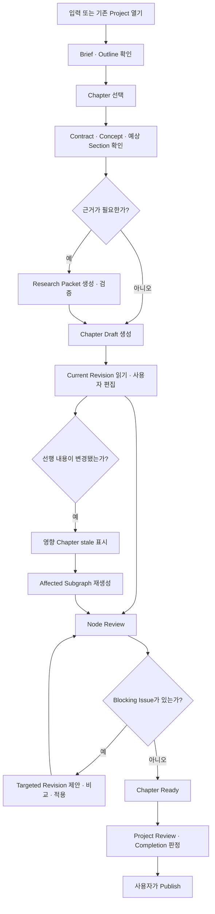

# Content Workspace API Handoff

| 항목 | 내용 |
| --- | --- |
| 작성일 | 2026-08-04 |
| 대상 화면 | `/content` Content Workspace |
| 목적 | API 부재로 이번 화면 개편에서 제외한 기능을 이후 Vertical Slice로 구현하기 위한 제품·UX·API 인계 |
| 상위 설계 | [`content-compiler-implementation-design.md`](./content-compiler-implementation-design.md) |

## 요약

현재 `/content`는 다음 핵심 흐름까지 구현되어 있다.

```text
사용자 입력
  → Content Brief 생성
  → Content Graph와 Outline 생성
  → Chapter 선택
  → 선택한 Chapter 하나 생성
  → 같은 Workspace에서 본문 읽기
```

이번 개편에서는 API가 실제로 제공하는 정보와 행동만 노출했다. 따라서 아래 기능은 시각적으로 흉내 내지 않고 후속 구현으로 남겼다.

1. Outline 이름 편집과 Part/Chapter 재정렬
2. 선택한 Chapter의 Concept 연결과 예상 Section 계획
3. Research Packet, Source와 Citation
4. 사용자 편집, AI Revision 비교와 Apply Gate
5. Node Review, Project Review와 Issue 처리
6. 변경 영향에 따른 `stale` 설명과 영향 범위 재생성
7. 여러 Chapter Build, 취소, 재시도와 `waiting_for_user` 해결
8. Completion 판정과 사용자 Publish

가장 중요한 구현 원칙은 **현재 본문을 덮어쓰는 기능을 늘리기 전에 `content_revisions`와 Apply Gate를 먼저 도입하는 것**이다. Outline 변경, 재생성, Review 기반 수정은 모두 이 안전장치에 의존한다.

이 문서는 기존 구현 설계를 대체하지 않는다. 기존 문서의 목표 도메인 모델을 현재 Content Workspace의 사용자 행동 및 API 계약에 연결하는 Handoff다.

## 1. 현재 기준선

### 1.1 구현된 API

| 목적 | API | 현재 UX |
| --- | --- | --- |
| Project 생성 | `POST /api/content-projects` | 입력 후 Build 시작 |
| Project 요약·Outline 조회 | `GET /api/content-projects/{projectId}` | Workspace 구조와 진행 상태 표시 |
| 전체 Graph 조회 | `GET /api/content-projects/{projectId}/graph` | 제품 기본 화면이 아닌 내부 Graph 데이터 |
| Build 상태 조회 | `GET /api/content-projects/{projectId}/builds/{buildId}` | Client polling과 완료 후 재조회 |
| Chapter 조회 | `GET /api/content-projects/{projectId}/nodes/{nodeId}` | Contract 또는 완성된 본문 표시 |
| 단일 Chapter 생성 | `POST /api/content-projects/{projectId}/nodes/{nodeId}/generate` | Inspector의 단일 Primary Action |

현재 실행되는 AI Job은 `brief_generation`, `graph_planning`, `node_drafting`뿐이다. `node_research`, `node_review`, `project_review`, `node_revision`은 타입만 정의되어 있고 실행 Vertical Slice는 없다.

### 1.2 현재 Workspace의 안정적인 구조

후속 기능은 화면 전체를 다시 바꾸지 않고 다음 정보 구조에 붙인다.

```text
Project Switcher
  └─ Structure: Part / Chapter 탐색과 상태
      └─ Canvas: Outline, Chapter Contract 또는 본문
          └─ Inspector: 선택 항목의 맥락, 상태, 다음 행동
```

- Structure는 위치와 상태를 답한다.
- Canvas는 사용자의 주 작업인 읽기와 편집을 담당한다.
- Inspector는 Concept, Source, Issue, Revision, Build처럼 선택한 대상의 보조 맥락과 행동을 담당한다.
- 제품 기본 화면에 raw Graph Inspector를 노출하지 않는다.
- API가 없는 기능을 동작하는 것처럼 보이는 버튼이나 수치로 표시하지 않는다.

### 1.3 현재 데이터의 한계

- Chapter 본문은 `content_nodes.content_json`에 직접 저장된다.
- Chapter 조회는 연결 Concept를 생성 Context에 사용하지만 응답에는 반환하지 않는다.
- Chapter Contract에는 `purpose`, 독자 상태, `mustCover`, `mustNotCover`만 있고 예상 Section 계획은 없다.
- `content_revisions`, `content_sources`, `content_node_sources`, `content_issues`는 목표 설계이며 현재 Vertical Slice가 아니다.
- Build 상태에는 `waiting_for_user`가 있지만 사용자가 무엇을 해결해야 하는지 표현하는 구조화된 Action 계약이 없다.

## 2. 전체 목표 UX Flow



### UX 상태 원칙

- Background Build 중에도 사용자는 다른 Chapter를 읽고 이동할 수 있어야 한다.
- URL의 `project`, `build`, `chapter` 식별자로 새로고침 후 동일한 작업 상태를 복원한다.
- Outline에서 상태를 짧게 보여주고, 이유와 해결 행동은 Inspector에서 설명한다.
- `stale`, `failed`, `waiting_for_user`, `conflicted`는 서로 다른 상태로 취급한다.
- 자동 생성 결과가 늦게 도착해도 사용자의 최신 편집을 덮어쓰지 않는다.
- Project가 `ready`가 되어도 자동 Publish하지 않는다.

## 3. 핵심 User Stories

| 우선순위 | User Story | 성공 기준 |
| --- | --- | --- |
| P0 | 작성자로서 기존 Project를 열었을 때 어디까지 완성됐고 다음에 무엇을 해야 하는지 알고 싶다. | Outline 상태와 Inspector의 한 가지 Primary Action이 서버 상태와 일치한다. |
| P0 | 작성자로서 Chapter를 다시 생성해도 현재 원고와 내 편집을 잃고 싶지 않다. | AI 결과가 새 Revision/Proposal로 보존되고 충돌 시 현재 Revision을 덮어쓰지 않는다. |
| P0 | 편집자로서 Part와 Chapter 제목·순서를 바꾸되 Graph 무결성을 깨뜨리고 싶지 않다. | 변경이 원자적으로 검증되고 성공 시 Graph Version이 한 번 증가한다. |
| P1 | 작성자로서 Chapter가 어떤 Concept를 소개·사용하며 어떤 Section을 만들 예정인지 알고 싶다. | Chapter 상세 응답만으로 실제 연결 목록과 Section 계획을 표시한다. |
| P1 | 독자로서 사실성 있는 내용을 출처와 함께 확인하고 싶다. | 승인된 Research Packet의 Source가 Chapter와 연결되고 검증되지 않은 URL은 저장되지 않는다. |
| P1 | 편집자로서 Review Issue를 해당 위치와 해결 행동까지 확인하고 싶다. | Blocking/Warning, 위치, 제안 행동과 상태가 영속화된다. |
| P1 | 작성자로서 앞 Chapter를 바꾼 뒤 무엇을 다시 만들어야 하는지 알고 싶다. | 변경 이유, 영향 Chapter와 재생성 범위를 Inspector에서 확인한다. |
| P2 | 작성자로서 전체 콘텐츠를 한 번에 진행하되 완료된 Chapter는 보존하고 실패한 범위만 재시도하고 싶다. | 의존성 Scheduler가 실행 가능한 Node만 처리하고 부분 실패를 보존한다. |
| P2 | 발행자로서 완성 조건을 모두 충족한 뒤 명시적으로 Publish하고 싶다. | 서버 Completion 판정이 `ready`를 만들고 Publish는 별도 사용자 행동이다. |

## 4. 후속 기능별 Handoff

### 4.1 Chapter 맥락 Read Model

#### 해결할 문제

현재 Inspector는 `mustCover` 개수와 생성 후 실제 Section 개수만 알 수 있다. 연결 Concept는 AI Context에는 들어가지만 사용자에게 보이지 않으며, 생성 전 예상 Section도 Contract에 없다.

#### 결정

별도 Count API를 만들지 않고 기존 Chapter 조회 응답을 확장한다. 수치는 반환된 실제 목록에서 계산한다.

```ts
type ChapterDetailV2 = ChapterDetailV1 & {
  contract: ChapterContractV2;
  concepts: Array<{
    id: string;
    name: string;
    canonicalDefinition: string;
    relationship: "introduces" | "uses";
  }>;
};

type ChapterContractV2 = ChapterContractV1 & {
  contractVersion: 2;
  expectedSections: Array<{
    key: string;
    title: string;
    purpose: string;
  }>;
};
```

- `GET /api/content-projects/{projectId}/nodes/{nodeId}`에 `concepts`와 `expectedSections`를 추가한다.
- Graph Planning 결과부터 `expectedSections`를 생성하고 `contract_json`에 저장한다.
- 기존 Project의 V1 Contract는 그대로 읽는다. V1 화면에서 예상 Section 수를 추정하거나 `mustCover` 수로 대체하지 않는다.
- V1을 V2로 올리는 작업은 새 Graph Repair Build로 수행하고 Graph Version을 증가시킨다.

#### Workspace 연결

- Inspector에 `Concept`를 `소개`와 `사용`으로 구분해 목록 표시한다.
- Canvas의 Contract 화면에 예상 Section 제목과 목적을 순서대로 표시한다.
- Concept 개수와 예상 Section 개수는 배열 길이에서 계산한다.

#### 완료 조건

- 사용자 소유가 아닌 Project/Node의 관계 정보가 노출되지 않는다.
- 중복 Edge가 Concept 목록을 중복시키지 않는다.
- V1/V2 Contract가 모두 안전하게 조회된다.
- 생성 Context와 사용자에게 보이는 Concept 관계가 같은 Graph Projection을 사용한다.

### 4.2 Outline 편집과 재정렬

#### 해결할 문제

현재 Structure는 탐색 전용이다. 제목 수정이나 재정렬을 클라이언트 상태만으로 제공하면 새로고침 시 사라지고, Concept-before-use 및 `continues` 관계를 깨뜨릴 수 있다.

#### 첫 범위

첫 Vertical Slice는 Part/Chapter의 제목 변경과 Chapter 재정렬만 포함한다. Node 추가·삭제, Concept 편집과 Edge 직접 편집은 포함하지 않는다.

#### API 계약

```http
PATCH /api/content-projects/{projectId}/outline
Idempotency-Key: <client-generated-key>
```

```json
{
  "baseGraphVersion": 3,
  "commands": [
    {
      "type": "rename_node",
      "nodeId": "chapter-id",
      "title": "새 Chapter 제목"
    },
    {
      "type": "move_chapter",
      "nodeId": "chapter-id",
      "parentPartId": "part-id",
      "position": 2
    }
  ]
}
```

서버는 모든 Command를 하나의 Transaction으로 처리한다.

1. Project와 모든 Node의 소유권 확인
2. `baseGraphVersion` 확인
3. 최종 Outline을 메모리에서 구성하고 position 정규화
4. Graph Validator로 Concept-before-use, Cycle과 `continues` 유효성 검사
5. 전체가 유효할 때만 저장
6. Graph Version을 한 번 증가
7. 실행 중인 오래된 AI 결과는 Apply Gate에서 `conflicted` 처리

응답에는 `graphVersion`, 갱신된 Outline Projection과 발생한 Impact를 반환한다. Version 불일치는 `409 graph_version_conflict`, Graph 규칙 위반은 `422 invalid_outline`로 구분한다.

#### Workspace 연결

- Structure에서 키보드와 Pointer로 재정렬할 수 있게 한다.
- 조작 중에는 로컬 Preview를 보여주되 `저장` 전 서버 상태로 표현하지 않는다.
- 저장 성공 후 Project 요약을 재조회한다.
- 충돌 시 최신 Outline을 다시 불러오고 사용자의 미적용 변경을 명시한다.

#### 완료 조건

- 같은 요청을 재전송해도 Graph Version이 중복 증가하지 않는다.
- Part 사이 Chapter 이동도 position이 연속적으로 정규화된다.
- 일부 Command만 저장되는 상태가 없다.
- Drag만이 아니라 키보드 이동과 제목 입력으로도 동일한 작업을 완료할 수 있다.

### 4.3 Revision, 사용자 편집과 Apply Gate

#### 해결할 문제

현재 생성 결과는 `content_nodes.content_json`을 직접 갱신한다. 이 상태에서 편집, 재생성 또는 Review 기반 수정을 추가하면 사용자 원고를 잃을 수 있다.

#### 데이터 계약

본문 Source of Truth를 기존 목표 스키마인 `content_revisions`로 옮긴다.

- Revision은 불변이다.
- 사용자 저장도 기존 본문을 갱신하지 않고 새 Revision을 만든다.
- 하나의 Node에는 하나의 Current Revision만 존재한다.
- AI Job은 반드시 `baseGraphVersion`과 `baseRevisionId`를 보존한다.
- 적용 조건이 맞지 않는 AI 결과는 `conflicted` Proposal로 남기고 Current Revision을 건드리지 않는다.
- `content_nodes.content_json`은 마이그레이션 후 읽기용 Projection으로 한시 유지한 뒤 제거하거나 역할을 명시적으로 축소한다.

#### API 계약

```http
GET  /api/content-projects/{projectId}/nodes/{nodeId}/revisions
POST /api/content-projects/{projectId}/nodes/{nodeId}/revisions
POST /api/content-projects/{projectId}/nodes/{nodeId}/revisions/{revisionId}/apply
POST /api/content-projects/{projectId}/nodes/{nodeId}/revisions/{revisionId}/reject
```

사용자 편집 저장 요청은 `baseRevisionId`를 필수로 받고 성공 시 바로 Current Revision으로 적용한다. AI 재생성은 Current Revision이 이미 존재하면 새 Proposal을 만들며, 사용자가 비교 후 `apply` 또는 `reject`한다. 최초 Draft는 기준 Version이 일치할 때 자동 적용할 수 있다.

Apply는 하나의 Transaction에서 다음을 수행한다.

```text
현재 Revision 해제
  → 대상 Revision을 Current로 적용
  → Node 상태와 freshness 갱신
  → 영향 Node stale 처리
  → AI Job result_disposition 갱신
```

#### Workspace 연결

- Canvas는 Current Revision을 기본으로 유지한다.
- 편집 중 저장 상태를 `저장 중`, `저장됨`, `충돌`로 구분한다.
- AI Proposal은 Current와 나란히 비교하고 `이 버전 적용`을 Primary Action으로 둔다.
- Revision History는 Inspector에서 열되, 현재 버전·작성 주체·생성 시각·Review 상태를 구분한다.

#### 완료 조건

- 늦게 완료된 AI 결과가 최신 사용자 편집을 덮어쓰지 않는다.
- 동일 Apply 요청이 여러 번 도착해도 Current Revision이 하나다.
- 충돌한 Proposal을 잃지 않고 조회할 수 있다.
- 기존 `content_json` Chapter가 첫 Revision으로 손실 없이 이관된다.

### 4.4 Research Packet, Source와 Citation

#### 해결할 문제

현재 생성은 검색 기반 근거(Grounding)를 사용하지 않는다. Source가 없는 기술적 사실을 본문에 포함해도 사용자와 Reviewer가 근거를 확인할 방법이 없다.

#### 데이터 계약

기존 목표 테이블 `content_sources`, `content_node_sources`에 더해 승인된 Research 입력을 버전으로 고정하기 위한 `content_research_packets`가 필요하다.

```text
content_research_packets
  id
  node_id
  graph_version
  result_json
  status = ready | blocked | superseded
  ai_job_id
  created_at
```

- Gemini 응답 JSON의 URL만 신뢰하지 않는다.
- Google Search Step과 Annotation에 실제로 존재하는 URL만 정규화해 `content_sources`에 저장한다.
- Source 원문 전체는 기본 저장하지 않는다.
- 첫 범위의 Citation은 Chapter/Claim과 Source의 추적성이다. 문장 위치에 고정된 워드프로세서형 각주 편집은 포함하지 않는다.
- `claim_key`가 있는 경우에만 Claim 단위 연결을 사용하고, 나머지는 Chapter 단위 Source로 표시한다.

#### 실행 API

Research, Draft, Review와 전체 Build는 장기적으로 하나의 Build 생성 계약을 사용한다.

```http
POST /api/content-projects/{projectId}/builds
Idempotency-Key: <client-generated-key>
```

```json
{
  "intent": "research",
  "scope": {
    "type": "chapter",
    "nodeId": "chapter-id"
  },
  "baseGraphVersion": 3
}
```

조회 계약:

```http
GET /api/content-projects/{projectId}/nodes/{nodeId}/research
```

Research Packet은 검증된 Source가 필수 질문을 해결하면 `ready`가 된다. 신뢰도가 낮거나 미해결 질문이 남으면 Draft를 시작하지 않고 Build를 `waiting_for_user`로 전환한다.

#### Workspace 연결

- Inspector에 Source 제목, 발행 주체, 유형, 조회 시각과 지원하는 Claim을 표시한다.
- 외부 링크임을 명확히 하고 새 탭 이동 전에 출처 도메인을 보여준다.
- `blocked` Packet은 모호한 실패 문구 대신 미해결 질문과 필요한 사용자 행동을 표시한다.
- 본문에서는 Source 목록으로 추적성을 제공하고, 근거가 연결된 Claim을 구분한다.

#### 완료 조건

- 모델이 임의 생성한 URL이 Source로 저장되지 않는다.
- Research Packet의 Graph Version이 현재 Chapter Contract와 다르면 Draft에 사용되지 않는다.
- Source 중복은 정규화된 `(project_id, url)`로 합쳐진다.
- 삭제·보존 정책이 정해지기 전 외부 원문 Snapshot을 저장하지 않는다.

### 4.5 Review와 Issue 처리

#### 해결할 문제

현재 `review` 상태 값은 있지만 실제 Reviewer, Issue 목록, 해결 상태와 Completion Gate가 없다.

#### API 계약

Review 시작은 통합 Build API를 사용한다.

```json
{
  "intent": "review",
  "scope": {
    "type": "chapter",
    "nodeId": "chapter-id"
  },
  "baseGraphVersion": 3,
  "baseRevisionId": "revision-id"
}
```

Issue 조회·처리:

```http
GET  /api/content-projects/{projectId}/issues?nodeId={nodeId}&status=open
POST /api/content-projects/{projectId}/issues/{issueId}/resolve
POST /api/content-projects/{projectId}/issues/{issueId}/dismiss
```

- `resolve`는 문제를 실제로 해결한 새 Revision 또는 Graph Version을 함께 기록한다.
- `dismiss`는 사용자 판단이며 사유를 필수로 받는다.
- Blocking Issue가 남아 있으면 Chapter를 `ready`로 만들지 않는다.
- Reviewer 결과의 `revisionId`가 Current Revision과 다르면 결과를 현재 상태에 자동 적용하지 않는다.

#### Workspace 연결

- Structure에는 Blocking 여부와 재검토 필요 상태만 짧게 표시한다.
- Inspector에는 `blocking`과 `warning`, 위치, 설명, 제안 행동을 표시한다.
- Issue의 Primary Action은 해당 위치로 이동하거나 Targeted Revision을 만드는 것이다.
- 단순히 목록에서 숨기는 행동과 실제 해결을 구분한다.

#### 완료 조건

- 같은 Review 결과를 반복 반영해도 Issue가 중복 생성되지 않는다.
- 오래된 Revision의 Review가 현재 Revision을 `ready`로 만들지 않는다.
- Dismiss된 Blocking Issue의 사용자와 사유를 추적할 수 있다.
- Graph Validator Issue와 Gemini Review Issue의 Source를 구분한다.

### 4.6 `stale` 영향 안내와 재생성

#### 해결할 문제

현재 Outline은 `freshness = stale`을 `업데이트 필요`로 표시할 수 있지만, 무엇이 바뀌었고 왜 이 Chapter가 영향을 받았는지 설명하거나 바로 복구할 수 없다.

#### 결정

Impact는 별도 수동 계산 기능이 아니라 Revision Apply 또는 Graph 변경 Transaction의 결과로 생성한다. `requires`, `continues`의 역방향 Edge를 따라 영향을 계산하고 `stale_reason_json`을 기록한다.

Chapter 상세 응답에 다음 Projection을 추가한다.

```ts
type StaleReason = {
  changedNodeId: string;
  changedNodeTitle: string;
  previousRevisionId: string | null;
  currentRevisionId: string | null;
  reason: string;
};
```

영향 범위 재생성:

```json
{
  "intent": "compile",
  "scope": {
    "type": "affected_subgraph",
    "nodeId": "changed-node-id"
  },
  "baseGraphVersion": 3
}
```

#### Workspace 연결

- Structure에는 `업데이트 필요` 상태만 표시한다.
- Inspector의 Impact Notice에는 변경된 선행 Chapter, 이유와 영향 Chapter 수를 표시한다.
- Primary Action은 `영향받은 Chapter 업데이트`다.
- 재생성 중에도 기존 Current Revision은 읽을 수 있게 유지한다.

#### 완료 조건

- 직접 영향과 전이 영향이 중복 없이 계산된다.
- 관계없는 형제 Chapter를 불필요하게 `stale`로 만들지 않는다.
- 실패한 재생성은 기존 Current Revision을 삭제하지 않는다.
- 새 Revision이 적용된 Chapter만 `fresh`로 돌아온다.

### 4.7 여러 Chapter Build와 실행 제어

#### 해결할 문제

현재 사용자는 Chapter 하나씩만 생성할 수 있다. Build를 취소할 수 없고, `waiting_for_user` 또는 부분 실패를 화면에서 해결하는 계약도 없다.

#### 통합 Build 계약

```ts
type CreateBuildRequest = {
  intent: "research" | "draft" | "review" | "revise" | "compile";
  scope:
    | { type: "chapter"; nodeId: string }
    | { type: "part"; nodeId: string }
    | { type: "affected_subgraph"; nodeId: string }
    | { type: "project" };
  baseGraphVersion: number;
  baseRevisionId?: string;
};
```

기존 단일 Chapter `/generate`는 통합 Build가 안정화될 때까지 호환 Route로 유지하고 내부적으로 같은 Service를 호출한다.

실행 제어:

```http
POST /api/content-projects/{projectId}/builds/{buildId}/cancel
POST /api/content-projects/{projectId}/builds/{buildId}/retry
POST /api/content-projects/{projectId}/builds/{buildId}/responses
```

Build Status에는 사람이 해결할 수 있는 구조화된 Attention을 포함한다.

```ts
type BuildAttention = {
  code: "confirm_assumption" | "choose_scope" | "resolve_research_question";
  title: string;
  description: string;
  fields: Array<{
    key: string;
    label: string;
    kind: "text" | "single_choice";
    options?: Array<{ value: string; label: string }>;
  }>;
};
```

- Scheduler는 `requires` Wave와 `continues` Chain을 지킨다.
- 완료된 Revision은 취소나 부분 실패 시에도 보존한다.
- Retry는 실패한 Job/Node만 새 attempt로 시작한다.
- Build Progress는 저장된 중복 Counter가 아니라 Node와 Job 상태에서 계산한다.

#### Workspace 연결

- Project 수준 Build Progress는 Inspector 또는 Project Summary에서 표시한다.
- `waiting_for_user`는 진행률 Spinner가 아니라 답변 Form과 `계속` 행동을 보여준다.
- 취소는 아직 완료되지 않은 작업에만 영향을 준다고 명시한다.
- 부분 실패 시 `실패한 Chapter 다시 시도`를 Primary Action으로 둔다.

#### 완료 조건

- 동일 Idempotency Key로 Build나 Job이 중복 생성되지 않는다.
- 취소 후 늦게 도착한 Provider 결과가 Current Revision으로 적용되지 않는다.
- Retry가 성공한 Chapter를 다시 생성하지 않는다.
- 새로고침, 탭 복귀와 여러 Coordinator 경합에서도 결과 적용이 멱등이다.

### 4.8 Project Completion과 Publish

#### 해결할 문제

Chapter가 일부 생성되어도 콘텐츠 전체가 완성됐는지 판단할 기준과 사용자 발행 행동이 없다.

#### 서버 판정

다음 조건을 서버에서 계산한다.

```text
Blocking Graph Issue 없음
AND Blocking Review Issue 없음
AND 필수 Chapter마다 Current Revision 존재
AND 필수 Chapter editorial_status = ready
AND 필수 Chapter freshness = fresh
AND 근거가 필요한 Claim에 검증된 Source 존재
AND Brief의 Promise와 Scope 충족
```

Project Review가 조건을 충족하면 Project를 `ready`로 전환한다. Publish는 별도 API와 사용자 행동으로 둔다.

```http
POST /api/content-projects/{projectId}/publish
```

#### Workspace 연결

- Project Summary는 완료율보다 남은 Blocking 조건을 우선 설명한다.
- 모든 조건을 만족할 때만 `Publish`를 Primary Action으로 노출한다.
- Publish 실패가 원고나 `ready` 상태를 되돌리지 않는다.

#### 완료 조건

- Client가 보낸 완료 여부를 신뢰하지 않는다.
- `stale` Chapter가 있으면 `ready`가 되지 않는다.
- Publish는 명시적인 사용자 행동과 감사 가능한 시각을 남긴다.
- 자동 Publish는 수행하지 않는다.

## 5. 공통 API 규칙

### 5.1 오류 계약

후속 Route는 안정적인 오류 코드를 사용한다.

```json
{
  "error": {
    "code": "revision_conflict",
    "message": "최신 원고가 변경되어 결과를 자동 적용하지 않았습니다.",
    "retryable": false,
    "currentGraphVersion": 4,
    "currentRevisionId": "revision-id"
  }
}
```

최소 공통 코드는 다음과 같다.

```text
unauthorized
not_found
invalid_request
graph_version_conflict
revision_conflict
invalid_outline
build_already_terminal
build_requires_attention
provider_temporarily_unavailable
```

내부 Stack, Gemini 원본 Error와 운영용 `error_message`는 클라이언트에 노출하지 않는다.

### 5.2 동시성·멱등성

- 모든 상태 변경 요청은 사용자 소유권을 서버에서 확인한다.
- 장기 작업 생성과 재시도에는 `Idempotency-Key`가 필요하다.
- Graph 변경은 `baseGraphVersion`, 본문 변경은 `baseRevisionId`를 확인한다.
- terminal Build/Job을 nonterminal로 되돌리지 않는다.
- Provider 완료 결과를 여러 번 조회해도 적용은 한 번만 일어난다.

### 5.3 응답 크기와 조회 경계

- Project/Outline 목록 응답에 전체 Chapter 본문, Source 원문과 Revision History를 넣지 않는다.
- Chapter 상세, Research, Revisions와 Issues는 필요할 때 별도로 조회한다.
- 사용자·Build·Job 응답은 캐시하지 않는다.

### 5.4 접근성·행동 규칙

- Pointer Drag만으로 재정렬을 강제하지 않는다.
- 상태를 색상만으로 구분하지 않는다.
- 한 상태에서 Primary Action은 하나만 둔다.
- 비활성 버튼만 보여주지 말고, 선행 조건과 이동할 위치를 설명한다.
- 취소·Reject·Dismiss처럼 결과가 다른 행동은 명확한 동사로 구분한다.

## 6. 권장 구현 순서

### Phase A. Chapter Read Model 확장

- Concept 관계 Projection
- `ChapterContractV2.expectedSections`
- V1/V2 호환 조회
- Workspace Inspector와 Contract Canvas 연결

이 단계는 쓰기 동작을 추가하지 않고 후속 작업에 필요한 Context를 먼저 안정화한다.

### Phase B. Revision과 Apply Gate

- `content_revisions` Migration
- 기존 `content_json` 이관
- 사용자 편집 저장
- AI Proposal, Apply/Reject와 Conflict
- Current Revision 조회

이 단계가 완료되기 전에는 AI 재생성이나 본문 편집 UX를 공개하지 않는다.

### Phase C. Outline Mutation과 Impact

- 원자적 Rename/Reorder
- Graph Version Conflict
- Impact Analyzer와 `stale_reason_json`
- Affected Subgraph Build 계약

### Phase D. Research와 Source

- `node_research` 실행
- `content_research_packets`, Source 정규화와 연결
- Grounding 검증
- Inspector Source UI와 `waiting_for_user`

### Phase E. Review, Scheduler와 Completion

- Node Review와 Issue
- Targeted Revision
- Part/Project Scheduler와 부분 재시도
- Project Review와 Completion 판정
- 명시적 Publish

## 7. 구현 시작 전 Checklist

각 Vertical Slice는 아래 항목이 확정된 뒤 구현한다.

- [ ] User Story와 단일 Primary Action이 정해졌는가
- [ ] 빈 상태, 로딩, 성공, 실패, 충돌, 취소와 권한 없음 상태가 정의됐는가
- [ ] Request/Response Runtime Schema가 정해졌는가
- [ ] Graph Version 또는 Revision Version 기준이 명시됐는가
- [ ] Idempotency Key의 논리적 작업 범위가 정해졌는가
- [ ] Migration과 기존 Project 호환 전략이 있는가
- [ ] 늦게 도착한 AI 결과의 Disposition이 정의됐는가
- [ ] Workspace의 Structure, Canvas, Inspector 중 소유 위치가 정해졌는가
- [ ] 완료 후 재조회해야 할 Projection이 정해졌는가
- [ ] 민감 정보, Source 원문과 Provider Error 보존 범위가 정해졌는가

## 8. 구현 완료의 Definition of Done

기능이 API만 존재하거나 화면만 그려진 상태는 완료로 보지 않는다. 다음 Vertical Slice 전체가 동작해야 한다.

```text
사용자 행동
  → Route Handler 소유권·입력 검증
  → Service Transaction 또는 Background Job
  → Version/Apply Gate
  → 영속 상태
  → polling 또는 mutation 응답
  → Projection 재조회
  → Workspace 상태·다음 행동 갱신
```

또한 다음 조건을 만족해야 한다.

- 기존 Project를 손상시키지 않는 Migration 경로가 있다.
- 재요청, 새로고침과 늦은 Provider 결과에 멱등이다.
- 사용자 편집과 Current Revision을 보존한다.
- 실패 상태가 사용자가 할 수 있는 다음 행동으로 연결된다.
- 관련 런타임 계약, API 문서와 이 Handoff의 상태를 함께 갱신한다.

## 9. 다음 구현자가 먼저 확인할 파일

| 목적 | 파일 |
| --- | --- |
| 전체 목표 아키텍처와 단계 | `docs/content-compiler-implementation-design.md` |
| 현재 DB와 구현 경계 | `docs/database-schema.md` |
| Content Workspace 오케스트레이션과 polling | `components/content-compiler-view.tsx` |
| Structure와 Outline Projection | `components/content-outline.tsx` |
| Chapter Canvas와 Inspector | `components/chapter-reader.tsx` |
| Chapter 조회·생성 Context | `lib/content/services/chapter-context.ts` |
| Project, Graph와 Build Projection | `lib/content/services/projects.ts` |
| 현재 Chapter Build | `lib/content/build/chapter.ts` |
| 완료 결과 Reconciliation | `lib/content/build/advance.ts` |
| Content Runtime Schema | `lib/content/contracts/` |
| Graph 변경 영향 계산 | `lib/content/graph/impact.ts` |

## 최종 권장 경계

다음 작업을 단순히 “빠진 Inspector 카드 추가”로 시작하지 않는다. 가장 먼저 `content_revisions` 이관, 사용자 저장, AI Proposal과 Apply Gate를 하나의 Vertical Slice로 완성한다. 그 위에 Outline 편집, Research, Review와 Scheduler를 순서대로 얹어야 현재 원고를 보호하면서 Content Workspace를 실제 편집 제품으로 확장할 수 있다.
