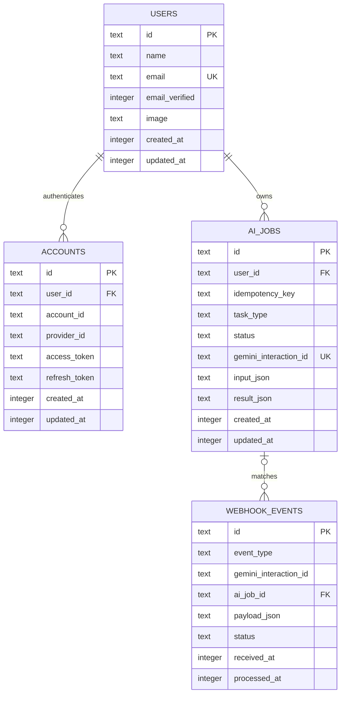
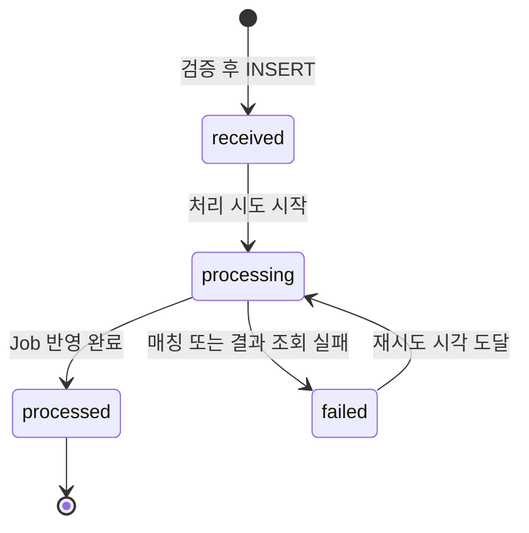

# Chaek Database Schema

Chaek은 Turso의 libSQL 데이터베이스와 Drizzle ORM을 사용한다. 현재 데이터 모델은 내부 사용자, 로그인 계정, Gemini Background Interaction 작업 상태, Gemini 웹훅의 중복 제거와 복구를 다루는 네 테이블로 구성된다.

이 문서의 기준 소스는 다음과 같다.

- Drizzle 스키마: `lib/db/schema`
- migrations: `drizzle/*.sql`
- DB 클라이언트: `lib/db/client.ts`

현재 스키마와 migration은 구현되어 있지만 인증 연동, AI Job Route Handler, Gemini 웹훅 Route Handler, reconciliation 작업은 아직 구현되지 않았다. 이 문서에서 설명하는 상태 전이와 처리 흐름 중 일부는 이후 애플리케이션 코드가 지켜야 할 규칙이다.

## Overview



관계의 핵심은 다음과 같다.

- 한 `users` 행은 여러 `accounts`를 가질 수 있다.
- 각 `accounts` 행은 Google 같은 외부 인증 계정 하나를 나타내며 반드시 한 사용자를 참조한다.
- 한 `users` 행은 여러 `ai_jobs`를 소유할 수 있다.
- 각 `ai_jobs` 행은 반드시 한 사용자를 참조한다.
- 한 `ai_jobs`에는 상태 변화와 재전송에 따라 여러 `webhook_events`가 연결될 수 있다.
- `webhook_events`는 아직 Job을 찾지 못한 상태로 먼저 저장될 수 있으므로 `ai_job_id`가 `NULL`일 수 있다.
- `ai_jobs.gemini_interaction_id`와 `webhook_events.gemini_interaction_id`는 DB 외래키가 아니라 Gemini가 발급한 외부 식별자를 통한 논리적 연결이다.

## Common conventions

### Identifiers

`users.id`, `accounts.id`, `ai_jobs.id`는 애플리케이션에서 `crypto.randomUUID()`로 생성하는 `TEXT` Primary Key다.

UUID 생성은 Drizzle의 `$defaultFn()`이 담당한다. 따라서 Drizzle을 거치지 않고 migration SQL이나 다른 SQL 클라이언트로 직접 `INSERT`할 때는 `id`를 명시해야 한다. DB migration 자체에는 UUID 생성 기본값이 없다.

`webhook_events.id`는 애플리케이션 UUID가 아니라 Gemini 웹훅 요청의 `webhook-id`를 그대로 사용한다. 이 값은 동일한 웹훅 재전송을 식별하는 멱등성 키다.

### Timestamps

모든 시각은 SQLite `INTEGER`에 Unix epoch milliseconds로 저장하고, Drizzle에서는 `timestamp_ms` 모드로 `Date`와 매핑한다.

```ts
integer("created_at", { mode: "timestamp_ms" });
```

`created_at`, `received_at` 등의 기본값은 DB의 `(unixepoch() * 1000)`을 사용한다. DB 자동 갱신 trigger는 없다. `users.updated_at`과 `accounts.updated_at`에는 Drizzle의 `$onUpdate()`가 설정되어 있지만 이는 Drizzle update 실행 시 동작하는 애플리케이션 레벨 기능이다. 직접 SQL을 실행하거나 다른 클라이언트를 사용하면 수정 코드가 `updated_at`을 함께 변경해야 한다.

### JSON

`input_json`, `result_json`, `usage_json`, `payload_json`은 SQLite에는 `TEXT`로 저장되고 Drizzle에서는 `text(..., { mode: "json" })`으로 직렬화된다.

현재 DB에는 `json_valid()` `CHECK` 제약이 없다. JSON 구조와 필수 속성은 Route Handler 또는 서비스 계층의 런타임 검증이 담당해야 한다.

### Naming

- DB 테이블과 컬럼은 `snake_case`를 사용한다.
- TypeScript 속성은 `camelCase`를 사용한다.
- Gemini가 발급한 외부 식별자에는 `gemini_` 접두사를 사용한다.
- 애플리케이션 내부 ID와 Gemini ID는 서로 대체하지 않는다.

## `users`

`users`는 로그인 방식과 독립적인 Chaek 내부 사용자를 나타낸다. AI Job을 비롯한 사용자 데이터는 외부 Google 계정이 아니라 안정적인 `users.id`를 소유자 ID로 사용한다.

### Columns

| Column           | Drizzle property | Required | Description                                                                 |
| ---------------- | ---------------- | -------- | --------------------------------------------------------------------------- |
| `id`             | `id`             | Yes      | Chaek 내부 사용자 UUID. `accounts.user_id`와 `ai_jobs.user_id`가 참조한다. |
| `name`           | `name`           | Yes      | UI에 표시할 사용자 이름. Google 프로필의 이름으로 최초 설정할 수 있다.     |
| `email`          | `email`          | Yes      | 사용자의 대표 이메일. 전체 사용자에서 고유하다.                            |
| `email_verified` | `emailVerified`  | Yes      | 인증 제공자가 이메일 소유권을 검증했는지 나타낸다. 기본값은 `false`다.     |
| `image`          | `image`          | No       | 사용자 프로필 이미지 URL.                                                   |
| `created_at`     | `createdAt`      | Yes      | 사용자 행이 생성된 시각.                                                    |
| `updated_at`     | `updatedAt`      | Yes      | 사용자 행이 마지막으로 수정된 시각.                                         |

`email`에는 unique index가 있다.

```text
UNIQUE (email)
```

현재 Google 로그인만 활성화할 예정이지만 이메일 문자열만으로 계정을 자동 병합하지 않는다. 계정 연결은 인증된 세션에서 명시적으로 수행해야 하며, 외부 identity 조회는 `accounts`를 사용한다.

## `accounts`

`accounts`는 사용자가 로그인할 때 사용하는 외부 인증 계정을 저장한다. 현재 애플리케이션에서 활성화할 `provider_id`는 `google` 하나지만, DB에는 provider별 `CHECK` 제약을 두지 않아 이후 다른 로그인 방식을 추가할 수 있다.

### Columns

| Column                     | Drizzle property       | Required | Description                                                                     |
| -------------------------- | ---------------------- | -------- | ------------------------------------------------------------------------------- |
| `id`                       | `id`                   | Yes      | Chaek 내부 계정 UUID.                                                           |
| `account_id`               | `accountId`            | Yes      | 인증 제공자가 발급한 계정 식별자. Google에서는 ID token의 `sub`에 해당한다.   |
| `provider_id`              | `providerId`           | Yes      | 인증 제공자 식별자. 현재 애플리케이션에서 사용하는 값은 `google`이다.         |
| `user_id`                  | `userId`               | Yes      | 계정이 연결된 `users.id`. 사용자 삭제 시 계정도 삭제된다.                     |
| `access_token`             | `accessToken`          | No       | provider access token. 클라이언트에 노출하지 않는 민감 정보다.                 |
| `refresh_token`            | `refreshToken`         | No       | provider refresh token. 클라이언트에 노출하지 않는 민감 정보다.                |
| `id_token`                 | `idToken`              | No       | OpenID Connect ID token.                                                        |
| `access_token_expires_at`  | `accessTokenExpiresAt` | No       | access token 만료 시각.                                                         |
| `refresh_token_expires_at` | `refreshTokenExpiresAt` | No       | refresh token 만료 시각.                                                       |
| `scope`                    | `scope`                | No       | provider에서 허용된 OAuth scope 문자열.                                        |
| `password`                 | `password`             | No       | Better Auth 호환 필드. Google 로그인만 사용하는 현재 단계에서는 항상 `NULL`. |
| `created_at`               | `createdAt`            | Yes      | 계정 연결이 생성된 시각.                                                       |
| `updated_at`               | `updatedAt`            | Yes      | 계정 정보가 마지막으로 수정된 시각.                                            |

외부 계정 identity는 다음 두 컬럼 조합으로 유일하다.

```text
UNIQUE (provider_id, account_id)
```

서로 다른 provider가 같은 account ID 문자열을 사용할 수 있으므로 `account_id` 하나만 고유키로 사용하지 않는다. 한 사용자는 여러 `accounts`를 가질 수 있지만, 동일한 외부 계정은 여러 Chaek 사용자에게 연결할 수 없다.

Google 로그인에서 의도한 조회 흐름은 다음과 같다.

```text
Google OAuth callback
  ├── provider_id = google
  └── account_id = Google ID token sub
                    │
                    ▼
accounts_provider_account_unique
                    │
                    ▼
accounts.user_id
                    │
                    ▼
users.id
                    │
                    ▼
ai_jobs.user_id
```

OAuth 토큰 컬럼은 인증 서버에서만 접근한다. Chaek가 Google API를 추가로 호출할 필요가 없다면 토큰 보관 범위를 인증 라이브러리 설정에서 최소화하고, 로그나 API 응답에 포함하지 않는다.

### Delete behavior

사용자를 삭제하면 연결된 `accounts`와 해당 사용자가 소유한 `ai_jobs`가 `ON DELETE CASCADE`로 삭제된다.

```text
DELETE users
  ├── CASCADE DELETE accounts
  └── CASCADE DELETE ai_jobs
```

Job과 연결된 `webhook_events`는 삭제되지 않고 `ai_job_id`만 `NULL`로 변경된다. 웹훅 payload는 Gemini Interaction ID와 상태를 담는 운영 이벤트이므로 Job 삭제 후에도 전달 이력을 보존한다.

## `ai_jobs`

`ai_jobs`는 클라이언트가 생성한 AI 요청부터 Gemini Background Interaction의 최종 결과까지 관리하는 애플리케이션 상태의 기준이다.

클라이언트는 Gemini Interaction ID가 아니라 `ai_jobs.id`를 사용해 작업을 조회한다.

### Identity and ownership columns

| Column                  | Drizzle property      | Required | Description                                                    |
| ----------------------- | --------------------- | -------- | -------------------------------------------------------------- |
| `id`                    | `id`                  | Yes      | Chaek 내부 AI Job UUID. 클라이언트에 노출하는 작업 식별자다.   |
| `user_id`               | `userId`              | Yes      | Job 소유자의 `users.id`. 사용자 삭제 시 Job도 삭제된다.        |
| `idempotency_key`       | `idempotencyKey`      | Yes      | 동일 사용자의 중복 작업 생성 요청을 막는 클라이언트 요청 키다. |
| `gemini_interaction_id` | `geminiInteractionId` | No       | Gemini가 Background Interaction 생성 시 반환하는 외부 ID다.    |

`user_id`와 `idempotency_key`는 함께 고유하다.

```text
UNIQUE (user_id, idempotency_key)
```

같은 사용자가 동일한 `Idempotency-Key`로 작업 생성을 다시 요청하면 새 Gemini Interaction을 만들지 않고 기존 Job을 반환해야 한다. 다른 사용자는 같은 문자열의 idempotency key를 사용할 수 있다.

`gemini_interaction_id`는 전체 테이블에서 고유하다.

```text
UNIQUE (gemini_interaction_id)
```

하나의 Gemini Interaction이 여러 Chaek Job에 연결되는 것을 방지한다. 이 컬럼은 Job이 DB에 먼저 생성되는 `queued` 단계에서는 `NULL`이고, Gemini가 Interaction ID를 반환한 뒤 채워진다. SQLite의 unique index는 `NULL`을 여러 행에 허용하므로 여러 `queued` Job을 동시에 만들 수 있다.

### Request and result columns

| Column            | Drizzle property | Required | Default              | Description                                                                |
| ----------------- | ---------------- | -------- | -------------------- | -------------------------------------------------------------------------- |
| `task_type`       | `taskType`       | Yes      | `content_generation` | AI 요청 종류. 현재 TypeScript에서 지원하는 기본 작업은 콘텐츠 생성 하나다. |
| `payload_version` | `payloadVersion` | Yes      | `1`                  | `input_json`과 `result_json` 계약의 버전이다.                              |
| `model`           | `model`          | Yes      | `gemini-3.6-flash`   | 실제 Job 실행에 사용한 Gemini 모델 기록이다.                               |
| `input_json`      | `inputJson`      | Yes      | -                    | 검증과 정규화를 마친 AI 요청 입력이다.                                     |
| `result_json`     | `resultJson`     | No       | `NULL`               | 완료된 AI 결과를 Chaek 도메인 형식으로 정규화한 값이다.                    |
| `usage_json`      | `usageJson`      | No       | `NULL`               | Gemini 토큰 사용량이다.                                                    |

`task_type`은 현재 TypeScript 타입에서 `content_generation`만 허용하지만 DB `CHECK` 제약은 없다. 이후 새로운 작업 종류를 추가할 때 DB 스키마 변경 없이 애플리케이션 타입과 검증 규칙을 확장할 수 있도록 한 결정이다.

`payload_version`은 1 이상이어야 한다.

```text
CHECK (payload_version >= 1)
```

`payload_version`은 Job 행 자체의 스키마 버전이 아니라 JSON payload 계약의 버전이다. 예를 들어 `content_generation`의 입력 필드가 변경되면 새로운 Job부터 버전을 올리고, 읽는 코드가 버전별 변환을 수행할 수 있다.

`result_json`에는 Gemini Interaction 원본 전체를 저장하지 않는다. 클라이언트가 사용할 결과만 정규화해서 저장한다. Gemini Interaction의 `steps` 구조가 바뀌어도 DB에 저장된 결과 계약이 직접 영향을 받지 않도록 하기 위함이다.

`usage_json`의 현재 TypeScript 구조는 다음 값을 선택적으로 보관한다.

| Property        | Description                |
| --------------- | -------------------------- |
| `inputTokens`   | 입력 토큰 수               |
| `outputTokens`  | 출력 토큰 수               |
| `cachedTokens`  | 캐시에서 사용된 토큰 수    |
| `thoughtTokens` | 모델 사고에 사용된 토큰 수 |
| `toolUseTokens` | 도구 사용에 관련된 토큰 수 |
| `totalTokens`   | 전체 토큰 수               |

### Status columns

| Column          | Drizzle property | Required | Default  | Description                                                         |
| --------------- | ---------------- | -------- | -------- | ------------------------------------------------------------------- |
| `status`        | `status`         | Yes      | `queued` | 클라이언트가 조회하는 현재 Job 상태다.                              |
| `error_stage`   | `errorStage`     | No       | `NULL`   | 실패가 발생한 처리 단계다.                                          |
| `error_code`    | `errorCode`      | No       | `NULL`   | 애플리케이션 또는 Gemini 오류 코드다.                               |
| `error_message` | `errorMessage`   | No       | `NULL`   | 운영과 디버깅용 오류 설명이다. 클라이언트에 그대로 노출하지 않는다. |

허용되는 Job 상태는 다음과 같다.

```text
queued
processing
requires_action
completed
failed
cancelled
incomplete
```


DB `CHECK` 제약은 허용된 상태 문자열만 검사한다. 위 전이 순서 자체는 DB가 강제하지 않으며 Job 서비스가 조건부 `UPDATE`로 보장해야 한다.

허용되는 `error_stage`는 다음과 같다.

| Value          | Description                                           |
| -------------- | ----------------------------------------------------- |
| `submission`   | Gemini Interaction 생성 요청 단계                     |
| `execution`    | Gemini Background Interaction 실행 단계               |
| `result_fetch` | 완료 웹훅 수신 후 `interactions.get()` 결과 조회 단계 |
| `webhook`      | 웹훅 검증, 저장 또는 매칭 단계                        |
| `internal`     | DB 처리 등 Chaek 내부 단계                            |

`submission_failed` 같은 상태를 별도로 두지 않고 `status = failed`, `error_stage = submission` 조합으로 표현한다.

### Lifecycle timestamps

| Column               | Drizzle property   | Required | Description                                               |
| -------------------- | ------------------ | -------- | --------------------------------------------------------- |
| `created_at`         | `createdAt`        | Yes      | DB에 Job이 처음 만들어진 시각이다.                        |
| `updated_at`         | `updatedAt`        | Yes      | 상태, 결과, 오류 등 Job이 마지막으로 변경된 시각이다.     |
| `submitted_at`       | `submittedAt`      | No       | Gemini Interaction ID를 받아 DB에 연결한 시각이다.        |
| `finished_at`        | `finishedAt`       | No       | Job이 terminal 상태에 도달한 시각이다.                    |
| `last_reconciled_at` | `lastReconciledAt` | No       | 서버가 Gemini에 현재 상태를 마지막으로 재조회한 시각이다. |

애플리케이션이 지켜야 할 컬럼 간 불변식은 다음과 같다. 현재 이 규칙들은 DB `CHECK`로 강제되지 않는다.

| Condition             | Expected columns                                                                                         |
| --------------------- | -------------------------------------------------------------------------------------------------------- |
| `status = queued`     | `gemini_interaction_id`와 `submitted_at`이 아직 `NULL`일 수 있다.                                        |
| `status = processing` | `gemini_interaction_id`와 `submitted_at`이 존재해야 한다.                                                |
| `status = completed`  | `result_json`과 `finished_at`이 존재해야 한다.                                                           |
| `status = failed`     | `error_stage`와 `finished_at`이 존재해야 하며, 가능한 경우 `error_code` 또는 `error_message`도 기록한다. |
| `status = cancelled`  | `finished_at`이 존재해야 한다.                                                                           |
| `status = incomplete` | 가능한 부분 결과가 있다면 `result_json`에 저장하고 `finished_at`을 기록한다.                             |

## `webhook_events`

`webhook_events`는 Gemini 웹훅 전달을 먼저 안전하게 보관하고 중복·실패·Job 매칭 경합을 흡수하는 inbox 테이블이다.

### Identity and matching columns

| Column                  | Drizzle property      | Required | Description                                                           |
| ----------------------- | --------------------- | -------- | --------------------------------------------------------------------- |
| `id`                    | `id`                  | Yes      | Gemini `webhook-id`. Primary Key이며 웹훅 전달 중복 제거 키다.        |
| `event_type`            | `eventType`           | Yes      | Gemini Interaction 이벤트 종류다.                                     |
| `event_version`         | `eventVersion`        | No       | Gemini 웹훅 envelope 버전이다.                                        |
| `gemini_interaction_id` | `geminiInteractionId` | Yes      | 이벤트가 가리키는 Gemini Interaction ID다.                            |
| `ai_job_id`             | `aiJobId`             | No       | 매칭된 `ai_jobs.id`. 아직 매칭되지 않았다면 `NULL`이다.               |
| `payload_json`          | `payloadJson`         | Yes      | 서명 검증을 통과한 웹훅 payload다. 서명이나 API 키는 저장하지 않는다. |

허용되는 `event_type`은 다음과 같다.

```text
interaction.requires_action
interaction.completed
interaction.failed
interaction.cancelled
```

`webhook_events.gemini_interaction_id`는 `ai_jobs.gemini_interaction_id`를 논리적으로 참조하지만 DB 외래키는 아니다. 웹훅이 먼저 도착하면 아직 일치하는 Job 행이 없을 수 있기 때문이다.

매칭 흐름은 다음과 같다.

```text
webhook_events.gemini_interaction_id
                │
                ▼
ai_jobs.gemini_interaction_id
                │
                ▼
webhook_events.ai_job_id = ai_jobs.id
```

Interaction ID로 Job을 찾지 못한 경우에도 웹훅 행을 삭제하지 않는다. `ai_job_id = NULL`, `status = received` 또는 `failed` 상태로 남겨 이후 reconciliation이 다시 매칭할 수 있어야 한다.

### Processing columns

| Column            | Drizzle property | Required | Default      | Description                                                             |
| ----------------- | ---------------- | -------- | ------------ | ----------------------------------------------------------------------- |
| `status`          | `status`         | Yes      | `received`   | Chaek 내부의 웹훅 처리 상태다. Gemini Interaction 상태와 다른 개념이다. |
| `attempt_count`   | `attemptCount`   | Yes      | `0`          | Chaek 내부에서 이벤트 처리를 시도한 횟수다.                             |
| `next_attempt_at` | `nextAttemptAt`  | No       | `NULL`       | 실패한 이벤트를 다시 처리할 수 있는 가장 이른 시각이다.                 |
| `last_error`      | `lastError`      | No       | `NULL`       | 가장 최근 웹훅 처리 오류다.                                             |
| `occurred_at`     | `occurredAt`     | No       | `NULL`       | Gemini payload에 기록된 이벤트 발생 시각이다.                           |
| `received_at`     | `receivedAt`     | Yes      | DB 현재 시각 | Chaek가 이벤트를 최초 수신한 시각이다.                                  |
| `processed_at`    | `processedAt`    | No       | `NULL`       | 이벤트 처리가 완료된 시각이다.                                          |
| `updated_at`      | `updatedAt`      | Yes      | DB 현재 시각 | 이벤트 처리 상태가 마지막으로 변경된 시각이다.                          |

웹훅 처리 상태는 다음과 같이 사용한다.



`attempt_count`는 음수가 될 수 없도록 DB `CHECK`가 적용되어 있다. 실제 처리 시도마다 증가시키고, 재시도가 필요하면 `next_attempt_at`과 `last_error`를 함께 갱신한다.

웹훅의 `status`는 전달된 Gemini Interaction 상태가 아니다.

```text
event_type = interaction.completed
status = received
```

위 조합은 “Gemini 작업은 완료되었고, Chaek는 완료 이벤트를 받았지만 아직 결과를 DB에 반영하지 않았다”는 의미다.

### Webhook idempotency

동일한 Gemini 웹훅이 재전송되면 같은 `webhook-id`가 다시 들어온다.

```text
INSERT webhook_events(id = webhook-id)
  ├── 성공: 최초 수신
  └── Primary Key 충돌: 이미 수신한 이벤트
```

Primary Key 충돌은 정상적인 중복 전달로 처리하고, 기존 이벤트 상태를 확인한 뒤 적절한 `2xx`를 반환해야 한다. 중복 이벤트 때문에 `attempt_count`를 무조건 증가시키거나 완료 Job을 다시 덮어쓰면 안 된다.

## Cross-table relationships

### Authentication identity

```text
users.id
   │
   └── accounts.user_id (NOT NULL, FK, ON DELETE CASCADE)
```

`users`는 Chaek 내부 정체성이고 `accounts`는 로그인 수단이다. Google callback에서 받은 외부 계정은 `(provider_id, account_id)`로 조회하며, 매칭된 `accounts.user_id`를 애플리케이션의 사용자 ID로 사용한다.

```sql
SELECT users.*
FROM accounts
JOIN users ON users.id = accounts.user_id
WHERE accounts.provider_id = :provider_id
  AND accounts.account_id = :account_id;
```

이메일이 같다는 사실만으로 기존 사용자와 새 Google 계정을 자동 연결하지 않는다. 기존 사용자에게 계정을 추가하는 기능은 로그인된 세션에서 별도의 계정 연결 절차로 구현해야 한다.

### User ownership

```text
users.id
   │
   └── ai_jobs.user_id (NOT NULL, FK, ON DELETE CASCADE)
```

모든 Job은 한 사용자를 소유자로 가져야 한다. 클라이언트 Job 조회는 Job ID만으로 수행하지 않고 인증된 사용자 ID를 함께 조건으로 사용해야 한다.

```sql
SELECT *
FROM ai_jobs
WHERE id = :job_id
  AND user_id = :authenticated_user_id;
```

### Request idempotency

```text
users.id
   │
   └── ai_jobs.user_id
           +
       ai_jobs.idempotency_key
           │
           ▼
UNIQUE (user_id, idempotency_key)
```

멱등성 범위는 사용자 단위다. 같은 사용자에게서 반복된 동일 요청은 한 Job으로 수렴하고, 서로 다른 사용자의 요청은 충돌하지 않는다.

### Gemini Interaction mapping

```text
ai_jobs.id                       Chaek 내부 ID
ai_jobs.gemini_interaction_id    Gemini 외부 ID
```

두 ID는 책임이 다르다.

- `ai_jobs.id`: 클라이언트 polling, 사용자 권한 검사, Chaek 내부 관계에 사용한다.
- `gemini_interaction_id`: 웹훅 매칭, `interactions.get()`, 취소 및 reconciliation에 사용한다.

클라이언트에 Gemini Interaction ID를 작업 조회 ID로 노출하지 않는다.

### Job and webhook matching

```text
webhook_events.gemini_interaction_id
                │ logical match
                ▼
ai_jobs.gemini_interaction_id
                │
                ▼
webhook_events.ai_job_id
```

`gemini_interaction_id`를 DB 외래키로 만들지 않고, 매칭 완료 후 내부 `ai_job_id` 외래키를 채운다. 이 구조는 Job 저장과 웹훅 도착 사이의 경합을 허용하면서, 매칭 이후에는 내부 관계를 명시적으로 남긴다.

### Delete propagation

```text
DELETE users
  ├── CASCADE DELETE accounts
  └── CASCADE DELETE ai_jobs
        └── SET NULL webhook_events.ai_job_id
```

인증 토큰을 포함할 수 있는 `accounts`와 사용자 입력·생성 결과를 가진 `ai_jobs`는 사용자와 함께 삭제된다. 웹훅 전달 이력은 남지만 더 이상 삭제된 Job을 참조하지 않는다.

## Indexes and query paths

### `users`

| Index                | Columns | Purpose                                         |
| -------------------- | ------- | ----------------------------------------------- |
| `users_email_unique` | `email` | 사용자 대표 이메일 중복을 데이터베이스에서 막는다. |

### `accounts`

| Index                              | Columns                     | Purpose                                                                  |
| ---------------------------------- | --------------------------- | ------------------------------------------------------------------------ |
| `accounts_provider_account_unique` | `provider_id`, `account_id` | 외부 계정 identity 중복 연결을 막고 OAuth callback에서 사용자를 찾는다. |
| `accounts_user_id_idx`             | `user_id`                   | 한 사용자에게 연결된 로그인 계정 목록을 조회한다.                       |

### `ai_jobs`

| Index                               | Columns                      | Purpose                                                                 |
| ----------------------------------- | ---------------------------- | ----------------------------------------------------------------------- |
| `ai_jobs_user_idempotency_unique`   | `user_id`, `idempotency_key` | 사용자별 중복 Job 생성을 방지한다.                                      |
| `ai_jobs_gemini_interaction_unique` | `gemini_interaction_id`      | 웹훅으로 Job을 찾고 Interaction 중복 연결을 방지한다.                   |
| `ai_jobs_user_created_at_idx`       | `user_id`, `created_at`      | 사용자의 Job 목록을 생성 시각 기준으로 조회한다.                        |
| `ai_jobs_status_updated_at_idx`     | `status`, `updated_at`       | 오래된 `queued` 또는 `processing` Job을 reconciliation 대상으로 찾는다. |

### `webhook_events`

| Index                                    | Columns                     | Purpose                                        |
| ---------------------------------------- | --------------------------- | ---------------------------------------------- |
| `webhook_events_gemini_interaction_idx`  | `gemini_interaction_id`     | Interaction별 웹훅 이력을 조회한다.            |
| `webhook_events_ai_job_idx`              | `ai_job_id`                 | 한 Job에 연결된 웹훅 이력을 조회한다.          |
| `webhook_events_status_next_attempt_idx` | `status`, `next_attempt_at` | 재처리가 필요한 이벤트를 스케줄 순서로 찾는다. |

## Intended data flow

다음 흐름은 현재 스키마가 지원하는 목표 구조이며 Route Handler와 서비스 코드는 아직 구현되지 않았다.

### 1. User synchronization

```text
Google OAuth callback
  ├── provider_id = google
  ├── account_id = Google sub
  └── verified profile
              │
              ▼
accounts 조회
  ├── 존재: 연결된 users 조회
  └── 없음: users + accounts 생성
              │
              ▼
users.id를 세션 사용자 ID로 사용
```

신규 사용자와 Google 계정 생성은 하나의 짧은 DB transaction으로 처리한다. 동일한 Google callback이 동시에 처리되더라도 `(provider_id, account_id)` unique index가 하나의 외부 계정만 생성되도록 보장한다.

### 2. Content generation request

```text
Client
  └── POST /api/ai/jobs
        ├── authenticated user
        ├── Idempotency-Key
        └── content generation input
                  │
                  ▼
ai_jobs INSERT
  ├── task_type = content_generation
  ├── status = queued
  └── user_id = users.id
                  │
                  ▼
Gemini interactions.create(background = true)
                  │
                  ▼
ai_jobs UPDATE
  ├── gemini_interaction_id
  ├── status = processing
  ├── submitted_at
  └── updated_at
```

DB 트랜잭션을 열어 둔 채 Gemini 외부 API를 호출하지 않는다. Job 생성과 Interaction ID 저장은 별도의 짧은 DB 작업으로 처리하고, 그 사이의 불일치는 웹훅 inbox와 reconciliation으로 복구한다.

### 3. Webhook completion

```text
Gemini
  └── interaction.completed
            │
            ▼
Webhook Route Handler
  ├── raw body 서명 검증
  ├── webhook-id 중복 확인
  └── webhook_events INSERT
            │
            ▼
ai_jobs lookup by gemini_interaction_id
            │
            ▼
Gemini interactions.get()
            │
            ▼
DB update
  ├── ai_jobs.status = completed
  ├── ai_jobs.result_json
  ├── ai_jobs.usage_json
  ├── ai_jobs.finished_at
  ├── webhook_events.ai_job_id
  └── webhook_events.status = processed
```

Gemini 웹훅은 최종 응답 전체가 아닌 Interaction ID 중심의 thin payload를 전달한다. `result_json`은 웹훅 payload를 그대로 복사하는 값이 아니라 `interactions.get()` 결과를 Chaek 형식으로 정규화한 값이다.

### 4. Reconciliation

```text
ai_jobs
  └── status in (queued, processing)
  └── updated_at < threshold
            │
            ▼
Gemini interactions.get(gemini_interaction_id)
            │
            ▼
실제 Gemini 상태로 ai_jobs 보정
```

```text
webhook_events
  └── status = failed
  └── next_attempt_at <= now
            │
            ▼
웹훅 이벤트 재처리
```

새 Gemini Interaction을 자동으로 만드는 재시도는 하지 않는다. reconciliation은 기존 `gemini_interaction_id`의 상태와 결과를 다시 확인하는 복구 절차다.

## Application-level rules

현재 DB 제약만으로는 다음 규칙을 보장하지 않는다. 이후 서비스와 Route Handler에서 명시적으로 구현해야 한다.

- 인증된 사용자의 `users.id`와 `ai_jobs.user_id`가 일치해야 한다.
- Google 로그인 callback은 `accounts.provider_id = 'google'`만 허용해야 한다.
- 외부 계정 조회는 이메일이 아니라 `(provider_id, account_id)`를 사용해야 한다.
- OAuth token과 ID token을 로그, 클라이언트 응답, AI 입력에 포함하지 않아야 한다.
- Job 생성 요청은 사용자별 `idempotency_key`를 사용해야 한다.
- `input_json`은 `task_type`과 `payload_version`에 맞게 런타임 검증해야 한다.
- `updated_at`은 모든 상태 변경과 결과 변경에서 함께 갱신해야 한다.
- terminal Job을 비terminal 상태로 되돌리지 않아야 한다.
- `completed` 처리와 웹훅 `processed` 처리는 가능한 한 하나의 짧은 DB transaction에서 함께 반영해야 한다.
- 웹훅 서명 검증 전에는 `webhook_events`에 신뢰된 이벤트로 저장하지 않아야 한다.
- Gemini 원본 오류와 `error_message`를 클라이언트에 그대로 노출하지 않아야 한다.
- 사용자 삭제 후 남은 `webhook_events.payload_json`의 보존 기간은 개인정보 정책이 정해지면 다시 검토해야 한다.

## Current boundaries

현재 포함된 범위:

- Turso/libSQL용 Drizzle 스키마
- 내부 사용자와 외부 로그인 계정 분리
- Google 로그인을 위한 account 및 OAuth token 필드
- 사용자 소유권
- 기본 `content_generation` 작업 타입
- Gemini Background Interaction 연결 필드
- AI Job 상태와 오류 모델
- 사용자 요청 멱등성
- 웹훅 inbox와 중복 제거
- reconciliation 조회를 위한 컬럼과 인덱스
- Drizzle migrations

현재 포함되지 않은 범위:

- Google OAuth와 세션 처리
- Better Auth 서버·클라이언트 설정
- 로그인, 로그아웃 및 callback Route Handler
- 사용자 upsert 서비스
- `content_generation` 입력·결과의 구체적인 런타임 스키마
- AI Job 생성·조회·취소 Route Handler
- Gemini 웹훅 서명 검증과 결과 조회
- Vercel Cron reconciliation
- 데이터 보존 기간과 자동 삭제
- 대화, 책, 문서 등 AI 결과가 귀속될 제품 도메인 테이블
