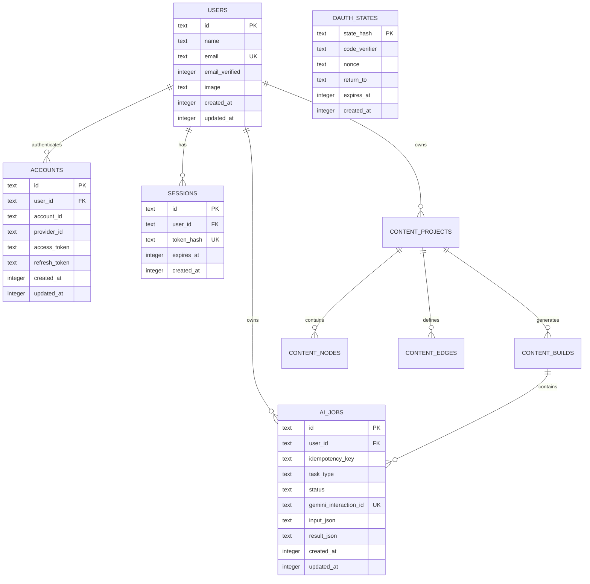
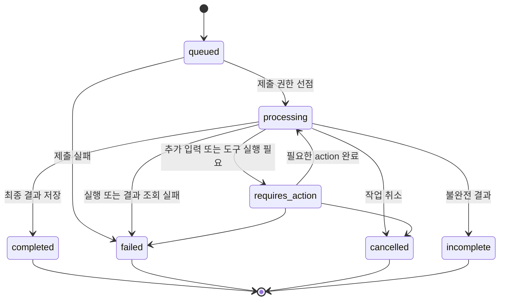

# Chaek Database Schema

Chaek은 Turso의 libSQL 데이터베이스와 Drizzle ORM을 사용한다. 현재 데이터 모델은 인증과 세션, Gemini Background Interaction, Content Project, Content Graph와 Build를 다루는 아홉 개 테이블로 구성된다.

이 문서의 기준 소스는 다음과 같다.

- Drizzle 스키마: `lib/db/schema`
- migrations: `drizzle/*.sql`
- DB 클라이언트: `lib/db/client.ts`

현재 스키마와 migration, Google OAuth, Chaek 세션, Brief/Graph Planning, 단일 Chapter Drafting AI Job과 Build Status 요청 기반 reconciliation이 구현되어 있다. Chapter 본문은 현재 `content_nodes.content_json`에 Structured JSON으로 직접 저장한다. Chapter Revision, Research, 전체 책 Build와 Review 관련 테이블은 아직 구현되지 않았다. Content Compiler의 상세 계약은 [`content-compiler-implementation-design.md`](./content-compiler-implementation-design.md)를 기준으로 한다.

## Overview



관계의 핵심은 다음과 같다.

- 한 `users` 행은 여러 `accounts`를 가질 수 있다.
- 각 `accounts` 행은 Google 같은 외부 인증 계정 하나를 나타내며 반드시 한 사용자를 참조한다.
- 한 `users` 행은 여러 `sessions`를 가질 수 있다.
- 각 `sessions` 행은 Chaek 브라우저 세션 하나를 나타내며 반드시 한 사용자를 참조한다.
- `oauth_states`는 아직 인증된 사용자가 없는 로그인 시작 단계를 저장하므로 `users`와 외래키 관계가 없다.
- 한 `users` 행은 여러 `ai_jobs`를 소유할 수 있다.
- 각 `ai_jobs` 행은 반드시 한 사용자를 참조한다.

## Common conventions

### Identifiers

`users.id`, `accounts.id`, `sessions.id`, `ai_jobs.id`는 애플리케이션에서 `crypto.randomUUID()`로 생성하는 `TEXT` Primary Key다.

UUID 생성은 Drizzle의 `$defaultFn()`이 담당한다. 따라서 Drizzle을 거치지 않고 migration SQL이나 다른 SQL 클라이언트로 직접 `INSERT`할 때는 `id`를 명시해야 한다. DB migration 자체에는 UUID 생성 기본값이 없다.

`oauth_states.state_hash`는 UUID가 아니라 로그인 시작 시 생성한 원본 OAuth `state`의 SHA-256 hash다. 원본은 브라우저의 짧은 HttpOnly cookie에만 저장한다.

### Timestamps

모든 시각은 SQLite `INTEGER`에 Unix epoch milliseconds로 저장하고, Drizzle에서는 `timestamp_ms` 모드로 `Date`와 매핑한다.

```ts
integer("created_at", { mode: "timestamp_ms" });
```

`created_at` 등의 기본값은 DB의 `(unixepoch() * 1000)`을 사용한다. DB 자동 갱신 trigger는 없다. `users.updated_at`과 `accounts.updated_at`에는 Drizzle의 `$onUpdate()`가 설정되어 있지만 이는 Drizzle update 실행 시 동작하는 애플리케이션 레벨 기능이다. 직접 SQL을 실행하거나 다른 클라이언트를 사용하면 수정 코드가 `updated_at`을 함께 변경해야 한다.

### JSON

`input_json`, `result_json`, `usage_json`, `brief_json`, `contract_json`, `content_json`은 SQLite에는 `TEXT`로 저장되고 Drizzle에서는 `text(..., { mode: "json" })`으로 직렬화된다.

현재 DB에는 `json_valid()` `CHECK` 제약이 없다. JSON 구조와 필수 속성은 Route Handler 또는 서비스 계층의 런타임 검증이 담당해야 한다.

### Naming

- DB 테이블과 컬럼은 `snake_case`를 사용한다.
- TypeScript 속성은 `camelCase`를 사용한다.
- Gemini가 발급한 외부 식별자에는 `gemini_` 접두사를 사용한다.
- 애플리케이션 내부 ID와 Gemini ID는 서로 대체하지 않는다.

## `users`

`users`는 로그인 방식과 독립적인 Chaek 내부 사용자를 나타낸다. AI Job을 비롯한 사용자 데이터는 외부 Google 계정이 아니라 안정적인 `users.id`를 소유자 ID로 사용한다.

### Columns

| Column           | Drizzle property | Required | Description                                                                 |
| ---------------- | ---------------- | -------- | --------------------------------------------------------------------------- |
| `id`             | `id`             | Yes      | Chaek 내부 사용자 UUID. `accounts.user_id`와 `ai_jobs.user_id`가 참조한다. |
| `name`           | `name`           | Yes      | UI에 표시할 사용자 이름. Google 프로필의 이름으로 최초 설정할 수 있다.     |
| `email`          | `email`          | Yes      | 사용자의 대표 이메일. 전체 사용자에서 고유하다.                            |
| `email_verified` | `emailVerified`  | Yes      | 인증 제공자가 이메일 소유권을 검증했는지 나타낸다. 기본값은 `false`다.     |
| `image`          | `image`          | No       | 사용자 프로필 이미지 URL.                                                   |
| `created_at`     | `createdAt`      | Yes      | 사용자 행이 생성된 시각.                                                    |
| `updated_at`     | `updatedAt`      | Yes      | 사용자 행이 마지막으로 수정된 시각.                                         |

`email`에는 unique index가 있다.

```text
UNIQUE (email)
```

현재 Google 로그인만 활성화할 예정이지만 이메일 문자열만으로 계정을 자동 병합하지 않는다. 계정 연결은 인증된 세션에서 명시적으로 수행해야 하며, 외부 identity 조회는 `accounts`를 사용한다.

## `accounts`

`accounts`는 사용자가 로그인할 때 사용하는 외부 인증 계정을 저장한다. 현재 애플리케이션에서 활성화할 `provider_id`는 `google` 하나지만, DB에는 provider별 `CHECK` 제약을 두지 않아 이후 다른 로그인 방식을 추가할 수 있다.

### Columns

| Column                     | Drizzle property       | Required | Description                                                                     |
| -------------------------- | ---------------------- | -------- | ------------------------------------------------------------------------------- |
| `id`                       | `id`                   | Yes      | Chaek 내부 계정 UUID.                                                           |
| `account_id`               | `accountId`            | Yes      | 인증 제공자가 발급한 계정 식별자. Google에서는 ID token의 `sub`에 해당한다.   |
| `provider_id`              | `providerId`           | Yes      | 인증 제공자 식별자. 현재 애플리케이션에서 사용하는 값은 `google`이다.         |
| `user_id`                  | `userId`               | Yes      | 계정이 연결된 `users.id`. 사용자 삭제 시 계정도 삭제된다.                     |
| `access_token`             | `accessToken`          | No       | provider access token. 클라이언트에 노출하지 않는 민감 정보다.                 |
| `refresh_token`            | `refreshToken`         | No       | provider refresh token. 클라이언트에 노출하지 않는 민감 정보다.                |
| `id_token`                 | `idToken`              | No       | OpenID Connect ID token.                                                        |
| `access_token_expires_at`  | `accessTokenExpiresAt` | No       | access token 만료 시각.                                                         |
| `refresh_token_expires_at` | `refreshTokenExpiresAt` | No       | refresh token 만료 시각.                                                       |
| `scope`                    | `scope`                | No       | provider에서 허용된 OAuth scope 문자열.                                        |
| `password`                 | `password`             | No       | Better Auth 호환 필드. Google 로그인만 사용하는 현재 단계에서는 항상 `NULL`. |
| `created_at`               | `createdAt`            | Yes      | 계정 연결이 생성된 시각.                                                       |
| `updated_at`               | `updatedAt`            | Yes      | 계정 정보가 마지막으로 수정된 시각.                                            |

외부 계정 identity는 다음 두 컬럼 조합으로 유일하다.

```text
UNIQUE (provider_id, account_id)
```

서로 다른 provider가 같은 account ID 문자열을 사용할 수 있으므로 `account_id` 하나만 고유키로 사용하지 않는다. 한 사용자는 여러 `accounts`를 가질 수 있지만, 동일한 외부 계정은 여러 Chaek 사용자에게 연결할 수 없다.

Google 로그인에서 의도한 조회 흐름은 다음과 같다.

```text
Google OAuth callback
  ├── provider_id = google
  └── account_id = Google ID token sub
                    │
                    ▼
accounts_provider_account_unique
                    │
                    ▼
accounts.user_id
                    │
                    ▼
users.id
                    │
                    ▼
ai_jobs.user_id
```

OAuth 토큰 컬럼은 인증 서버에서만 접근할 수 있는 구조지만, 현재 직접 구현한 Google 로그인은 Google API를 추가 호출하지 않으므로 토큰을 저장하지 않는다. callback은 검증된 ID token에서 사용자 정보를 읽은 뒤 token을 폐기하며 `access_token`, `refresh_token`, `id_token` 컬럼은 `NULL`로 유지한다.

### Delete behavior

사용자를 삭제하면 연결된 `accounts`, `sessions`, 해당 사용자가 소유한 `ai_jobs`가 `ON DELETE CASCADE`로 삭제된다.

```text
DELETE users
  ├── CASCADE DELETE accounts
  ├── CASCADE DELETE sessions
  └── CASCADE DELETE ai_jobs
```

## `sessions`

`sessions`는 Google OAuth 성공 후 Chaek가 발급하는 자체 로그인 세션을 저장한다. Google access token이나 ID token을 애플리케이션 세션으로 재사용하지 않는다.

### Columns

| Column        | Drizzle property | Required | Description                                                                        |
| ------------- | ---------------- | -------- | ---------------------------------------------------------------------------------- |
| `id`          | `id`             | Yes      | Chaek 내부 session UUID. 운영과 관리용 식별자이며 cookie에는 넣지 않는다.          |
| `user_id`     | `userId`         | Yes      | 인증된 `users.id`. 사용자 삭제 시 session도 삭제된다.                             |
| `token_hash`  | `tokenHash`      | Yes      | 브라우저에 발급한 원본 session token의 SHA-256 hash. 전체 session에서 고유하다.    |
| `expires_at`  | `expiresAt`      | Yes      | session이 유효한 마지막 시각. 현재 생성 시점부터 30일인 고정 만료 방식이다.        |
| `created_at`  | `createdAt`      | Yes      | session이 생성된 시각.                                                             |

원본 session token은 브라우저의 HttpOnly cookie에만 존재하고 DB에는 hash만 저장한다.

```text
Browser cookie: raw session token
                        │
                        ▼ SHA-256
DB sessions.token_hash: token hash
```

요청이 들어오면 cookie token을 서버에서 hash한 뒤 `token_hash`와 `expires_at`으로 조회한다. API 응답, 로그, URL에는 원본 token이나 hash를 포함하지 않는다.

현재 한 사용자에게 여러 session을 허용한다. 새 로그인은 동일 브라우저가 보내온 이전 session만 삭제하고 다른 기기의 session은 유지한다.

## `oauth_states`

`oauth_states`는 Google OAuth 로그인 시작부터 callback까지 필요한 일회용 서버 상태를 최대 10분 동안 보관한다. 아직 인증된 사용자가 없는 단계이므로 `users`와 외래키 관계를 만들지 않는다.

### Columns

| Column          | Drizzle property | Required | Description                                                                           |
| --------------- | ---------------- | -------- | ------------------------------------------------------------------------------------- |
| `state_hash`    | `stateHash`      | Yes      | 원본 OAuth `state`의 SHA-256 hash. Primary Key이며 callback 재생을 막는 일회용 키다.  |
| `code_verifier` | `codeVerifier`   | Yes      | PKCE token 교환에 필요한 원본 verifier. authorization 요청에는 challenge만 보낸다.  |
| `nonce`         | `nonce`          | Yes      | callback에서 받은 Google ID token과 로그인 시도를 연결한다.                          |
| `return_to`     | `returnTo`       | Yes      | 인증 성공 후 돌아갈 애플리케이션 내부 경로. 기본값은 `/`다.                          |
| `expires_at`    | `expiresAt`      | Yes      | 로그인 시도의 만료 시각.                                                              |
| `created_at`    | `createdAt`      | Yes      | 로그인 시도가 생성된 시각.                                                            |

callback은 URL의 원본 `state`와 브라우저의 HttpOnly state cookie를 먼저 비교하고, `state`를 hash해 DB 행을 찾는다. 일치한 행은 `DELETE ... RETURNING`으로 읽는 동시에 제거한다. 같은 callback을 두 번 재생하면 두 번째 요청에는 사용할 행이 없다.

`return_to`에는 애플리케이션 내부 상대 경로만 저장한다. 입력을 `AUTH_BASE_URL` 기준 URL로 해석한 뒤 origin이 정확히 같은지 확인하므로 외부 절대 URL, `//`로 시작하는 protocol-relative URL, `/\`처럼 URL parser가 외부 origin으로 해석하는 값은 `/`로 정규화한다.

## `ai_jobs`

`ai_jobs`는 클라이언트가 생성한 AI 요청부터 Gemini Background Interaction의 최종 결과까지 관리하는 애플리케이션 상태의 기준이다.

클라이언트는 Gemini Interaction ID가 아니라 `ai_jobs.id`를 사용해 작업을 조회한다.

### Identity and ownership columns

| Column                  | Drizzle property      | Required | Description                                                    |
| ----------------------- | --------------------- | -------- | -------------------------------------------------------------- |
| `id`                    | `id`                  | Yes      | Chaek 내부 AI Job UUID. 클라이언트에 노출하는 작업 식별자다.   |
| `user_id`               | `userId`              | Yes      | Job 소유자의 `users.id`. 사용자 삭제 시 Job도 삭제된다.        |
| `content_project_id`    | `contentProjectId`    | No       | Content Compiler Project 연결이다.                             |
| `content_build_id`      | `contentBuildId`      | No       | 여러 Job을 묶는 Content Build 연결이다.                        |
| `target_node_id`        | `targetNodeId`        | No       | Chapter 등 Node 단위 작업의 대상이다.                          |
| `idempotency_key`       | `idempotencyKey`      | Yes      | 동일 사용자의 중복 작업 생성을 막는 요청 키다.                 |
| `gemini_interaction_id` | `geminiInteractionId` | No       | Gemini가 Background Interaction 생성 시 반환하는 외부 ID다.    |

`user_id`와 `idempotency_key`는 함께 고유하다.

```text
UNIQUE (user_id, idempotency_key)
```

같은 사용자가 동일한 `Idempotency-Key`로 작업 생성을 다시 요청하면 새 Gemini Interaction을 만들지 않고 기존 Job을 반환해야 한다. 다른 사용자는 같은 문자열의 idempotency key를 사용할 수 있다.

`gemini_interaction_id`는 전체 테이블에서 고유하다.

```text
UNIQUE (gemini_interaction_id)
```

하나의 Gemini Interaction이 여러 Chaek Job에 연결되는 것을 방지한다. 이 컬럼은 Job이 DB에 먼저 생성되는 `queued` 단계에서는 `NULL`이고, Gemini가 Interaction ID를 반환한 뒤 채워진다. SQLite의 unique index는 `NULL`을 여러 행에 허용하므로 여러 `queued` Job을 동시에 만들 수 있다.

### Request and result columns

| Column               | Drizzle property    | Required | Default              | Description                                                                 |
| -------------------- | ------------------- | -------- | -------------------- | --------------------------------------------------------------------------- |
| `task_type`          | `taskType`          | Yes      | `content_generation` | AI 요청 종류다. Brief와 Graph Planning을 포함한 Compiler Pass를 구분한다.   |
| `payload_version`    | `payloadVersion`    | Yes      | `1`                  | `input_json`과 `result_json` 계약의 버전이다.                               |
| `model`              | `model`             | Yes      | `gemini-3.6-flash`   | 실제 Job 실행에 사용한 Gemini 모델 기록이다.                                |
| `input_json`         | `inputJson`         | Yes      | -                    | 검증과 정규화를 마친 AI 요청 입력이다.                                      |
| `result_json`        | `resultJson`        | No       | `NULL`               | 완료된 AI 결과를 Chaek 도메인 형식으로 정규화한 값이다.                     |
| `usage_json`         | `usageJson`         | No       | `NULL`               | Gemini 토큰 사용량이다.                                                     |
| `base_graph_version` | `baseGraphVersion`  | No       | `NULL`               | 결과가 만들어진 기준 Graph Version이다.                                    |
| `base_revision_id`   | `baseRevisionId`    | No       | `NULL`               | 이후 Chapter 작업에서 사용할 기준 Revision ID다.                           |
| `attempt_number`     | `attemptNumber`     | Yes      | `1`                  | 동일 논리 작업의 시도 번호다.                                               |
| `result_disposition` | `resultDisposition` | No       | `NULL`               | AI 실행 성공과 결과 적용 결과를 분리하는 값이다.                            |
| `applied_at`         | `appliedAt`         | No       | `NULL`               | 검증된 결과가 Content Project에 적용된 시각이다.                            |

현재 TypeScript가 허용하는 `task_type`은 `content_generation`, `brief_generation`, `graph_planning`, `graph_repair`, `node_research`, `node_drafting`, `node_review`, `project_review`, `node_revision`이다. 현재 실행 서비스는 이 중 `brief_generation`, `graph_planning`, `node_drafting`을 처리한다.

`payload_version`은 1 이상이어야 한다.

```text
CHECK (payload_version >= 1)
```

`payload_version`은 Job 행 자체의 스키마 버전이 아니라 JSON payload 계약의 버전이다. 예를 들어 `content_generation`의 입력 필드가 변경되면 새로운 Job부터 버전을 올리고, 읽는 코드가 버전별 변환을 수행할 수 있다.

`result_json`에는 Gemini Interaction 원본 전체를 저장하지 않는다. 클라이언트가 사용할 결과만 정규화해서 저장한다. Gemini Interaction의 `steps` 구조가 바뀌어도 DB에 저장된 결과 계약이 직접 영향을 받지 않도록 하기 위함이다.

`usage_json`의 현재 TypeScript 구조는 다음 값을 선택적으로 보관한다.

| Property        | Description                |
| --------------- | -------------------------- |
| `inputTokens`   | 입력 토큰 수               |
| `outputTokens`  | 출력 토큰 수               |
| `cachedTokens`  | 캐시에서 사용된 토큰 수    |
| `thoughtTokens` | 모델 사고에 사용된 토큰 수 |
| `toolUseTokens` | 도구 사용에 관련된 토큰 수 |
| `totalTokens`   | 전체 토큰 수               |

### Status columns

| Column          | Drizzle property | Required | Default  | Description                                                         |
| --------------- | ---------------- | -------- | -------- | ------------------------------------------------------------------- |
| `status`        | `status`         | Yes      | `queued` | 클라이언트가 조회하는 현재 Job 상태다.                              |
| `error_stage`   | `errorStage`     | No       | `NULL`   | 실패가 발생한 처리 단계다.                                          |
| `error_code`    | `errorCode`      | No       | `NULL`   | 애플리케이션 또는 Gemini 오류 코드다.                               |
| `error_message` | `errorMessage`   | No       | `NULL`   | 운영과 디버깅용 오류 설명이다. 클라이언트에 그대로 노출하지 않는다. |

허용되는 Job 상태는 다음과 같다.

```text
queued
processing
requires_action
completed
failed
cancelled
incomplete
```



DB `CHECK` 제약은 허용된 상태 문자열만 검사한다. 위 전이 순서 자체는 DB가 강제하지 않으며 Job 서비스가 조건부 `UPDATE`로 보장해야 한다.

허용되는 `error_stage`는 다음과 같다.

| Value          | Description                                           |
| -------------- | ----------------------------------------------------- |
| `submission`   | Gemini Interaction 생성 요청 단계                     |
| `execution`    | Gemini Background Interaction 실행 단계               |
| `result_fetch` | client polling에서 `interactions.get()` 결과 조회 단계 |
| `internal`     | DB 처리 등 Chaek 내부 단계                            |

`submission_failed` 같은 상태를 별도로 두지 않고 `status = failed`, `error_stage = submission` 조합으로 표현한다.

### Lifecycle timestamps

| Column               | Drizzle property   | Required | Description                                               |
| -------------------- | ------------------ | -------- | --------------------------------------------------------- |
| `created_at`         | `createdAt`        | Yes      | DB에 Job이 처음 만들어진 시각이다.                        |
| `updated_at`         | `updatedAt`        | Yes      | 상태, 결과, 오류 등 Job이 마지막으로 변경된 시각이다.     |
| `submitted_at`       | `submittedAt`      | No       | Gemini Interaction 제출을 시작한 시각이다.                |
| `finished_at`        | `finishedAt`       | No       | Job이 terminal 상태에 도달한 시각이다.                    |
| `last_reconciled_at` | `lastReconciledAt` | No       | 서버가 Gemini에 현재 상태를 마지막으로 재조회한 시각이다. |

애플리케이션이 지켜야 할 컬럼 간 불변식은 다음과 같다. 현재 이 규칙들은 DB `CHECK`로 강제되지 않는다.

| Condition             | Expected columns                                                                                         |
| --------------------- | -------------------------------------------------------------------------------------------------------- |
| `status = queued`     | `gemini_interaction_id`와 `submitted_at`이 아직 `NULL`일 수 있다.                                        |
| `status = processing` | `submitted_at`이 존재한다. 정상 제출 후에는 `gemini_interaction_id`도 존재하며, 없는 상태가 오래 지속되면 reconciliation이 제출 실패로 정리한다. |
| `status = completed`  | `result_json`과 `finished_at`이 존재해야 한다.                                                           |
| `status = failed`     | `error_stage`와 `finished_at`이 존재해야 하며, 가능한 경우 `error_code` 또는 `error_message`도 기록한다. |
| `status = cancelled`  | `finished_at`이 존재해야 한다.                                                                           |
| `status = incomplete` | 가능한 부분 결과가 있다면 `result_json`에 저장하고 `finished_at`을 기록한다.                             |

## Cross-table relationships

### Authentication identity

```text
users.id
   │
   └── accounts.user_id (NOT NULL, FK, ON DELETE CASCADE)
```

`users`는 Chaek 내부 정체성이고 `accounts`는 로그인 수단이다. Google callback에서 받은 외부 계정은 `(provider_id, account_id)`로 조회하며, 매칭된 `accounts.user_id`를 애플리케이션의 사용자 ID로 사용한다.

```sql
SELECT users.*
FROM accounts
JOIN users ON users.id = accounts.user_id
WHERE accounts.provider_id = :provider_id
  AND accounts.account_id = :account_id;
```

이메일이 같다는 사실만으로 기존 사용자와 새 Google 계정을 자동 연결하지 않는다. 기존 사용자에게 계정을 추가하는 기능은 로그인된 세션에서 별도의 계정 연결 절차로 구현해야 한다.

### Authentication session

```text
users.id
   │
   └── sessions.user_id (NOT NULL, FK, ON DELETE CASCADE)
```

Google callback이 외부 identity를 `users.id`로 해석한 뒤 Chaek session을 만든다. 브라우저는 원본 session token을 HttpOnly cookie로 가지고, 서버는 그 값을 SHA-256 hash해 `sessions.token_hash`를 조회한다.

`oauth_states`는 인증 이전의 임시 데이터이므로 사용자에 연결하지 않는다.

```text
OAuth 시작
  ├── raw state → browser HttpOnly cookie
  └── state hash + PKCE verifier + nonce → oauth_states
                                                │
                                                ▼ callback에서 1회 소비
Google identity → accounts → users → sessions
```

### User ownership

```text
users.id
   │
   └── ai_jobs.user_id (NOT NULL, FK, ON DELETE CASCADE)
```

모든 Job은 한 사용자를 소유자로 가져야 한다. 클라이언트 Job 조회는 Job ID만으로 수행하지 않고 인증된 사용자 ID를 함께 조건으로 사용해야 한다.

```sql
SELECT *
FROM ai_jobs
WHERE id = :job_id
  AND user_id = :authenticated_user_id;
```

### Request idempotency

```text
users.id
   │
   └── ai_jobs.user_id
           +
       ai_jobs.idempotency_key
           │
           ▼
UNIQUE (user_id, idempotency_key)
```

멱등성 범위는 사용자 단위다. 같은 사용자에게서 반복된 동일 요청은 한 Job으로 수렴하고, 서로 다른 사용자의 요청은 충돌하지 않는다.

### Gemini Interaction mapping

```text
ai_jobs.id                       Chaek 내부 ID
ai_jobs.gemini_interaction_id    Gemini 외부 ID
```

두 ID는 책임이 다르다.

- `ai_jobs.id`: 클라이언트 polling, 사용자 권한 검사, Chaek 내부 관계에 사용한다.
- `gemini_interaction_id`: `interactions.get()`, 취소 및 request-driven reconciliation에 사용한다.

클라이언트에 Gemini Interaction ID를 작업 조회 ID로 노출하지 않는다.

### Delete propagation

```text
DELETE users
  ├── CASCADE DELETE accounts
  ├── CASCADE DELETE sessions
  └── CASCADE DELETE ai_jobs
```

외부 로그인 연결인 `accounts`, 활성 로그인인 `sessions`, 사용자 입력·생성 결과를 가진 `ai_jobs`는 사용자와 함께 삭제된다. `oauth_states`는 사용자와 무관한 짧은 일회용 데이터이므로 별도의 만료 정리 대상이다.

## Indexes and query paths

### `users`

| Index                | Columns | Purpose                                         |
| -------------------- | ------- | ----------------------------------------------- |
| `users_email_unique` | `email` | 사용자 대표 이메일 중복을 데이터베이스에서 막는다. |

### `accounts`

| Index                              | Columns                     | Purpose                                                                  |
| ---------------------------------- | --------------------------- | ------------------------------------------------------------------------ |
| `accounts_provider_account_unique` | `provider_id`, `account_id` | 외부 계정 identity 중복 연결을 막고 OAuth callback에서 사용자를 찾는다. |
| `accounts_user_id_idx`             | `user_id`                   | 한 사용자에게 연결된 로그인 계정 목록을 조회한다.                       |

### `sessions`

| Index                        | Columns      | Purpose                                                        |
| ---------------------------- | ------------ | -------------------------------------------------------------- |
| `sessions_token_hash_unique` | `token_hash` | cookie token hash로 session을 조회하고 중복 token을 막는다.    |
| `sessions_user_id_idx`       | `user_id`    | 사용자의 session 목록과 전체 기기 로그아웃을 지원한다.         |
| `sessions_expires_at_idx`    | `expires_at` | 만료된 session을 정리한다.                                     |

### `oauth_states`

| Index                         | Columns      | Purpose                                               |
| ----------------------------- | ------------ | ----------------------------------------------------- |
| Primary Key                   | `state_hash` | callback에서 OAuth 상태를 한 번만 소비한다.           |
| `oauth_states_expires_at_idx` | `expires_at` | 완료되지 않고 만료된 로그인 시도를 정리한다.          |

### `ai_jobs`

| Index                               | Columns                      | Purpose                                                                 |
| ----------------------------------- | ---------------------------- | ----------------------------------------------------------------------- |
| `ai_jobs_user_idempotency_unique`   | `user_id`, `idempotency_key` | 사용자별 중복 Job 생성을 방지한다.                                      |
| `ai_jobs_gemini_interaction_unique` | `gemini_interaction_id`      | polling 대상 Interaction의 중복 연결을 방지한다.                       |
| `ai_jobs_user_created_at_idx`       | `user_id`, `created_at`      | 사용자의 Job 목록을 생성 시각 기준으로 조회한다.                        |
| `ai_jobs_status_updated_at_idx`     | `status`, `updated_at`       | 오래된 `queued` 또는 `processing` Job을 reconciliation 대상으로 찾는다. |
| `ai_jobs_content_project_idx`       | `content_project_id`         | Project에 연결된 Compiler Job을 조회한다.                               |
| `ai_jobs_content_build_idx`         | `content_build_id`           | Build 진행 상태를 구성하는 Job을 조회한다.                              |
| `ai_jobs_target_node_idx`           | `target_node_id`             | 이후 Node 단위 작업 이력을 조회한다.                                    |

## Intended data flow

인증 흐름, Content Graph Planning과 단일 Chapter Drafting 흐름은 Route Handler와 서비스 코드까지 구현되어 있다. 아래 AI 흐름은 현재 실행 경로다.

### 1. User synchronization

```text
Google OAuth callback
  ├── provider_id = google
  ├── account_id = Google sub
  └── verified profile
              │
              ▼
accounts 조회
  ├── 존재: 연결된 users 조회
  └── 없음: users + accounts 생성
              │
              ▼
Chaek session 생성
  ├── raw token → HttpOnly cookie
  └── token hash + users.id → sessions
```

신규 사용자와 Google 계정 생성은 하나의 짧은 DB transaction으로 처리한다. 동일한 Google callback이 동시에 처리되더라도 `(provider_id, account_id)` unique index가 하나의 외부 계정만 생성되도록 보장한다.

### 2. Content generation request

```text
Client
  └── POST /api/content-projects
        ├── authenticated user
        ├── Idempotency-Key
        └── seedInput
                  │
                  ▼
content_projects + content_builds + ai_jobs INSERT
  ├── task_type = brief_generation
  ├── build.phase = interpreting
  └── user_id = users.id
                  │
                  ▼
ai_jobs UPDATE
  ├── status = processing
  └── submitted_at
                  │
                  ▼
Gemini interactions.create(background = true)
                  │
                  ▼
ai_jobs UPDATE
  ├── gemini_interaction_id
  └── updated_at
```

DB 트랜잭션을 열어 둔 채 Gemini 외부 API를 호출하지 않는다. Job 생성과 Interaction ID 저장은 별도의 짧은 DB 작업으로 처리한다.

### 3. Client polling completion

```text
Client
  └── GET /api/content-projects/{projectId}/builds/{buildId}
            │
            ▼
Build 소유권 확인
            │
            ▼
reconcileContentBuild(buildId)
  └── 마지막 조회 후 5초 이상 지난 nonterminal ai_jobs 조회
            │
            ▼
Gemini interactions.get(gemini_interaction_id)
            │
            ▼
DB update
  ├── ai_jobs.status = completed
  ├── ai_jobs.result_json
  ├── ai_jobs.usage_json
  └── ai_jobs.finished_at
```

`result_json`은 `interactions.get()` 결과를 Chaek 형식으로 정규화한 값이다. Client는 nonterminal Build를 polling하고, 탭이 중지되었다가 다시 활성화되면 같은 Build Status API를 즉시 다시 호출한다. 그동안 Gemini가 완료되었다면 복귀 시점의 요청이 결과를 DB에 반영한다. 아직 제출되지 않은 `queued` Job은 이 request-driven reconciliation이 제출할 수 있고, `gemini_interaction_id`가 저장된 Job은 새 Interaction을 만들지 않고 기존 Interaction을 조회한다.

### 4. Single Chapter generation

```text
Client
  └── POST /api/content-projects/{projectId}/nodes/{nodeId}/generate
            │
            ▼
content_builds + ai_jobs INSERT
  ├── scope_type = chapter
  ├── scope_node_id = selected Chapter
  └── task_type = node_drafting
            │
            ▼
Gemini Structured Output
            │
            ▼ client polling reconciliation
ChapterContentResult runtime validation
  ├── baseGraphVersion 일치 확인
  ├── content_nodes.content_json 저장
  ├── editorial_status = ready
  └── Build completed
```

현재 Chapter 본문 저장은 Revision 도입 전 baseline이다. Google Search Grounding, Citation, 사용자 편집과 Revision Apply Gate는 포함하지 않는다.

## Application-level rules

현재 DB 제약만으로는 다음 규칙을 모두 보장하지 않는다. 인증과 현재 AI 관련 규칙은 서비스와 Route Handler에도 명시적으로 구현되어 있다.

- 인증된 사용자의 `users.id`와 `ai_jobs.user_id`가 일치해야 한다.
- Google 로그인 callback은 `accounts.provider_id = 'google'`만 허용해야 한다.
- 외부 계정 조회는 이메일이 아니라 `(provider_id, account_id)`를 사용해야 한다.
- 같은 이메일을 발견했다는 이유만으로 새 Google identity를 기존 사용자에 자동 연결하지 않아야 한다.
- OAuth `state`는 만료 전에 한 번만 사용할 수 있어야 한다.
- ID token의 서명, issuer, audience, expiry, nonce, subject, 검증된 이메일을 확인해야 한다.
- 원본 session token은 HttpOnly cookie에만 저장하고 DB에는 hash만 저장해야 한다.
- OAuth token과 ID token을 DB, 로그, 클라이언트 응답, AI 입력에 포함하지 않아야 한다.
- Job 생성 요청은 사용자별 `idempotency_key`를 사용해야 한다.
- `input_json`은 `task_type`과 `payload_version`에 맞게 런타임 검증해야 한다.
- `updated_at`은 모든 상태 변경과 결과 변경에서 함께 갱신해야 한다.
- terminal Job을 비terminal 상태로 되돌리지 않아야 한다.
- 같은 완료 결과를 반복 조회해도 결과 적용과 다음 Job 생성은 한 번만 일어나야 한다.
- Gemini 원본 오류와 `error_message`를 클라이언트에 그대로 노출하지 않아야 한다.

## Current boundaries

현재 포함된 범위:

- Turso/libSQL용 Drizzle 스키마
- 내부 사용자와 외부 로그인 계정 분리
- Google 로그인을 위한 account 필드
- Authorization Code Flow, PKCE, state, nonce
- Google ID token 검증과 사용자 동기화
- Chaek 자체 opaque session과 로그아웃
- 사용자 소유권
- 기본 `content_generation` 작업 타입
- Brief Generation과 Graph Planning 작업 타입
- 단일 Chapter `node_drafting` 작업 타입과 Structured Output 저장
- Gemini Background Interaction 연결 필드
- AI Job 상태와 오류 모델
- 사용자 요청 멱등성
- client polling과 request-driven reconciliation을 위한 컬럼과 인덱스
- Content Project, Node, Edge와 Build
- Content Graph 소유권과 Project 생성 멱등성
- AI Job과 Project, Build, Target Node 연결
- `content_nodes.content_json` Chapter 본문 필드
- `/content` 사용자 화면과 Chapter 생성·읽기 흐름
- Drizzle migrations

현재 포함되지 않은 범위:

- Better Auth 서버·클라이언트 설정
- 실제 Google credential을 이용한 end-to-end 로그인 검증
- 계정 명시적 연결·해제와 모든 기기 로그아웃
- session rotation과 주기적인 만료 데이터 정리
- 일반 목적 AI Job 생성·취소 Route Handler
- Scheduled reconciliation
- 데이터 보존 기간과 자동 삭제
- Chapter Revision, Research Source, Issue와 Review 테이블
- Google Search Grounding과 Citation
