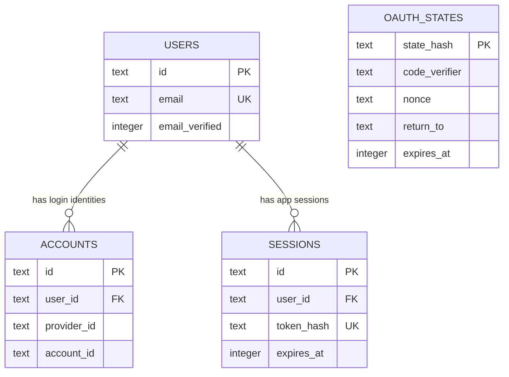
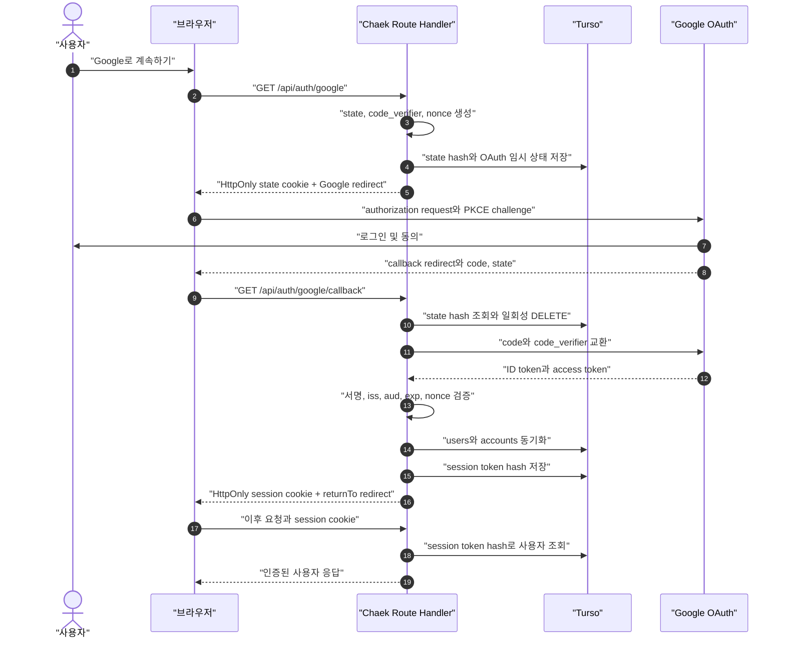

# Google OAuth 직접 구현 종합 가이드

Chaek은 Google OpenID Connect의 Authorization Code Flow를 직접 구현한다. 현재 목표는 Google API를 대신 호출하는 것이 아니라 Google 계정으로 사용자를 인증하고, 그 외부 identity를 Chaek 내부 사용자로 연결한 뒤, Chaek 자체 세션을 발급하는 것이다.

각 설계가 필요한 이유와 처음 등장하는 용어의 의미는 보충 문서인 [`google-oauth-why-and-terms.md`](./google-oauth-why-and-terms.md)에서 설명한다.

이 문서는 다음 네 가지 질문에 답하는 구현의 기준 문서다.

1. 이 기능을 이해하려면 어떤 인증 배경지식이 필요한가?
2. 어떤 설계 결정을 내렸고, 왜 그렇게 결정했는가?
3. 어떤 순서와 파일 구조로 구현했는가?
4. 브라우저, Chaek, Google, Turso 사이에서 실제 요청과 데이터가 어떻게 이동하는가?

구현의 기준 소스는 다음과 같다.

- 인증 설정과 암호 유틸리티: [`config.ts`](../lib/auth/config.ts), [`crypto.ts`](../lib/auth/crypto.ts)
- Google OAuth 처리: [`google.ts`](../lib/auth/google.ts), [`google-account.ts`](../lib/auth/google-account.ts)
- 일회용 OAuth 상태: [`oauth-state.ts`](../lib/auth/oauth-state.ts)
- Chaek 세션: [`session.ts`](../lib/auth/session.ts)
- Route Handlers: [`app/api/auth`](../app/api/auth)
- 로그인 화면과 작업 복귀: [`app/sign-in/page.tsx`](../app/sign-in/page.tsx)
- 데이터베이스 스키마: [`oauth-states.ts`](../lib/db/schema/oauth-states.ts), [`sessions.ts`](../lib/db/schema/sessions.ts)

Google의 현재 OpenID Connect discovery 문서에 정의된 authorization endpoint, token endpoint, JWKS endpoint를 사용한다. Authorization Code 교환에는 PKCE `S256`을 추가하고, `state`와 `nonce`를 각각 다른 공격 경계에 사용한다. 자세한 provider 계약은 [Google OpenID Connect reference](https://developers.google.com/identity/openid-connect/reference)와 [Google OAuth 2.0 web server applications guide](https://developers.google.com/identity/protocols/oauth2/web-server)를 기준으로 한다.

## 문서 범위와 학습 목표

현재 구현에 포함된 기능은 다음과 같다.

- Google 로그인 시작
- Authorization Code Flow와 PKCE
- `state`를 이용한 OAuth 요청과 callback의 연결
- `nonce`를 이용한 ID token 재사용 방어
- Google 공개키를 이용한 ID token 서명·claim 검증
- `users`와 `accounts` 동기화
- Chaek 자체 opaque session 생성·조회·삭제
- `GET /api/auth/session`을 통한 현재 사용자 조회
- `POST /api/auth/logout`을 통한 로그아웃
- `/sign-in`의 성공·취소·실패·만료 상태 처리
- 로그인 전 작업 URL을 보존하는 안전한 `returnTo`
- `/content`의 인증 계정 menu와 로그아웃 진입점
- 작업 중 session 만료 시 현재 URL을 보존한 재로그인

현재 Google scope는 `openid email profile`뿐이다. Gmail, Drive, Calendar 같은 Google API 권한은 요청하지 않으며, token endpoint가 반환한 access token도 저장하지 않는다.

이 문서를 읽은 뒤에는 다음 경계를 구분할 수 있어야 한다.

- OAuth 2.0과 OpenID Connect의 역할 차이
- authorization code, ID token, access token, Chaek session token의 차이
- `state`, PKCE, `nonce`가 각각 막는 공격의 차이
- Google의 외부 identity와 Chaek의 내부 사용자가 분리되어야 하는 이유
- 브라우저에 저장하는 값과 DB에 저장하는 값의 차이
- 인증과 사용자 데이터 authorization이 별개의 검사인 이유

## 인증 vertical slice

인증은 OAuth callback 하나가 성공하는 것으로 끝나지 않는다. Chaek의 인증 vertical slice는 사용자가 비로그인 상태에서 작업을 시작해 로그인하고, 원래 위치로 돌아오며, session이 만료되거나 로그아웃할 때까지의 상태 전이를 하나의 기능 단위로 정의한다.

| 시나리오 | 시작 상태 | 사용자 행동 또는 사건 | 기대 결과 |
| --- | --- | --- | --- |
| 비로그인 콘텐츠 진입 | session 없음 | `/content` 확인 | 콘텐츠 입력은 볼 수 있고 생성 action은 `/sign-in?returnTo=/content`로 연결 |
| 직접 로그인 진입 | session 없음 | `/sign-in` 확인 | 단일 Google 로그인 action과 허용된 오류만 표시 |
| OAuth 성공 | 유효한 일회용 state | Google 인증 완료 | 내부 사용자 동기화, Chaek session 발급, 안전한 `returnTo`로 복귀 |
| OAuth 취소·실패 | OAuth 진행 중 | 취소, state 오류, 계정 충돌, provider 실패 | 오류 code와 `returnTo`를 `/sign-in`으로 전달하고 같은 작업으로 재시도 가능 |
| 이미 로그인됨 | 유효한 session | `/sign-in` 진입 | 로그인 화면을 다시 보여주지 않고 안전한 `returnTo`로 이동 |
| session 만료 | 열린 `/content`에서 session 만료 | 보호 API가 `401` 반환 | 현재 path·query·hash를 보존해 `session_expired` 상태로 `/sign-in` 이동 |
| 로그아웃 | 유효한 session | 계정 menu에서 로그아웃 | strict Origin을 확인한 POST로 DB session과 cookie를 제거한 뒤 `/sign-in` 이동 |
| 보호 API 접근 | session 있음 또는 없음 | project, build, Chapter API 호출 | `requireUser()`와 `resource.user_id` 조건을 모두 통과한 사용자 데이터만 응답 |

`returnTo`는 일반 navigation 값이 아니라 인증 상태 전이의 일부다. URL parser로 해석한 origin이 `AUTH_BASE_URL`과 정확히 같은 내부 경로만 허용한다. `/sign-in`과 `/api/auth/*`는 post-login 목적지에서 제외해 로그인 성공 후 인증 화면으로 되돌아가는 loop를 막는다.

이 slice는 사용자에게 보이는 인증 흐름과 애플리케이션의 session·authorization 경계를 포함한다. 분산 rate limiting, 보안 이벤트 집계, 정기 cleanup은 여러 instance가 공유해야 하는 운영 통제이므로 별도의 배포 계층 책임으로 둔다.

## 배경지식

### 인증과 인가

인증(authentication)은 “누구인가?”를 확인하는 과정이고, 인가(authorization)는 “그 사용자가 이 데이터나 행동에 접근해도 되는가?”를 결정하는 과정이다.

Google 로그인은 사용자의 identity를 확인하는 인증 수단이다. Google 로그인이 성공했다는 사실만으로 모든 `ai_jobs`를 읽을 권한이 생기지는 않는다. AI Job Route Handler는 인증된 `users.id`와 `ai_jobs.user_id`가 일치하는지도 별도로 검사해야 한다.

```text
Authentication
Google identity → accounts → users.id

Authorization
users.id == ai_jobs.user_id ?
```

### OAuth 2.0과 OpenID Connect

OAuth 2.0은 원래 사용자가 어떤 서비스의 API 접근 권한을 다른 애플리케이션에 위임하기 위한 프로토콜이다. OAuth의 대표 결과물인 access token은 API 호출 권한을 나타낸다.

OpenID Connect는 OAuth 2.0 위에 identity 계층을 추가한다. `openid` scope를 요청하면 provider가 사용자의 인증 결과를 담은 ID token을 반환한다. Chaek의 현재 목적은 Google API 위임이 아니라 로그인 사용자 식별이므로 핵심 결과물은 access token이 아니라 검증된 ID token이다.

| 구분 | OAuth 2.0 | OpenID Connect |
| --- | --- | --- |
| 주된 질문 | “이 앱이 어떤 API를 호출해도 되는가?” | “현재 로그인한 사용자는 누구인가?” |
| 대표 결과물 | Access token | ID token |
| Chaek의 현재 사용 | Google API를 호출하지 않으므로 사용하지 않음 | Google 사용자를 식별하는 데 사용 |
| 현재 scope | OpenID Connect의 기반으로만 사용 | `openid email profile` |

### 참여자

현재 흐름에는 네 주체가 참여한다.

| 주체 | 역할 |
| --- | --- |
| 사용자와 브라우저 | 로그인 시작, Google 인증, Chaek cookie 보관 |
| Chaek Route Handler | OAuth 요청 생성, callback 검증, 내부 세션 발급 |
| Google OAuth | 사용자 인증, authorization code와 ID token 발급 |
| Turso | OAuth 임시 상태, 사용자, 외부 계정, Chaek session 저장 |

Chaek는 Google OAuth의 confidential client다. `GOOGLE_OAUTH_CLIENT_SECRET`, PKCE verifier, Google token은 모두 서버에서만 다루며 Client Component나 브라우저 JavaScript에 전달하지 않는다.

### Authorization Code Flow

브라우저가 Google에서 직접 token을 받아 Chaek에 전달하는 방식이 아니라, Google은 먼저 수명이 짧고 한 번만 교환할 수 있는 authorization code를 Chaek callback으로 보낸다. Chaek 서버가 그 code를 Google token endpoint에서 ID token으로 교환한다.

```text
Browser
  └── Google authorization endpoint
            │
            └── short-lived authorization code
                          │
                          ▼
                    Chaek callback
                          │
                          └── server-to-server token exchange
                                        │
                                        ▼
                                   Google ID token
```

이 방식의 중요한 경계는 Google client secret과 token 교환이 브라우저가 아니라 서버에서 이루어진다는 점이다.

### Authorization code, ID token, access token, session token

네 값은 생김새가 비슷해 보여도 책임이 다르다.

| 값 | 발급자 | 수신자 | 용도 | 현재 저장 여부 |
| --- | --- | --- | --- | --- |
| Authorization code | Google | Chaek callback | ID token으로 한 번 교환 | 저장하지 않음 |
| ID token | Google | Chaek 서버 | Google identity 검증 | 저장하지 않음 |
| Access token | Google | Chaek 서버 | Google API 호출 권한 | 사용·저장하지 않음 |
| Chaek session token | Chaek | 사용자 브라우저 | 이후 Chaek 요청 인증 | 원본은 cookie, hash는 DB |

Google ID token을 Chaek session으로 그대로 사용하지 않는다. Google token은 외부 provider의 인증 결과이고, Chaek session은 애플리케이션이 수명과 폐기를 통제하는 내부 로그인 상태다.

### `state`, PKCE, `nonce`

세 값은 모두 로그인 시작 시 생성되지만 서로 대체할 수 없다.

| 장치 | 연결하는 대상 | 방어 대상 | 검증 위치 |
| --- | --- | --- | --- |
| `state` | 로그인 시작 요청 ↔ callback | Login CSRF, callback 위조·혼동 | callback query, cookie, DB |
| PKCE | authorization request ↔ code 교환 | 탈취된 authorization code의 단독 사용 | Google token endpoint |
| `nonce` | 로그인 시작 요청 ↔ ID token | 다른 로그인 시도의 ID token 재사용 | ID token claim |

`state`가 맞아도 PKCE verifier가 없으면 code를 교환할 수 없어야 하고, code 교환이 성공해도 ID token의 `nonce`가 다르면 인증을 중단해야 한다.

### ID token과 JWT 검증

ID token은 JWT 형식이지만, JWT payload를 Base64 decode하는 것만으로는 진위를 확인할 수 없다. Chaek은 `jose`의 `createRemoteJWKSet()`으로 Google 공개키 집합을 사용하고 `jwtVerify()`로 서명과 표준 claim을 검증한다.

`jwtVerify()`에는 허용 알고리즘, issuer, audience를 명시한다. `azp`, `nonce`, `sub`, `email`, `email_verified`처럼 Chaek의 로그인 계약에 필요한 추가 claim은 검증 이후 애플리케이션 코드가 확인한다.

### 자체 opaque session

OAuth callback이 끝날 때마다 Chaek가 별도의 고엔트로피 무작위 token을 만든다. 이 token 자체에는 사용자 ID나 만료 시각 같은 정보를 넣지 않는다. 의미 없는 불투명 값이므로 opaque session이라고 부른다.

```text
raw session token
  ├── Browser: HttpOnly cookie
  └── Server: SHA-256 → sessions.token_hash
```

요청마다 cookie token을 hash해 DB를 조회해야 하지만, 서버가 session을 즉시 삭제할 수 있고 원본 token을 DB에 남기지 않는다는 장점이 있다. 현재 트래픽과 제품 단계에서는 이 단순성과 폐기 가능성을 stateless session JWT보다 우선한다.

### 외부 identity와 내부 사용자

Google의 `sub`는 Google provider 안에서 사용자를 식별하는 안정적인 subject다. 그러나 AI Job 같은 Chaek 데이터가 Google `sub`를 직접 소유하면 provider 교체나 추가가 어려워진다.

그래서 identity를 두 단계로 나눈다.

```text
Google ID token sub
        │
        ▼
accounts(provider_id, account_id)
        │
        ▼
users.id
        │
        ├── sessions.user_id
        └── ai_jobs.user_id
```

`users.id`는 Chaek 내부 identity이고 `accounts`는 그 사용자가 로그인할 수 있는 외부 수단이다. 현재는 Google 하나만 사용하지만 데이터 모델은 이후 다른 provider나 명시적 계정 연결을 수용할 수 있다.

## 설계 결정

### Better Auth 대신 직접 구현

직접 구현을 선택한 이유는 OAuth/OIDC의 신뢰 경계와 session 수명주기를 학습하기 위해서다. provider 수, 계정 연결, session 관리 기능이 늘어날 때는 검증된 인증 라이브러리가 더 적합하지만, 현재 단계에서는 각 보안 장치를 코드와 DB에서 직접 확인할 수 있는 구조를 우선한다.

### Google API token을 저장하지 않음

현재 요구사항은 Google 로그인뿐이며 Google API 호출이 아니다. 따라서 refresh token을 요청하지 않고, token endpoint가 반환한 access token과 ID token도 검증이 끝나면 폐기한다.

이 결정은 다음 위험과 운영 부담을 줄인다.

- OAuth token 유출 범위
- token 암호화와 key rotation
- refresh token 폐기와 Google grant 철회
- 불필요한 Google scope 동의

### OAuth 상태를 DB와 cookie에 나누어 저장

DB만 사용하면 다른 브라우저에서 가져온 `state`를 구분하기 어렵고, cookie만 사용하면 callback 재생을 서버에서 일회성으로 제어하기 어렵다. 따라서 두 저장소를 함께 사용한다.

```text
Browser cookie: raw state
DB: SHA-256(state), code_verifier, nonce, expires_at
```

callback은 URL state, cookie state, DB state hash가 모두 일치해야 한다. DB 행을 `DELETE ... RETURNING`으로 소비해 정확히 한 요청만 성공하도록 한다.

### 내부 session token은 hash만 DB에 저장

브라우저가 인증에 사용하는 원본 token과 DB 조회용 token hash를 분리한다. DB가 노출되더라도 저장된 hash를 브라우저 cookie로 그대로 사용할 수 없게 하기 위한 선택이다.

### 이메일 자동 연결 금지

Google `sub`가 다른데 이메일만 같은 계정을 기존 사용자에 자동 연결하지 않는다. 외부 계정 연결은 기존 Chaek session과 Google 재인증을 함께 요구하는 별도의 민감 작업이어야 한다.

### 고정 만료 세션

현재 session은 생성 시점부터 30일 동안 유효하고 요청마다 만료를 연장하지 않는다. sliding expiration과 rotation을 함께 구현하면 동시 요청과 token 교체 경계가 복잡해지므로, 학습용 첫 구현에서는 고정 만료를 사용한다.

### Node.js Route Handler

인증 코드는 `node:crypto`, `jose`, Turso 연결, 서버 전용 환경 변수를 사용하므로 관련 Route Handler에 `runtime = "nodejs"`를 명시한다. `server-only` import를 사용해 인증 모듈이 실수로 Client Component 번들에 들어가는 것도 방지한다.

Next.js App Router에서 `route.ts`는 HTTP method 이름의 함수를 export하는 Route Handler다. 요청 cookie는 `NextRequest.cookies` 또는 비동기 `cookies()`로 읽고, 새 cookie는 Route Handler가 반환하는 `NextResponse`에 설정한다. 인증에 필요한 client secret과 token 교환은 Client Component나 Server Component의 렌더 결과로 전달하지 않는다.

## 구현 구조

### 디렉터리

```text
app/
├── api/auth/
│   ├── google/route.ts
│   ├── google/callback/route.ts
│   ├── logout/route.ts
│   └── session/route.ts
├── content/page.tsx
└── sign-in/page.tsx

components/
├── account-menu.tsx
└── content-compiler-view.tsx

lib/
├── auth/
│   ├── config.ts
│   ├── crypto.ts
│   ├── errors.ts
│   ├── google.ts
│   ├── google-account.ts
│   ├── oauth-state.ts
│   ├── redirects.ts
│   └── session.ts
└── db/schema/
    ├── users.ts
    ├── accounts.ts
    ├── oauth-states.ts
    └── sessions.ts

drizzle/
└── 0002_fresh_magneto.sql

tests/
└── auth-redirects.test.ts
```

### 인증 데이터 관계



`oauth_states`는 아직 인증된 사용자가 없는 로그인 시작 단계를 표현하므로 `users`와 외래키 관계가 없다. callback이 성공해 Google identity가 내부 `users.id`로 해석된 뒤에야 `sessions.user_id`가 만들어진다.

### 파일별 책임

| 파일 | 책임 |
| --- | --- |
| `lib/auth/config.ts` | 환경 변수, Google endpoint, callback URL, cookie 옵션, 만료 시간 |
| `lib/auth/crypto.ts` | 안전한 무작위 token, SHA-256, PKCE challenge, constant-time 비교 |
| `lib/auth/errors.ts` | 인증 실패 유형을 애플리케이션 오류로 구분 |
| `lib/auth/oauth-state.ts` | OAuth 임시 상태 생성, 만료 정리, 일회성 소비 |
| `lib/auth/google.ts` | Google authorization URL, code 교환, ID token 검증 |
| `lib/auth/google-account.ts` | Google subject와 `users`/`accounts` 동기화 |
| `lib/auth/session.ts` | Chaek session 생성, 조회, 삭제, 인증 사용자 요구 |
| `lib/auth/redirects.ts` | 로그인 오류 allowlist, 안전한 복귀 경로와 sign-in URL 계약 |
| `app/api/auth/google/route.ts` | 로그인 시작 endpoint |
| `app/api/auth/google/callback/route.ts` | callback 전체 orchestration |
| `app/api/auth/session/route.ts` | 현재 로그인 사용자 조회 |
| `app/api/auth/logout/route.ts` | origin 검증 후 session 삭제 |
| `app/sign-in/page.tsx` | 로그인 action, 오류 표시, 기존 session의 작업 복귀 |
| `components/account-menu.tsx` | 인증 사용자 식별과 POST 로그아웃 진입점 |
| `components/content-compiler-view.tsx` | 로그인 진입과 session 만료 복구 |

Route Handler는 HTTP 입력과 redirect/cookie 응답을 담당하고, 검증과 DB 규칙은 `lib/auth`에 둔다. 이 분리는 이후 다른 Route Handler나 Server Component가 같은 session 규칙을 재사용하게 한다.

### Route 계약

| Method | Path | 입력 | 성공 결과 | 실패 결과 |
| --- | --- | --- | --- | --- |
| `GET` | `/api/auth/google` | 선택적 `returnTo` | Google authorization endpoint로 redirect | `/sign-in?error=configuration&returnTo=...` |
| `GET` | `/api/auth/google/callback` | `code`, `state`, 선택적 `iss`·`error` | session cookie 후 `returnTo` redirect | `/sign-in?error=...&returnTo=...` |
| `GET` | `/api/auth/session` | session cookie | `{ user }` 또는 `{ user: null }` | 민감 정보 없는 JSON |
| `POST` | `/api/auth/logout` | session cookie, `Origin` | session 삭제 후 `/sign-in` | 잘못된 origin은 `403` |

## 구현 과정

### 1. 인증 데이터 모델 분리

먼저 `users`를 Chaek 내부 사용자로 두고, Google identity를 `accounts`에 분리했다. 이후 OAuth callback 전용 `oauth_states`와 로그인 유지용 `sessions`를 추가했다.

이 순서가 중요한 이유는 callback 구현 전에 다음 identity 변환을 데이터 모델로 먼저 고정해야 했기 때문이다.

```text
Google sub → accounts → users.id → sessions
```

### 2. migration 생성과 검증

Drizzle 스키마에서 `oauth_states`, `sessions`를 정의하고 `0002_fresh_magneto.sql`을 생성했다. 새 빈 libSQL DB에 모든 migration을 순서대로 적용하고 다음 항목을 확인했다.

- 예상한 테이블이 모두 생성되는가?
- `sessions.token_hash` unique index가 동작하는가?
- 사용자를 삭제하면 `accounts`, `sessions`가 cascade 삭제되는가?
- 만료 정리용 index가 존재하는가?

### 3. 설정과 암호 primitive 구현

`config.ts`에 환경 변수와 provider endpoint를 모으고 `crypto.ts`에 다음 작은 primitive를 만들었다.

- `randomBytes(32)` 기반 Base64 URL token
- SHA-256 Base64 URL hash
- PKCE `S256` challenge
- 길이를 먼저 확인하는 constant-time 문자열 비교

OAuth 서비스 코드가 임의의 random/hash 구현을 반복하지 않도록 가장 작은 단위부터 고정했다.

### 4. OAuth 상태 저장 구현

로그인 시작 시 `state`, `code_verifier`, `nonce`를 각각 생성한다. 원본 state는 callback browser binding용 cookie에 두고, DB에는 hash와 서버 비밀값을 저장한다.

callback에서는 state를 단순 조회하지 않고 `DELETE ... RETURNING`으로 소비한다. 만료됐거나 이미 소비된 state는 실패한다.

### 5. Google provider 계약 구현

`google.ts`에 Google과 직접 통신하는 책임을 모았다.

1. authorization URL과 query parameter 생성
2. authorization code를 token endpoint에서 교환
3. Google remote JWKS로 ID token 서명 검증
4. issuer, audience, algorithm과 Chaek 전용 claim 검증
5. 검증된 profile만 애플리케이션 타입으로 반환

이 모듈 밖의 코드는 검증 전 JWT payload나 Google token response를 신뢰하지 않는다.

### 6. Google identity와 사용자 동기화

`google-account.ts`는 `(provider_id, account_id)`로 외부 identity를 찾는다. 기존 계정은 profile을 갱신하고, 신규 계정은 transaction에서 `users`와 `accounts`를 함께 만든다.

동시 신규 callback이 unique constraint에서 경합하면 실제 unique constraint 오류만 복구 대상으로 취급하고, 이미 생성된 Google subject를 다시 조회한다. 다른 DB 오류를 성공으로 숨기지 않는다.

### 7. Chaek session 구현

Google 인증이 성공하면 별도의 random session token을 만든다. 원본은 HttpOnly cookie에, hash는 `sessions`에 저장한다.

`getCurrentSession()`은 Next.js의 비동기 `cookies()` API로 cookie를 읽고, 만료되지 않은 session과 `users`를 join한다. `requireUser()`는 보호된 서버 코드가 인증 사용자를 요구할 수 있는 공통 진입점이다.

### 8. Route Handler orchestration

각 Route Handler는 앞서 만든 작은 모듈을 연결한다.

- 시작 Route Handler: 설정 검증 → OAuth 상태 생성 → Google redirect
- callback Route Handler: state 소비 → code 교환 → ID token 검증 → 사용자 동기화 → session 발급
- session Route Handler: cookie token → 현재 사용자
- logout Route Handler: origin 검증 → DB session 삭제 → cookie 만료

인증 redirect와 session JSON에는 `Cache-Control: no-store`를 적용한다.

### 9. 로그인 화면과 작업 복귀

`/sign-in`은 Server Component다. 로그인 전에는 Google 시작 링크와 허용된 오류만 표시한다. 이미 유효한 session이 있으면 로그인 화면을 반복하지 않고 안전한 `returnTo`로 이동한다. 인증된 사용자의 계정 확인과 `POST` 로그아웃 form은 실제 작업 화면인 `/content`의 compact account menu가 담당한다.

보호 API가 `401`을 반환하면 Client Component는 현재 path, query, hash를 `returnTo`로 보존하고 `/sign-in?error=session_expired`로 이동한다. 재로그인에 성공하면 사용자가 보고 있던 project, build, Chapter 위치로 돌아온다.

### 10. 보안·런타임 검증

구현 후 lint, production build, Drizzle schema check, 전체 migration 적용, 임시 production server smoke test를 수행했다. 더미 OAuth client로 Google 호출 직전까지 authorization URL, PKCE, cookie, DB state 저장과 callback 일회성 소비도 검증했다.

검증 과정에서 `/\evil.example`처럼 문자열상 `/`로 시작하지만 URL parser가 외부 origin으로 해석하는 `returnTo`를 발견했다. 단순 prefix 검사 대신 `AUTH_BASE_URL` 기준으로 URL을 해석한 뒤 origin을 비교하도록 수정했다.

## 런타임 동작 방식

### 전체 흐름



Chaek는 Google이 발급한 access token을 애플리케이션 세션으로 사용하지 않는다. Google 인증이 성공하면 별도의 무작위 Chaek session token을 만들고, 이후 애플리케이션 요청은 이 자체 세션으로 인증한다.

### 1. 로그인 시작

브라우저는 다음 Route Handler로 이동한다.

```text
GET /api/auth/google?returnTo=/content
```

서버는 먼저 OAuth 환경 변수가 유효한지 확인한 뒤 세 개의 서로 다른 무작위 값을 만든다.

| Value           | Purpose                                                        |
| --------------- | -------------------------------------------------------------- |
| `state`         | 시작 요청과 callback을 연결하고 login CSRF를 방어한다.         |
| `code_verifier` | callback에서 authorization code를 교환할 수 있는 비밀값이다.   |
| `nonce`         | callback에서 받은 ID token이 현재 로그인 요청의 것인지 검증한다. |

`code_verifier`의 SHA-256 결과를 Base64 URL 형식으로 변환한 값이 PKCE `code_challenge`다. Google authorization endpoint에는 challenge만 전달하고 원본 verifier는 전달하지 않는다.

DB에는 원본 `state` 대신 SHA-256 hash를 저장한다. 원본 `state`는 짧게 유지되는 HttpOnly cookie에도 저장한다. callback은 URL의 `state`, 브라우저 cookie의 `state`, DB의 `state_hash`가 모두 같은 로그인 시도에서 나온 값일 때만 진행한다.

`returnTo`는 `/`로 시작하는 값만 받은 뒤 `AUTH_BASE_URL`을 기준으로 실제 URL을 해석한다. 해석된 origin이 정확히 같을 때만 path, query, hash를 저장한다. `//evil.example`, `/\evil.example`, 외부 절대 URL처럼 URL parser에서 다른 origin이 되는 값과 `/sign-in`, `/api/auth/*` 같은 인증 endpoint는 기본 작업 경로 `/content`로 정규화한다.

### 2. Google authorization request

Chaek가 Google로 보내는 핵심 parameter는 다음과 같다.

| Parameter               | Value                    | Reason                                                |
| ----------------------- | ------------------------ | ----------------------------------------------------- |
| `client_id`             | Google OAuth client ID   | Chaek OAuth client를 식별한다.                        |
| `redirect_uri`          | Chaek callback URL       | code를 받을 정확한 주소다.                            |
| `response_type`         | `code`                   | Authorization Code Flow를 사용한다.                   |
| `scope`                 | `openid email profile`   | 로그인에 필요한 최소 OpenID Connect 정보다.          |
| `state`                 | 무작위 값                | 요청과 callback을 연결한다.                           |
| `nonce`                 | 무작위 값                | ID token과 로그인 시도를 연결한다.                    |
| `code_challenge`        | verifier의 SHA-256 결과 | 탈취된 authorization code의 단독 사용을 막는다.       |
| `code_challenge_method` | `S256`                   | PKCE에 SHA-256 방식을 사용한다.                       |

Google 화면에서 사용자가 취소하면 callback의 `error`를 확인해 로그인 화면으로 돌려보낸다. 이때도 DB의 OAuth 상태는 먼저 소비되므로 같은 callback을 다시 재생할 수 없다.

### 3. Callback과 일회용 state 소비

Google callback 주소는 다음 하나다.

```text
GET /api/auth/google/callback
```

callback은 다음 순서로 검증한다.

1. URL에 `state`가 있는지 확인한다.
2. 같은 브라우저의 HttpOnly state cookie가 있는지 확인한다.
3. 두 원본 값을 constant-time 비교한다.
4. URL `state`의 SHA-256 hash와 일치하는 `oauth_states` 행을 `DELETE ... RETURNING`으로 소비한다.
5. 이미 사용됐거나 만료된 행이면 요청을 거부한다.
6. Google이 보낸 선택적 `iss` parameter가 알려진 Google issuer인지 확인한다.
7. `code`가 있는지 확인한다.

조회 후 삭제가 아니라 삭제와 반환을 한 DB 명령으로 처리하므로 같은 `state`로 들어온 두 callback 중 하나만 성공할 수 있다.

### 4. Authorization code 교환

Chaek 서버는 Google token endpoint에 다음 값을 서버 간 `POST`로 전송한다.

- authorization `code`
- `client_id`
- `client_secret`
- 로그인 시작 단계에서 저장한 `code_verifier`
- authorization request와 정확히 같은 `redirect_uri`
- `grant_type=authorization_code`

token endpoint 호출은 캐시하지 않고 10초 후 중단한다. 응답이 성공하지 않거나 ID token이 없으면 로그인 전체를 실패 처리한다.

현재 access token은 Google userinfo API나 다른 Google API를 호출하는 데 사용하지 않으므로 메모리에서 즉시 버린다. refresh token도 요청하지 않는다. 사용자 인증에 필요한 프로필은 검증된 ID token에서 읽는다.

### 5. ID token 검증

ID token은 Google이 서명한 JWT다. JWT payload를 단순 Base64 decode해 신뢰하면 안 된다. Chaek은 `jose`와 Google JWKS endpoint를 이용해 다음 항목을 검증한다.

| Check             | Expected value                                             |
| ----------------- | ---------------------------------------------------------- |
| Signature         | Google 공개키로 검증 가능한 서명                           |
| Algorithm         | `RS256`                                                    |
| `iss`             | 알려진 Google issuer                                      |
| `aud`             | Chaek의 Google client ID                                   |
| `exp`, `nbf`      | 현재 시각에 유효한 token                                   |
| `azp`             | 존재한다면 Chaek의 Google client ID                        |
| `nonce`           | 로그인 시작 단계에서 저장한 nonce                         |
| `sub`             | 문자열인 Google 계정의 안정적인 subject ID                 |
| `email`           | 문자열인 이메일                                            |
| `email_verified`  | 반드시 `true`                                              |

사용자 identity의 기준은 이메일이 아니라 Google ID token의 `sub`다. Google은 ID token 검증 시 issuer, audience, expiry 등을 확인하도록 안내한다. 관련 claim 의미는 [Google OpenID Connect documentation](https://developers.google.com/identity/openid-connect/openid-connect)을 따른다.

### 6. `users`와 `accounts` 동기화

검증된 Google profile은 다음 identity로 조회한다.

```text
provider_id = google
account_id = ID token의 sub
```

외부 계정이 이미 존재하면 연결된 `users`의 이름, 이메일, 이메일 검증 상태, 이미지를 갱신한다. 처음 로그인한 계정이면 하나의 짧은 DB transaction에서 `users`와 `accounts`를 함께 생성한다.

같은 이메일을 가진 `users`가 있더라도 Google 계정을 자동으로 연결하지 않는다. 이메일만으로 identity를 합치면 이미 존재하는 계정을 잘못 탈취할 수 있기 때문이다. 이 경우 `account_conflict`로 중단하며, 향후 “로그인된 사용자가 추가 Google 계정을 연결하는 절차”를 별도로 구현해야 한다.

현재 `accounts`의 OAuth token 컬럼은 직접 로그인 구현에서도 호환성을 위해 남아 있지만 다음 값만 저장한다.

```text
provider_id
account_id
user_id
scope
```

`access_token`, `refresh_token`, `id_token`은 모두 `NULL`로 둔다.

### 7. Chaek session 발급

Google identity가 Chaek 사용자와 연결되면 Google token과 별개인 session을 생성한다.

1. 암호학적으로 안전한 무작위 session token을 만든다.
2. 브라우저에는 원본 token을 HttpOnly cookie로 보낸다.
3. DB에는 token의 SHA-256 hash만 저장한다.
4. 이후 요청의 cookie token을 같은 방식으로 hash해 `sessions.token_hash`를 조회한다.
5. 만료되지 않은 session과 연결된 `users`를 함께 읽는다.

cookie 설정은 다음과 같다.

| Attribute  | Development              | Production              |
| ---------- | ------------------------ | ----------------------- |
| `HttpOnly` | `true`                   | `true`                  |
| `SameSite` | `Lax`                    | `Lax`                   |
| `Secure`   | HTTP라면 `false`         | HTTPS이므로 `true`      |
| `Path`     | `/`                      | `/`                     |
| `Max-Age`  | 30일                     | 30일                    |

원본 token을 DB에 저장하지 않으므로 DB 내용만 유출된 경우 공격자가 그 값을 cookie로 그대로 사용할 수 없다. 현재 session은 생성 시점부터 30일인 고정 만료 방식이며, 매 요청마다 만료를 연장하지 않는다.

이 구조는 서버 저장형 opaque session이므로 별도의 `AUTH_SECRET`으로 session JWT를 서명하지 않는다. 필요한 비밀성은 충분히 긴 무작위 token, 브라우저의 HttpOnly cookie, DB의 token hash 분리로 만든다.

### 8. 현재 사용자 조회와 보호된 Route Handler

클라이언트에서 현재 로그인 상태가 필요하면 다음 endpoint를 호출할 수 있다.

```text
GET /api/auth/session
```

응답에는 애플리케이션에 필요한 사용자 필드만 포함하고 session token, token hash, OAuth token은 포함하지 않는다. 응답과 인증 redirect에는 `Cache-Control: no-store`를 사용한다.

Server Component와 Route Handler에서는 `getCurrentSession()` 또는 `requireUser()`를 사용한다.

```ts
import { requireUser } from "@/lib/auth/session";

export async function POST() {
  const user = await requireUser();

  // 모든 사용자 소유 데이터는 user.id로 제한한다.
}
```

인증 확인만으로 authorization이 끝나는 것은 아니다. AI Job 조회와 변경은 항상 `ai_jobs.id`와 `user.id`를 함께 조건으로 사용해야 한다.

### 9. 로그아웃

로그아웃은 상태를 변경하므로 `GET`이 아니라 다음 `POST`를 사용한다.

```text
POST /api/auth/logout
```

서버는 요청의 `Origin`이 `AUTH_BASE_URL`과 같은지 확인하고, cookie token의 hash에 해당하는 `sessions` 행을 삭제한 뒤 cookie를 만료시킨다. Google 계정이나 Google 동의 자체를 철회하지는 않는다.

## 실패 처리와 복구

### 사용자에게 노출하는 오류

callback의 provider 응답이나 내부 오류 내용을 그대로 브라우저에 노출하지 않는다. 로그인 화면에는 제한된 오류 code를 전달하고 사람이 읽을 수 있는 메시지로 변환한다.

| Error code | 발생 조건 | 사용자 관점의 의미 |
| --- | --- | --- |
| `configuration` | 필수 OAuth 환경 변수가 없거나 잘못됨 | 서버 설정을 확인해야 함 |
| `invalid_state` | state, cookie, DB 행이 없거나 만료·소비됨 | 로그인 시도를 처음부터 다시 시작해야 함 |
| `access_denied` | Google이 사용자 취소·거부를 `access_denied`로 반환 | 사용자가 원하면 다시 시도할 수 있음 |
| `account_conflict` | 같은 이메일의 다른 내부 사용자가 이미 존재함 | 자동 병합하지 않고 명시적 연결 절차가 필요함 |
| `oauth_failed` | Google의 기타 오류, code 교환, ID token 검증, DB 처리 등 나머지 실패 | 로그인 전체를 다시 시작해야 함 |
| `session_expired` | 열린 화면에서 보호 API가 `401` 반환 | 현재 작업 URL을 보존하고 다시 로그인해야 함 |

서버 로그에는 token, authorization code, 이메일, 원본 provider 응답을 남기지 않는다. 애플리케이션이 정의한 `OAuthFlowError`는 제한된 내부 code를, 그 밖의 오류는 이름만 기록한다.

### 단계별 실패 의미

| 실패 지점 | 이미 변경된 상태 | 복구 방식 |
| --- | --- | --- |
| 로그인 시작 설정 검증 | 없음 | 환경 변수 수정 후 다시 시작 |
| state/cookie 비교 | 일치하지 않으면 DB 행은 남을 수 있음 | 10분 만료 후 정리, 사용자는 다시 시작 |
| state 일회성 소비 이후 | `oauth_states` 행 삭제 | 같은 callback 재시도 금지, 새 로그인 시작 |
| Google token endpoint timeout | state는 이미 소비됨 | 새 authorization code가 필요하므로 다시 로그인 |
| ID token 검증 실패 | 사용자·session 생성 전 | 요청 거부 후 다시 로그인 |
| 사용자 신규 생성 경합 | 한 transaction만 성공 | unique constraint 확인 후 기존 Google subject 재조회 |
| 만료·알 수 없는 session | 해당 token hash 삭제 시도 | 비로그인 상태로 처리 |

OAuth state를 code 교환보다 먼저 소비하는 것은 의도적인 선택이다. 네트워크 오류가 나면 사용자가 로그인을 다시 시작해야 하지만, 같은 callback URL을 반복 재생할 수 없다는 보안 성질을 우선한다.

### DB transaction 경계

Google token endpoint 같은 외부 네트워크 호출을 DB transaction 안에서 실행하지 않는다. 외부 호출 동안 transaction을 오래 유지하면 lock 시간과 실패 범위가 커지기 때문이다.

짧은 transaction은 다음 원자성에만 사용한다.

- 신규 `users`와 `accounts`를 함께 생성
- 기존 browser session 삭제와 새 session 생성을 함께 처리

OAuth state 소비, Google token 교환, 사용자 동기화, session 발급은 서로 다른 단계다. 중간 단계가 실패하면 완료된 것으로 가장하지 않고 로그인 전체를 실패 처리한다.

## 저장 위치와 수명

| Data                         | Browser                             | Database                       | Lifetime              |
| ---------------------------- | ----------------------------------- | ------------------------------ | --------------------- |
| 원본 OAuth `state`           | HttpOnly cookie                     | 저장하지 않음                  | 10분                  |
| OAuth `state` hash           | 저장하지 않음                       | `oauth_states.state_hash`      | 10분 또는 1회 사용    |
| PKCE `code_verifier`         | 저장하지 않음                       | `oauth_states.code_verifier`   | 10분 또는 1회 사용    |
| OpenID Connect `nonce`       | 저장하지 않음                       | `oauth_states.nonce`           | 10분 또는 1회 사용    |
| Google authorization code    | URL query에 일시 존재               | 저장하지 않음                  | 즉시 교환             |
| Google ID token              | 전달하지 않음                       | 저장하지 않음                  | 요청 메모리에서 폐기  |
| Google access token          | 전달하지 않음                       | 저장하지 않음                  | 요청 메모리에서 폐기  |
| 원본 Chaek session token     | HttpOnly cookie                     | 저장하지 않음                  | 30일                  |
| Chaek session token hash     | 저장하지 않음                       | `sessions.token_hash`          | 30일 또는 로그아웃    |

## 위협과 방어

| Threat                            | Control                                                                 |
| --------------------------------- | ----------------------------------------------------------------------- |
| Login CSRF                        | 무작위 `state`, 브라우저 cookie binding, DB hash, 일회용 소비           |
| Authorization code 탈취           | PKCE `S256`, 서버에만 저장된 `code_verifier`                            |
| ID token 재사용                   | 로그인 시도별 `nonce` 검증                                              |
| 위조된 ID token                   | Google JWKS 서명, `RS256`, issuer와 audience 검증                        |
| Callback 재생                     | `DELETE ... RETURNING`을 통한 OAuth 상태 1회 사용                        |
| Open redirect                     | URL 해석 후 `AUTH_BASE_URL`과 origin이 같은 `returnTo`만 허용             |
| Post-login redirect loop          | `/sign-in`, `/api/auth/*`를 인증 복귀 목적지에서 제외                    |
| Session DB 유출 후 token 사용     | 브라우저에는 원본, DB에는 SHA-256 hash만 저장                            |
| 브라우저 JavaScript의 token 탈취  | `HttpOnly` cookie                                                       |
| Logout CSRF                       | `POST`와 strict `Origin` 비교                                           |
| 이메일 기반 계정 오연결          | `(provider_id, account_id)` 조회와 이메일 자동 연결 금지                 |
| 민감 token 로그·응답 노출         | access token과 ID token 미저장, 오류 로그에는 제한된 code·이름만 기록   |

## 환경 변수와 Google Console 설정

로컬 `.env.local`에는 다음 값을 둔다.

```dotenv
GOOGLE_OAUTH_CLIENT_ID="..."
GOOGLE_OAUTH_CLIENT_SECRET="..."
AUTH_BASE_URL="http://localhost:3000"
TURSO_DATABASE_URL="..."
TURSO_AUTH_TOKEN="..."
```

| Variable | 공개 여부 | 역할 |
| --- | --- | --- |
| `GOOGLE_OAUTH_CLIENT_ID` | 서버 전용으로 취급 | Google이 Chaek OAuth client를 식별 |
| `GOOGLE_OAUTH_CLIENT_SECRET` | 비밀 | 서버 간 authorization code 교환 |
| `AUTH_BASE_URL` | 설정값 | callback, cookie, origin 검증의 기준 |
| `TURSO_DATABASE_URL` | 서버 전용 | OAuth state와 session DB 연결 |
| `TURSO_AUTH_TOKEN` | 비밀 | Turso DB 인증 |

`AUTH_BASE_URL`은 path, query, fragment가 없는 origin 하나여야 한다. production에서는 HTTPS여야 하며, 이 조건을 만족하지 않으면 인증 설정 단계에서 실패한다. `GOOGLE_OAUTH_CLIENT_SECRET`과 `TURSO_AUTH_TOKEN`은 `NEXT_PUBLIC_` 접두사를 붙이지 않고 Git에도 저장하지 않는다.

Google Cloud Console에서 OAuth 2.0 Client ID 유형을 Web application으로 만들고 redirect URI를 정확히 등록한다.

```text
Development
http://localhost:3000/api/auth/google/callback

Production
https://your-domain.example/api/auth/google/callback
```

Google에 보낸 `redirect_uri`와 token endpoint에서 다시 보낸 `redirect_uri`는 등록값과 정확히 같아야 한다. scheme, host, port, path, trailing slash 차이도 오류 원인이 될 수 있다.

Vercel에는 production 도메인에 맞춘 환경 변수를 등록한다. Preview deployment는 도메인이 매번 달라질 수 있으므로 Google에 고정 preview 도메인을 두거나, preview 전용 OAuth client와 고정 redirect proxy를 설계하지 않는 한 실제 OAuth 왕복 테스트 대상으로 사용하기 어렵다.

## 구현 검증

### 자동·로컬 검증

아래 통과 기록은 최초 OAuth 구현 시점의 검증이다. 이후 추가한 인증 vertical slice에는 `tests/auth-redirects.test.ts`로 내부 복귀 URL, open redirect, 인증 route loop, 오류 allowlist 계약을 작성했지만 이번 변경에서는 프로젝트 지침에 따라 테스트·lint·build·브라우저 검증을 실행하지 않았다.

| 검증 | 확인 내용 | 결과 |
| --- | --- | --- |
| `npm run lint` | 전체 TypeScript와 프로젝트 규칙 | 통과 |
| `npm run build` | Next.js production compile과 TypeScript | 통과 |
| `npm run db:check` | Drizzle schema와 migration metadata | 통과 |
| 전체 migration 적용 | 새 libSQL DB에 `0000`부터 `0002`까지 적용 | 통과 |
| DB 제약 | session token hash unique, 사용자 삭제 cascade | 통과 |
| Route smoke test | `/sign-in`, `/api/auth/session`, 설정 오류 redirect | 통과 |
| OAuth 시작 통합 테스트 | PKCE URL, HttpOnly cookie, DB state 저장 | 통과 |
| OAuth callback 통합 테스트 | provider 취소, state 1회 소비, cookie 만료 | 통과 |
| Open redirect 회귀 테스트 | `/\evil.example`이 `/`로 정규화되는지 확인 | 통과 |
| Mermaid render | 이 문서와 DB 문서의 diagram 문법 | 통과 |

더미 OAuth client를 사용한 테스트는 Google authorization endpoint로 redirect하기 직전과 provider가 취소한 callback까지를 검증한다. 실제 Google 계정으로 authorization code와 ID token을 받는 end-to-end 검증은 실제 credential과 Google Console callback 등록 후 수행해야 한다.

### 실제 Google 로그인에서 확인할 항목

- Google 로그인과 동의 화면에서 요청 scope가 `openid email profile`뿐인가?
- callback 후 `users`, `accounts`, `sessions`가 각각 기대한 한 행을 가지는가?
- `accounts.access_token`, `refresh_token`, `id_token`이 `NULL`인가?
- 동일한 Google 계정으로 다시 로그인해도 새 `users`가 생기지 않는가?
- ID token의 Google `sub`가 `accounts.account_id`에만 사용되는가?
- `/api/auth/session`에 사용자 정보만 있고 token이 없는가?
- 로그아웃하면 해당 session 행과 cookie가 모두 사라지는가?
- 로그아웃 후 보호된 Route Handler가 `401` 또는 애플리케이션의 비인증 응답을 반환하는가?

## 개발 환경 검증 순서

1. 새 migration을 Turso에 적용한다.

   ```bash
   npm run db:migrate
   ```

2. `.env.local`에 Google OAuth 환경 변수를 추가한다.
3. Google Cloud Console에 로컬 callback URI를 등록한다.
4. 개발 서버를 실행한다.

   ```bash
   npm run dev
   ```

5. `http://localhost:3000/sign-in`에서 로그인한다.
6. callback 후 `users`, `accounts`, `sessions`에 각각 행이 생겼는지 확인한다.
7. `accounts.access_token`, `accounts.refresh_token`, `accounts.id_token`이 `NULL`인지 확인한다.
8. 동일한 Google 계정으로 다시 로그인했을 때 새 사용자가 생기지 않는지 확인한다.
9. 로그아웃 후 해당 session 행이 삭제되고 `/api/auth/session`이 `user: null`을 반환하는지 확인한다.

## 현재 경계와 다음 단계

아직 포함하지 않은 항목은 다음과 같다.

- Google Cloud Console과 Vercel의 실제 credential 설정
- 실제 Google 계정을 이용한 end-to-end 검증
- session 목록, 모든 기기 로그아웃, session 회전
- 명시적인 Google 계정 연결과 연결 해제
- Google grant 철회
- 로그인 시작 endpoint rate limiting
- 만료된 `oauth_states`와 `sessions`를 주기적으로 정리하는 작업
- 여러 기기별 session 조회·개별 폐기

권장 구현 순서는 다음과 같다.

1. 현재 vertical slice를 로컬 브라우저와 실제 Google credential로 end-to-end 검증한다.
2. state replay, nonce mismatch, account conflict, session expiry의 DB·Route 통합 테스트를 자동화한다.
3. OAuth 시작과 callback에 공유 저장소 기반 rate limit과 관측 지표를 추가한다.
4. 만료된 OAuth state와 session을 정리하는 Vercel Cron 작업을 추가한다.
5. 필요해질 때 session rotation, 모든 기기 로그아웃, 명시적 계정 연결을 설계한다.

직접 구현은 OAuth와 session의 신뢰 경계를 학습하는 데 적합하지만, provider 추가, 계정 연결, session rotation, 이메일 로그인, 보안 패치 유지보수까지 제품 범위가 넓어지면 Better Auth 같은 검증된 인증 라이브러리로 전환하는 편이 안전하다. 현재 `users`와 `accounts` 구조와 Route Handler 바깥의 인증 모듈 분리는 그 전환 비용을 낮추는 방향으로 유지한다.

## 참고 자료

- [Google OpenID Connect reference](https://developers.google.com/identity/openid-connect/reference)
- [Google OAuth 2.0 for web server applications](https://developers.google.com/identity/protocols/oauth2/web-server)
- [Google OpenID Connect authentication](https://developers.google.com/identity/openid-connect/openid-connect)
- [Next.js Route Handlers](https://nextjs.org/docs/app/api-reference/file-conventions/route)
- [Next.js `cookies()` API](https://nextjs.org/docs/app/api-reference/functions/cookies)
- [Next.js authentication guide](https://nextjs.org/docs/app/guides/authentication)
- [`jose` remote JWKS](https://github.com/panva/jose/blob/main/docs/jwks/remote/functions/createRemoteJWKSet.md)
- [`jose` JWT verification](https://github.com/panva/jose/blob/main/docs/jwt/verify/functions/jwtVerify.md)
